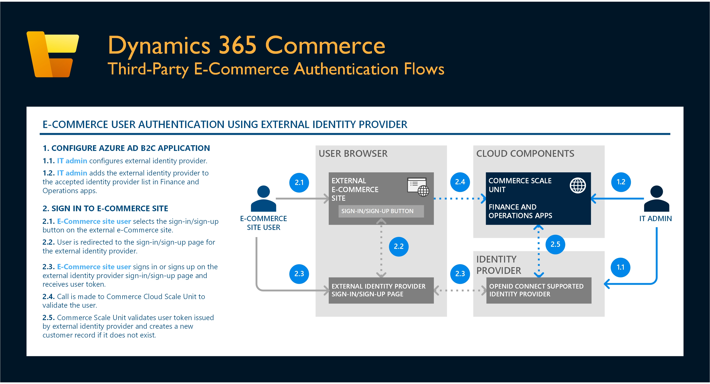

---
# required metadata

title: Dynamics 365 Commerce authentication flows
description: This topic provides an overview of the various authentication flows in Microsoft Dynamics 365 Commerce.
author: samjarawan
ms.date: 06/30/2020
ms.topic: article
ms.prod: 
ms.technology: 

# optional metadata

ms.search.form: RetailITWorkspace
# ROBOTS: 
audience: Developer, IT Pro
# ms.devlang: 
ms.reviewer: v-chgri
# ms.tgt_pltfrm: 
ms.custom: 
ms.assetid: 
ms.search.region: Global
ms.search.industry: Retail
ms.author: samjar
ms.search.validFrom: 2020-03-01
ms.dyn365.ops.version: Release 10.0.11

---

# Dynamics 365 Commerce authentication flows

[!include [banner](includes/banner.md)]

This topic provides an overview of the various authentication flows in Microsoft Dynamics 365 Commerce. Although the Dynamics 365 Commerce solution currently supports several authentication scenarios and flows, the core authentication infrastructure of the Commerce Scale Unit (also known as the headless commerce engine) is fully based on [OpenID Connect](https://openid.net/connect/).

## Authentication methods

Access to each of the application programming interfaces (APIs) on the Commerce Scale Unit is natively restricted by one or more of the following roles:

- **Employee** – Access to APIs associated with this role requires point of sale (POS) device activation (a device token) and an authenticated employee.
- **Customer** – Access to APIs associated with this role requires an authenticated customer. E-Commerce sites generally use these APIs for operations such as retrieving order history and changing customer details.
- **Application** – Access to APIs associated with this role requires application-level authentication, such as Azure Active Directory (Azure AD) service-to-service authentication.
- **Anonymous** – APIs associated with this role are primarily used by e-Commerce sites without user authentication.
- **Customized APIs** – Access to APIs associated with this role can be restricted using any of the methods described above such as POS device activation, customer authentication, and anonymous authentication.

For the full list of Commerce Scale Unit APIs and their access restrictions, see [Commerce Scale Unit customer and consumer APIs](/dev-itpro/retail-server-customer-consumer-api).

### Supported authentication methods

The following table describes the set of supported authentication methods for APIs that require either POS device activation that generates a device token or user authentication that generates a user token.

| API category | Scenario | Supported authentication method | Required setup | Additional details |
|----------|-----------|------------|------------|------------|
| Employee | Dynamics 365 POS authentication flows\* | Simple cashier user name and password | In Dynamics 365 Commerce headquarters, configure a user name and password for a worker. | [Create a worker](retail-modern-pos-device-activation.md#create-a-worker) |
| Employee | Dynamics 365 POS authentication flows\* | Azure AD credentials | In Commerce headquarters, configure a worker that is mapped to Azure AD credentials. | [Enable Azure Active Directory authentication for POS sign-in](aad-pos-logon.md) |
| Employee | Dynamics 365 POS authentication flows\* | Extended sign-in credentials (for example, by using a bar code or a magnetic stripe reader \[MSR\]) | In Commerce headquarters, configure a worker for extended sign-in. | [Set up extended logon functionality for MPOS and Cloud POS](extended-logon.md) |
| Customer | Dynamics 365 Commerce authentication flows | Site user authentication by using Azure AD B2C | <ol><li>Create an Azure AD business-to-consumer (B2C) application.</li><li>In Commerce headquarters, add the Azure AD B2C application to the accepted list of identity providers.</li><li>In Commerce site builder, configure the Azure AD B2C application.</li></ol> | [Set up a B2C tenant in Commerce](set-up-b2c-tenant.md)
[Set up custom pages for user sign-ins](custom-pages-user-logins.md)
 |
| Customer | Dynamics 365 Commerce authentication flows | Site user authentication by using an external identity provider that supports OpenID Connect | <ol><li>Create an Azure AD B2C application, and configure it to support external identity providers.</li><li>In Commerce headquarters, add the Azure AD B2C application to the accepted list of identity providers.</li><li>In Commerce site builder, configure the Azure AD B2C application.</li></ol> | [Set up a B2C tenant in Commerce](set-up-b2c-tenant.md)
[Set up custom pages for user sign-ins](custom-pages-user-logins.md)
 |
| Customer | Third-party e-Commerce authentication flows | Site user authentication by using an external identity provider that supports OpenID Connect | In Commerce headquarters, add the external identity provider to the accepted list of identity providers. | [Configure authentication providers](/dynamics365/commerce/dev-itpro/configure-authentication-providers) |
| Application | Third-party app or service authentication flows | Azure AD service-to-service authentication/application authentication | In Commerce headquarters, add the external identity provider to the accepted list of identity providers. | |

\* Sign-in to POS requires device activation for each terminal. For more information, see [Point of Sale (POS) device activation](/dev-itpro/retail-device-activation.md).

### Unsupported authentication flows

| Scenario | Unsupported authentication method | Details |
|----------|-----------|------------|
| Dynamics 365 POS authentication flows | Authentication without device activation (that is, without a device token) | All POS-related Commerce Scale Unit APIs require a device activation token for authentication. |

## Dynamics 365 POS employee authentication flows

The following illustration shows POS employee authentication flows in Commerce.

## Dynamics 365 e-Commerce customer authentication flows

The following illustration shows e-Commerce customer authentication flows in Commerce.

## Third-party e-Commerce customer authentication flows

The following illustration shows third-party e-Commerce customer authentication flows in Commerce.

## Third-party application authentication flows

The following illustration shows third-party application authentication flows in Commerce.

## Additional resources

[Dynamics 365 Commerce architecture overview](commerce-architecture.md)

[Commerce Scale Unit customer and consumer APIs](/dev-itpro/retail-server-customer-consumer-api.md)

[POS worker logon](retail-modern-pos-device-activation.md#create-a-worker)

[Enable Azure Active Directory authentication for POS sign-in](aad-pos-logon.md)

[Set up extended logon functionality for MPOS and Cloud POS](extended-logon.md)

[Set up a B2C tenant in Commerce](set-up-b2c-tenant.md)

[Set up custom pages for user sign-ins](custom-pages-user-logins.md)

[Configure authentication providers](/dev-itpro/configure-authentication-providers.md)

[Point of Sale (POS) device activation](/dev-itpro/retail-device-activation.md)

[!INCLUDE[footer-include](../includes/footer-banner.md)]
