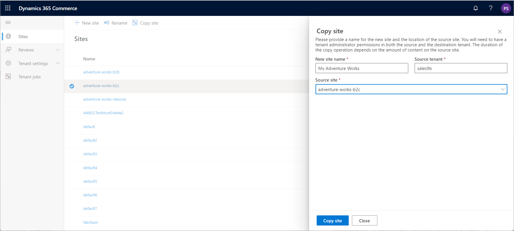
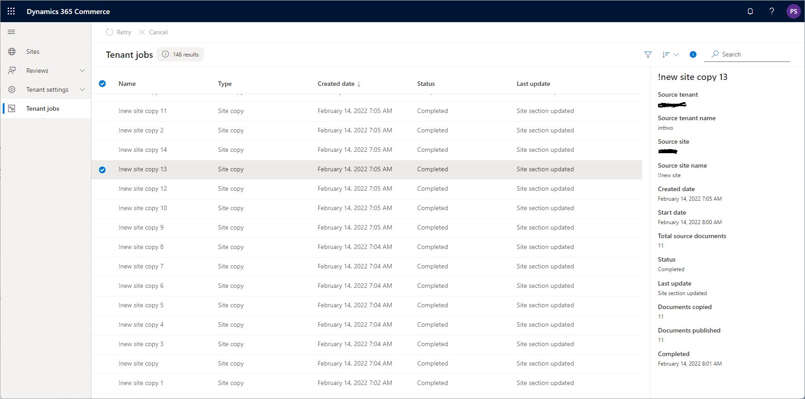
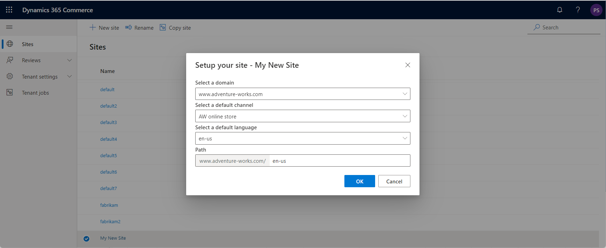

---
# required metadata

title: Copy an e-commerce site
description: This topic describes how to copy an existing e-commerce site within or between e-commerce environments in Microsoft Dynamics 365 Commerce site builder.
author: psimolin
ms.date: 03/01/2022
ms.topic: article
audience: Application User, Developer, IT Pro
ms.reviewer: v-chgriffin
ms.search.region: Global
ms.author: psimolin
ms.search.validFrom: 2017-06-20
---

# Copy an e-commerce site

[!include [banner](../includes/banner.md)]

This topic describes how to copy an existing e-commerce site within or between e-commerce environments in Microsoft Dynamics 365 Commerce site builder.

Dynamics 365 Commerce supports copying or cloning sites as a self-serve operation in Commerce site builder. Sites can be copied within a single e-commerce environment or between two different e-commerce environments. The user initiating the site copy must be a tenant administrator in both the source and destination e-commerce environments. 

The site copy operation copies all e-commerce content under the source site including pages, fragments, templates, URLs, and assets. A new site will need to be initialized using the first run experience (FRE) process before it can be used. Channels can be mapped and managed in site builder at **Site Settings \> Channels**. 

The duration of the site copy operation depends primarily on the number of assets on the source site. For exceptionally large sites it is recommended that you consider using the environment copy operation (also known as the data portability operation) instead. 

> [!NOTE]
> - The source site will be read-only for the duration of the site copy operation. 
> - Only published versions (or the latest versions if no versions have been published) of documents are copied over. 
> - Version history for content will not be available on the destination site.

## Copy a site within an e-commerce environment 

To copy a site within an e-commerce environment, follow these steps.

1. Sign in to site builder for the environment where you want to perform the copy operation. 
1. Navigate to site list view by selecting **Site switcher** in the upper-right corner, and then selecting **Manage sites**.
1. Locate the site you want to copy or clone, and then select it by checking the option next to the site name. 
1. On the action bar, select **Copy site**. 
1. In the **Copy site** dialog box, under **New site name**, enter the name for the new site. The new site name must be unique for the e-commerce environment. Note that the **Source tenant** and **Source site** fields are autopopulated with the current tenant and selected site information. 
1. Select **Create copy**.” 

After the information has been validated, a notification appears indicating that a new site copy job has been created. Job progress can be monitored from the [right-side pane of the **Tenant jobs** page](#monitor-the-site-copy-operation). When the copy operation has successfully finished, the new site will appear in the list of sites in site list view. 

The following illustration shows an example of the **Copy site** dialog box in site builder.

## Copy a site between two different e-commerce environments 

To copy a site between two different e-commerce environments, follow these steps. 

1. Sign in to site builder for the destination e-commerce environment.  
1. On the action bar, select **Copy site**. 
1. In the **Copy site** dialog box, under **New site name**, enter the name for the new site. The new site name must be unique for the e-commerce environment.
1. Under **Source tenant**, select the source tenant name from the drop-down list. 
1. Under **Source site**, select the source site from the drop-down list. 
1. Select **Create copy**. 

> [!NOTE]
> Tenant administrator permissions are required for both the source and destination e-commerce environments. 

After the information has been validated, a notification appears indicating that a new site copy job has been created. Progress of the job can be monitored from the [right-side pane of the **Tenant jobs** page](#monitor-the-site-copy-operation). When the copy operation has successfully finished, the new site will appear in the list of sites in site list view. 

## Monitor the site copy operation 

To monitor the progress of the site copy operation, follow these steps. 

1. Sign in to site builder for the destination e-commerce environment. 
1. In the left-side pane, select **Tenant jobs**. 
1. Under **Tenant jobs**, locate and select your site copy job from the list. 
1. The right-side pane will appear showing the status and the details of the selected job.

Jobs that show a status of **In progress** can be canceled by selecting the job and then selecting **Cancel** on the action bar. 

If a job shows a status of **Failed** or **Completed with errors**, the job can be retried by selecting it from the list and then selecting **Retry** on the action bar. 

> [!NOTE]
> Video assets might still be processing after a site copy job finishes.

The following illustration shows an example of the right-side pane of the **Tenant jobs** page in site builder.

## Initialize a new site using the first run experience (FRE) process 

Before the new site can be taken into use, it must be initialized by going through first run experience (FRE) process. 

To initialize a new site using FRE, follow these steps. 

1. Sign in to site builder for the new site. 
1. Navigate to site list view by selecting **Site switcher** in the upper-right corner, and then selecting **Manage sites**. 
1. Locate and select the new site you want to initialize. 
1. In the **Setup your site** dialog box, for **Select a domain**, select a domain from the drop-down list. The drop-down list is populated with domains associated with the e-commerce environment during initialization. 
1. For **Select a default channel**, select the associated online store channel from the drop-down list. The selected channel will provide assortments and other information stored in headquarters. 
1. For **Select a default language**, select the default authoring language from the drop-down list. The drop-down list is populated with the languages that are configured for the selected online store channel. 
1. For **Site path**, the value consists of the base domain and optional URL path. You may leave the path empty if the channel will be served from the domain root, or if you want to enter this information later in the channel configuration view in the site builder. The site path must be unique for the e-commerce environment. 
1. Select **OK**. Your site will be initialized with the information you provided, and you will be sent to the site management view.

The following illustration shows an example of the **Setup your site** dialog box in site builder.

## Additional resources

[Configure your domain name](configure-your-domain-name.md) 

[Deploy a new e-commerce tenant](deploy-ecommerce-site.md) 

[Associate a Dynamics 365 Commerce site with an online channel](associate-site-online-store.md) 

[Manage robots.txt files](manage-robots-txt-files.md) 

[Upload URL redirects in bulk](upload-bulk-redirects.md) 

[Set up a B2C tenant in Commerce](set-up-b2c-tenant.md) 

[Set up custom pages for user logins](custom-pages-user-logins.md) 

[Configure multiple B2C tenants in a Commerce environment](configure-multi-b2c-tenants.md) 

[Add support for a content delivery network (CDN)](add-cdn-support.md) 

[Enable location-based store detection](enable-store-detection.md) 
