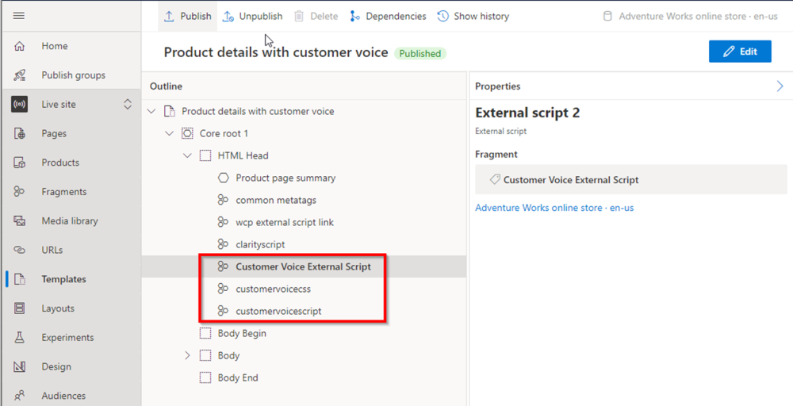

---
# required metadata

title: Integrate Customer Voice into e-commerce site pages
description: This topic describes how to integrate Microsoft Dynamics 365 Customer Voice into Microsoft Dynamics 365 Commerce e-commerce site pages.
author: samjarawan
ms.date: 05/05/2022
ms.topic: article
audience: Application User, Developer, IT Pro
ms.reviewer: v-chgriffin
ms.search.region: Global
ms.author: samjar
ms.search.validFrom: 2019-10-31

---
# Integrate Customer Voice into e-commerce site pages

[!include [banner](../includes/banner.md)]

This topic describes how to integrate Microsoft Dynamics 365 Customer Voice into Microsoft Dynamics 365 Commerce e-commerce site pages.

You can integrate [Customer Voice](https://dynamics.microsoft.com/customer-voice/overview/) into your e-commerce site to collect, analyze, and track real-time customer feedback. To get started integrating Customer Voice, you must first create an account and select a Customer Voice project template for the type of feedback you want to collect. 

## Integrate the Customer Voice service

First, you must select a Customer Voice project template for the type of feedback you want to collect.

To select a Customer Voice project template, follow these steps. 

1. Go to the [Customer Voice project template page](https://customervoice.microsoft.com/Pages/ProjectPage.aspx).
1. Select **Get started**.
1. Select the project template for the type of feedback you want to collect, and then select **Next**.
1. Select the **Send** tab, and then under **Choose an embed format**, select the embed format. The necessary code to embed within site builder appears below **Embedded code**. 

The following example illustration shows the **Periodic customer survey** page with the **Button** embed code option selected and the embedd code provided under **Embedded code**. The embedded code will be split into three parts as described in the sections below.


### Embed the external script URL block

You must embed the following external script URL block on all pages that will have a Customer Voice survey. The best way to embed the script on multiple pages  is to create a fragment in Commerce site builder that contains the script and then add the fragment to the appropriate page template(s). The embedded external script code will look like the following example code:

```html
<script src=https://mfpembedcdnmsit.azureedge.net/mfpembedcontmsit/Embed.js type="text/javascript"></script>
```

For information on fragments, see [Work with fragments](work-with-fragments.md).

To embed the external script into a fragment, follow these steps.

1. Create a fragment in site builder based off the [External script module](script-module.md).
1. In the fragment, select the **Default external script** slot. 
1. In the **Default external script** properties pane, under **Script source**, add the external script URL as shown in the following example illustration.

    

1. Select **Save**, and then select **Finish editing**.
1. Select **Publish** to publish the fragment.

You can then add the new fragment to the appropriate page template.

### Embed the external style sheet

You must embed the the external stylesheet on all pages that will have a Customer Voice survey. The best way to embed the external style sheet on multiple pages is to create a fragment in Commerce site builder that contains the style sheet and then add the fragment to the appropriate page template(s). The embedded external style sheet code will look like the following example code:

```html
<link rel="stylesheet" type="text/css" href=https://mfpembedcdnmsit.azureedge.net/mfpembedcontmsit/Embed.css />
```

To embed the external style sheet into a fragment, follow these steps.

1. Create a fragment in site builder based off the [Metatags](metatags-module.md).
1. In the fragment, select the **Default metatags** slot. 
1. In the **Default metatags** properties pane, under **Meta tags**, add the style sheet URL as shown in the following example illustration.

    

1. Select **Save**, and then select **Finish editing**.
1. Select **Publish** to publish the fragment.

You can then add the new fragment to the appropriate page template.

### Inline script

The inline script provided by Customer Voice needs to be embedded as an inline script. The below is just a sample and note that **SURVEY_KEY** should match the actual survey key provided by Customer Voice.  Also notice the last line which calls the code to render the survey button after 1 second to ensure time is given for the scripts to be loaded.  You may also need to add other meta data such as company name if needed, this will be dependent on if your survey requires it.  

```html
function renderSurveyButton() {
  var se = new SurveyEmbed("SURVEY_KEY","https://customervoice.microsoft.com/","https://mfpembedcdnmsit.azureedge.net/mfpembedcontmsit/","true");

  var context = {
    "First Name":"",
    "Last Name": "",
    "locale": "en-us",
    "companyname": "Adventure Works"
  };
  se.renderButton(context);
}

setTimeout(renderSurveyButton, 4000);
```

The below image shows the above code added an [inline script](script-module.md) module.


## Enable scripts on e-commerce site

Once the fragments have been created, they can be added to the page templates that you plan to use them on. The below screenshot shows the three fragments added to a product details page template. Once the changes are published the survey will appear on the pages controlled by the template that the fragments were added to.



## Content security policy

After making the above changes, the survey should fail to load due to content security policy since the web site by default can't call out to other services. To see errors caused by this, open developer tools within a browser (F12) and navigate to the page that has the survey and notice CSP errors in the console output.  For more information, see [Content security policy](manage-csp.md).

To fix these errors, from within site builder, select the **Extensions** tab on the bottom left and then the **Content security policy** tab and add the following URLs:

* Add `https://customervoice.microsoft.com/` to **child-src**
* Add `https://customervoice.microsoft.com/` to **frame-src**
* Add `https://mfpembedcdnmsit.azureedge.net` and ".azureedge.net" to the **img-src** section

Below shows where to add some of these:


