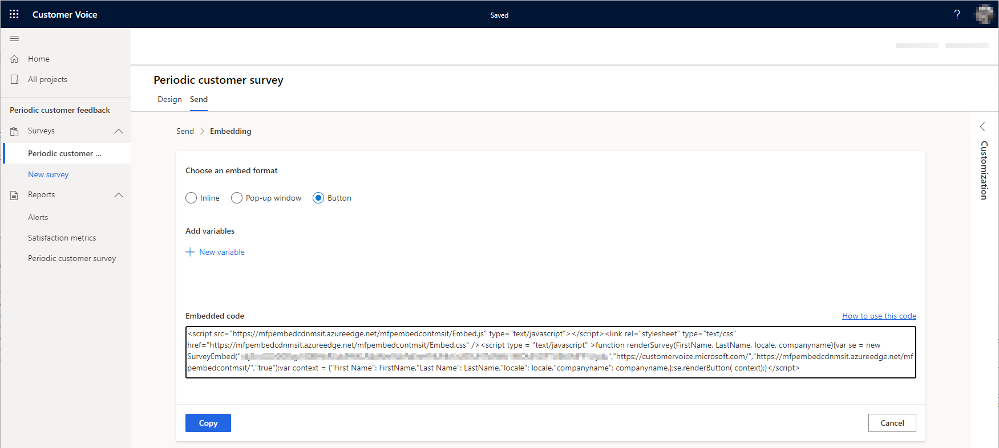

---
# required metadata

title: Integrate Customer Voice into an e-commerce page
description: 
author: samjarawan
ms.date: 09/14/2021
ms.topic: overview
ms.prod: 
ms.technology: 

# optional metadata

# ms.search.form: 
audience: Developer
# ms.devlang: 
ms.reviewer: v-chgri
# ms.tgt_pltfrm: 

ms.assetid: 
ms.search.region: Global
# ms.search.industry: 
ms.author: samjar
ms.search.validFrom: 2019-10-31
ms.dyn365.ops.version: Release 10.0.5

---
# Integrate Customer Voice into an e-commerce page

[!include [banner](../includes/banner.md)]

[Customer Voice](https://dynamics.microsoft.com/customer-voice/overview/) can be used to collect, analyze and track real-time feedback within your e-commerce web site.  This topic will cover the steps needed to integrate the service into Dynamics 365 Commerce e-commerce platform.

As a pre-requisite you will require an account within Dynamics 365 Customer Voice and have created the desired survey. 

## Service Integration
1. Select the survey you will be using from the [Customer Voice](https://customervoice.microsoft.com/Pages/ProjectPage.aspx.) portal.
2. Select the **Send** tab and the **Embed** link which will provide the necessary code to embed within the site builder tool and select the type of survey you want as shown below.  We'll use the **Button** type for this example.

The above code will be split into 3 parts 

### External script link

1.	The external script block needs to be embedded on any pages that will have a survey.  The best way to do this is to create a fragment that holds the script and embed the fragment on the page template(s). The script that will be embedded looks like this

To embed the above external script, create a fragment in site builder based off the “External script” module then add the URL to the “Script source” configuration as shown below:

### External style sheet

2.	The external stylesheet needs to be embedded on any pages that will have a survey. The best way is to create a fragment and ensure the fragment is added to the appropriate page template(s). The stylesheet link looks like this:

<link rel="stylesheet" type="text/css" href=https://mfpembedcdnmsit.azureedge.net/mfpembedcontmsit/Embed.css />

To embed the above link, create a fragment in site builder based off the “Metatags” module and paste the link into the “Meta Tags” configuration field as shown below:

