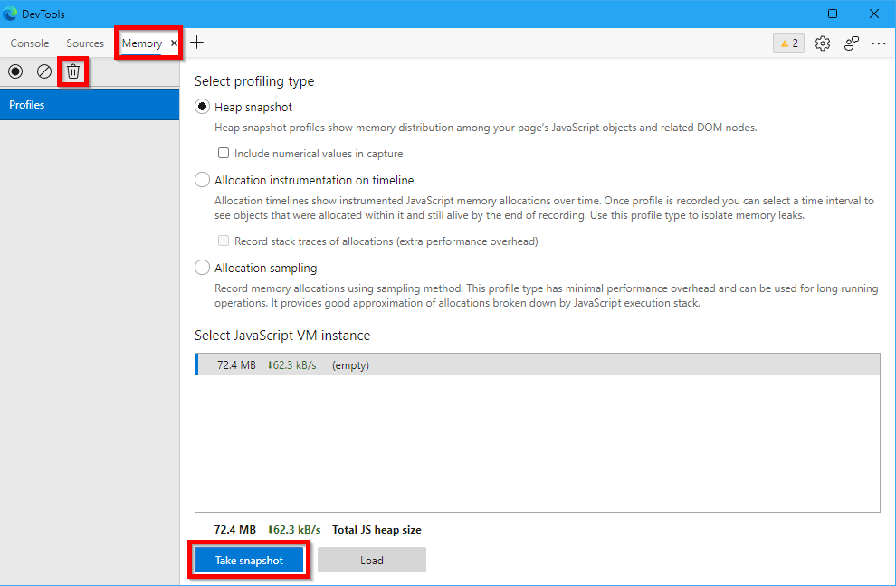

---
# required metadata

title: Testing for memory leaks
description: This topic describes how to test custom e-commerce code for memory leaks in Microsoft Dynamics 365 Commerce. 
author: samjarawan
ms.date: 09/14/2021
ms.topic: article
ms.prod: 
ms.technology: 

# optional metadata

# ms.search.form: 
audience: Developer
# ms.devlang: 
ms.reviewer: v-chgri
# ms.tgt_pltfrm: 
ms.custom: 
ms.assetid: 
ms.search.region: Global
# ms.search.industry: 
ms.author: samjar
ms.search.validFrom: 2019-10-31
ms.dyn365.ops.version: Release 10.0.5

---
# Testing e-commerce page for memory leaks

[!include [banner](../includes/banner.md)]

This topic describes how to test an e-commerce page for custom code memory leaks in Microsoft Dynamics 365 Commerce.

Memory leak tests can be done on a mock page to ensure custom e-commerce module and data action code running on that page do not leak memory.


The following steps outline the approach to generate heap snapshots of an e-commerce page to detect memory leaks.  The process involves establishing a baseline, adding request load to the page, then running the garbage collection and ensuring all memory is free'd up back to the baseline size.

### Create a page mock that represents the e-commerce page you want to test.  
The [page mock](test-page-mock.md) documentation explains how to create a custom page mock which can include any modules you would like to test or a live e-commerce page can be saved into a page mock using the **?item=nodeserviceproxy:true** query string parameter.

### Build production code
From within the online SDK root folder build the code in PROD mode with the command ```yarn build:prod```.

### Run Node server in debug mode
Execute the below command to start the Node server in debug mode:
```node --inspect-brk build/server.js```

### Open browser inspect tool
Open a browser and navigate to **edge://inspect/#devices** to load the browser inspect tool then select the **inspect** link once the "build/server.js" shows up under the "Remote Target" section (this could take up 20-30 seconds to show up).


A "DevTools" windows should open up with the debugger in a paused state.  Hit the "Resume script execution" button as shown below to run the code.


### Establish a server startup heap memory baseline
To take a baseline heap memory snapshot after server startup, select the **Memory** tab, followed by the "Collect garbage" icon to run the garbage collection and press the **Take snapshot** button.



### Take memory snapshot for page
Open a new browser window and navigate to the page mock you are testing.  For example if you have a page mock with filename "my-test-page.json" use the following URL: ```https://localhost:4000/page?mock=my-test-page```.  All page requests will involve some level of caching so you should expect the memory to be increased slightly. This is expected. Perform the garbage collection and take another snapshot at this stage. This will be your baseline for the page being tested.

### Test for memory leaks
At this point benchmarking load tools could be used to hit to create more URL hits to the page being tested.  Select the garbage collector after this and take another heap snapshot.  Outside of some data load for caching, the memory should come down to the baseline of the page from the previous step.  This can be repeated several times to ensure memory is coming down.  If memory is not coming down it may be due to objects that cannot be garbage collected, and you will see the heap grow after each run.  The custom code can then be examined for any memory leaks causing this.

