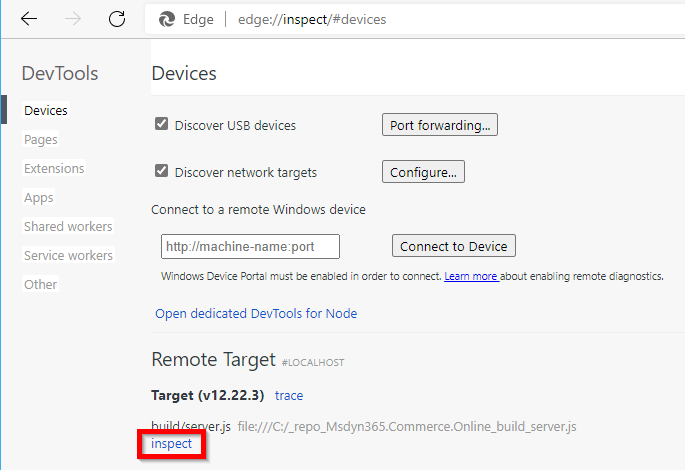

---
# required metadata

title: Testing for memory leaks
description: This topic describes how to test custom e-commerce code for memory leaks in Microsoft Dynamics 365 Commerce. 
author: samjarawan
ms.date: 09/14/2021
ms.topic: article
ms.prod: 
ms.technology: 

# optional metadata

# ms.search.form: 
audience: Developer
# ms.devlang: 
ms.reviewer: v-chgri
# ms.tgt_pltfrm: 
ms.custom: 
ms.assetid: 
ms.search.region: Global
# ms.search.industry: 
ms.author: samjar
ms.search.validFrom: 2019-10-31
ms.dyn365.ops.version: Release 10.0.5

---
# Testing e-commerce page for memory leaks

[!include [banner](../includes/banner.md)]

This topic describes how to test an e-commerce page for custom code memory leaks in Microsoft Dynamics 365 Commerce.

Memory leak tests can be done on a mock page to ensure custom e-commerce module and data action code running on that page do not leak memory.


The following steps outline the approach to generate heap snapshots of an e-commerce page to detect memory leaks.

## Create a page mock that represents the e-commerce page you want to test.  
The [page mock](test-page-mock.md) documentation explains how to create a custom page mock which can include any modules you would like to test or a live e-commerce page can be saved into a page mock using the **?item=nodeserviceproxy:true** query string parameter.

## Build production code
From within the online SDK root folder build the code in PROD mode with the command ```yarn build:prod```.

## Run Node server in debug mode
Execute the below command to start the Node server in debug mode:
```node --inspect-brk build/server.js```

## Open browser inspect tool
Open a browser and navigate to **edge://inspect/#devices** to load the browser inspect tool then select the **inspect** link which will open the inspect debug window



## 


 
