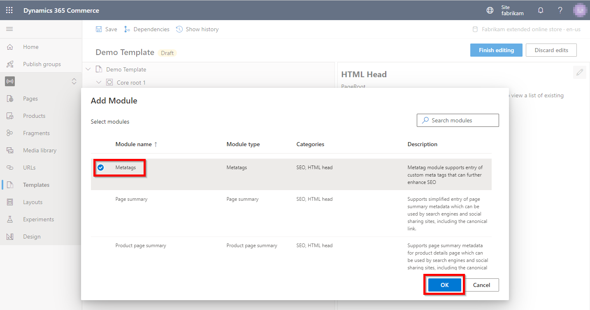

---
# required metadata

title: Metatags module
description: This topic covers metatags modules and describes how to add them to templates in Microsoft Dynamics 365 Commerce.
author: samjarawan
ms.date: 05/18/2022
ms.topic: article
ms.prod: 
ms.technology: 

# optional metadata

# ms.search.form: 
audience: Developer
# ms.devlang: 
ms.reviewer: v-chgri
# ms.tgt_pltfrm: 
ms.custom: 
ms.assetid: 
ms.search.region: Global
# ms.search.industry: 
ms.author: samjar
ms.search.validFrom: 2019-10-31
ms.dyn365.ops.version: Release 10.0.5

---

# Metatags module

[!include [banner](includes/banner.md)]

This topic covers metatags modules and describes how to add them to templates in Microsoft Dynamics 365 Commerce.

The metatags module supports the entry of custom HTML meta tags that can help improve search engine optimization (SEO) rankings for site pages.

The metatags module is added to a template's **HTML Head** slot. It's then available for configuration both in the template and on the site pages that are derived from the template.

One or more general meta tags can be added to a template. However, page-specific meta tags should be added to the relevant site pages. Page-level meta tags overwrite template-level meta tags. 

The following illustration shows an example where a metatags module has been added to the **HTML Head** slot of a template.

## Metatags module properties

| Property name | Values | Description |
|---------------|--------|-------------|
| Meta Tags | Text | One or more meta tags can be added to the module. |

## Add a metatags module to a template

To add a metatags module to a template, follow these steps.

1. In Commerce site builder for your site, select **Templates**.
1. Select a template, and then select **Edit**.
1. In the **HTML Head** slot, select the ellipsis (**...**), and then select **Add module**.

    

1. In the **Add Module** dialog box, select the **Metatags** module, and then select **OK**.

    

1. To add meta tags, select the **Metatags** slot. Then, in the module properties pane, select **Add Meta Tag** to add each meta tag. You can reorder the meta tags by using the up arrow and down arrow buttons.
1. When you've finished editing the template, select **Save**, select **Finish editing**, and then select **Publish** to publish it.

After the meta tags module is added to a template, page-specific meta tags can be added to the site pages that use the template.

## Additional resources

[Module library overview](starter-kit-overview.md)

[Default page module](default-page-module.md)

[Page summary modules](page-summary-module.md)

[!INCLUDE[footer-include](../includes/footer-banner.md)]
