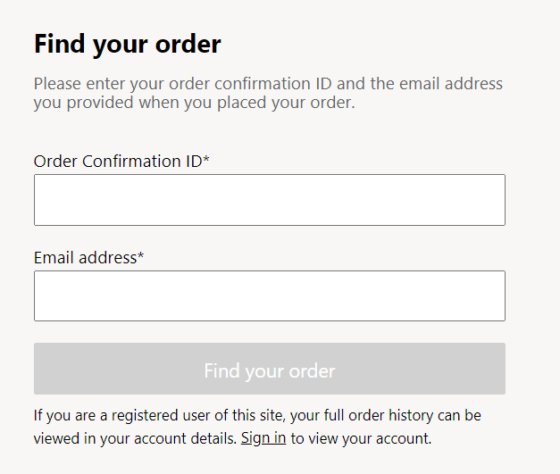
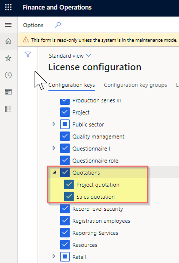

# Order lookup module

[!include [banner](includes/banner.md)]

This article covers the order lookup module and explains how to configure it in Microsoft Dynamics 365 Commerce.

The order lookup module provides a form that customers can use to look up orders that they placed on an e-commerce site. It's used as part of the [Enable order lookup for guest checkouts](order-lookup-guest.md) feature. The order lookup module can be used to look up orders that were submitted through an e-commerce site, the retail point of sale (POS), or a call center. The form can retrieve orders that were submitted both by guest users and by registered users.

The following illustration shows an example of the form that is rendered by the order lookup module. When customers fill out the form and select **Find your order**, they are redirected to the order details page.

## Order lookup module properties

| Property name     | Value     | Description |
|-------------------|-----------|-------------|
| Heading           | Text      | The heading that appears at the top of the form (for example, "Find your order"). |
| Rich text         | Rich text | Optional explanatory text that appears below the heading. |
| Order status type | Enum      | 
Select the type of information that the form will request from the customer in addition to the order confirmation ID. The following values are currently supported:
<ul><li><b>Email</b> – The form will include a field where customers can enter the email address that they used when they placed the order.</li><li><b>None</b> – The form will request no information besides the order confirmation ID.</li></ul> |

## Add an order lookup module to a page

The order lookup module can be added to the body of any page of your e-commerce site. If you want to use the order lookup module to enable order lookup for guest checkouts, be sure to add it to a page that doesn't require that the user be signed in. To find a page's **Requires sign in?** setting in the Commerce site builder tree view, select the **Default page (Required)** slot, and look at the bottom of the right pane.

> [!NOTE]
> For Order lookup feature to work, please make sure that 'Quotations' key is enabled among the license configurations. 
> 
> 
## Additional resources

[Enable order lookup for guest checkouts](order-lookup-guest.md)

[Module library overview](starter-kit-overview.md)

[!INCLUDE[footer-include](../includes/footer-banner.md)]
