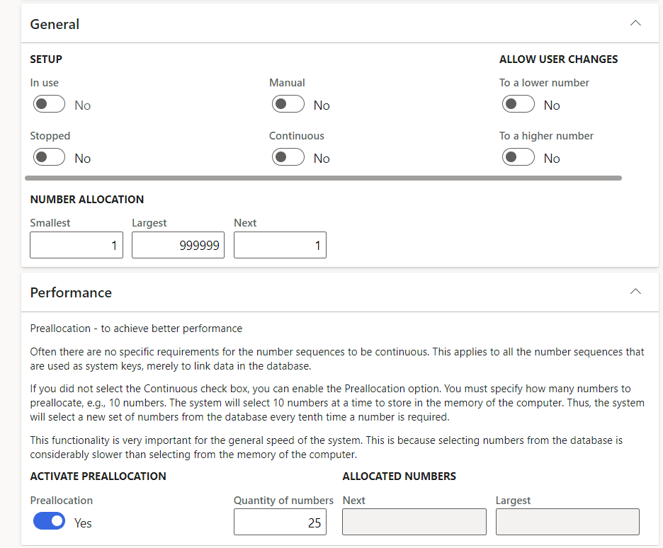

---
# required metadata

title: Retail statements number sequence setup
description: This topic describes how to configure the number sequences required for retail statements.
author: analpert
ms.date: 04/12/2022
ms.topic: article
ms.prod: 
ms.technology: 

# optional metadata

ms.search.form: RetailParameters
# ROBOTS: 
audience: Application User
# ms.devlang: 
ms.reviewer: josaw
# ms.tgt_pltfrm: 
ms.custom: ?
ms.assetid: ?
ms.search.region: Global
ms.search.industry: Retail
ms.author: analpert
ms.search.validFrom: 2022-04-12
ms.dyn365.ops.version: 10.0.21

---

# Retail statements number sequence setup

[!include [banner](includes/banner.md)]

There are two types of retail statements used within Dynamics 365 Commerce. **Transactional statements** are intended to be created and posted at a high frequency and are utilized to post all non-financial transactions within the store to Dynamics 365 Commerce Headquarters. **Financial statements** are intended to be created and posted a single time per business day and will only include closed shifts from the retail stores that have been uploaded to headquarters through the p-job.

#### **Number Sequence Setup for Statement Posting**
After you have completed the setup of a retail store, you must setup a unique number sequence that will be used for statements during the statement creation process.
  1. Navigate to **Organization administration | Number sequences | Number sequences** to open the **Number sequence** maintenance forms.
  1. Enter the following information on the form:
		1. Number sequence code
		1. Number sequence name
		1. Set **Scope parameters** to **Operating unit**
		1. Select from the dropdown the Operating unit for the store this number sequence will be used
		1. Define the segments
		1. Update the **Number allocation** to match the length of the Alphanumeric segment
		1. Define the reference **Area** as **Retail store** and **Reference** as **Statement number** and select **Ok**
		1. A recommendation is to enable the **Preallocation** toggle to **Yes** and set the **Quantity of numbers** to **25**
  1. Save the new **Number sequence** and close the form

