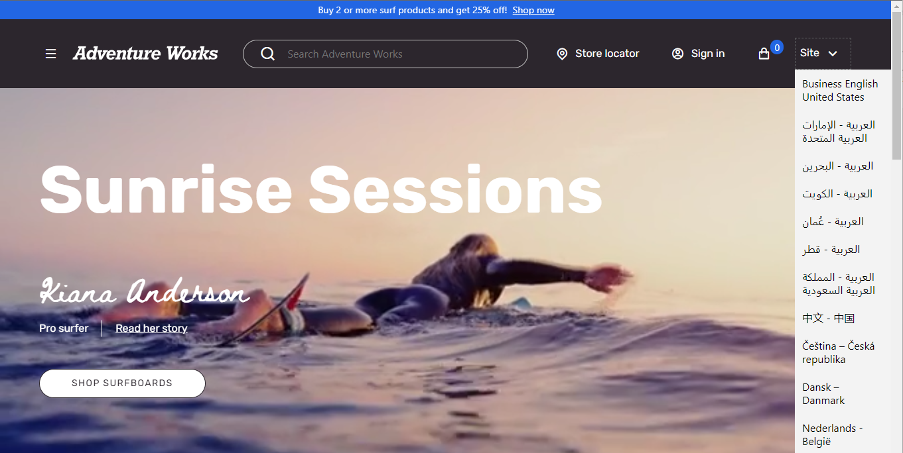
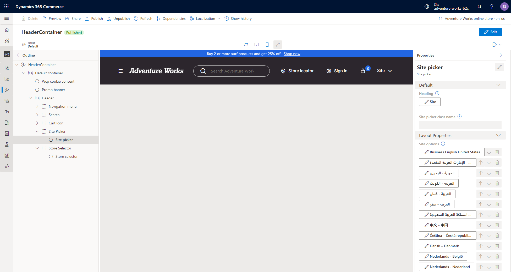

---
# required metadata

title: Site picker module
description: This topic covers the site picker module and describes how to add it to site pages in Microsoft Dynamics 365 Commerce.
author:  anupamar-ms
ms.date: 02/11/2022
ms.topic: article
ms.prod:
ms.technology:

# optional metadata
# ms.search.form:
# ROBOTS:
audience: Application User
# ms.devlang:
ms.reviewer: v-chgri
# ms.tgt\_pltfrm:
ms.custom:
ms.assetid:
ms.search.region: Global
ms.search.industry:
ms.author: anupamar
ms.search.validFrom: 2020-02-10
ms.dyn365.ops.version: Release 10.0.13

---

# Site picker module

[!include [banner](includes/banner.md)]

This topic covers the site picker module and describes how to add it to site pages in Microsoft Dynamics 365 Commerce.

When a business has different sites across markets, regions, and locales, site users need an easy way to switch between sites and select their preferred shopping site. To accommodate this scenario, the site picker module lets users browse across multiple sites. A site picker is also recommended when [geo detection and redirection](geo-detection-redirection.md) have been implemented for your e-commerce site so that customers have a way to override the site preference they make using the [country/region picker](country-region-picker-module.md) module. 

The site picker module must be configured with the list of sites (markets, regions, or locales) that site users can browse. The following illustration shows an example of a site picker module that is featured in the header of a site page.

## Site picker module properties

| Property name | Value                 | Description |
|---------------|-----------------------|-------------|
| Heading       | Text                  | The heading for the module. |
| Site options  | Name, Image, URL      | This property specifies a name, a link to the site's home page, and an optional image to show for each site that is included in the module. The image can be a flag, or some representation of a market, region, or locale. |

## Add a site picker module to a page

The site picker module can be added to the **Site picker** slot of the [header module](author-header-module.md). After a site picker module is added, you can define the module heading and site options. Generally, a header module is contained in a header fragment that can be shared across e-commerce pages for a site. In the following example, the site picker module has been added to the **Site picker** slot of a header module that is contained in a header fragment that is named **HeaderContainer**.

## Additional resources

[Module library overview](starter-kit-overview.md)

[Header module](author-header-module.md)

[Breadcrumb module](add-breadcrumb.md)

[Navigation menu module](nav-menu-module.md)

[!INCLUDE[footer-include](../includes/footer-banner.md)]
