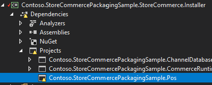
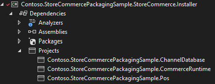

---
# required metadata

title: Troubleshoot Store Commerce extension issues
description: This topic explains how to troubleshoot Store Commerce extension issues.
author: mugunthanm
ms.date: 05/27/2022
ms.topic: article
audience: Application User, Developer, IT Pro
ms.reviewer: v-chgriffin
ms.search.region: Global
ms.author: rassadi
ms.search.validFrom: 2017-06-20

---

# Troubleshoot Store Commerce extension issues

[!include [banner](../includes/banner.md)]
[!include [banner](../includes/preview-banner.md)]

This topic explains how to troubleshoot Store Commerce extension issues.

## Extensions are not loading

### Extensions are packages not showing up in the POS \> Settings page

CRT Triggers is not updated to include the extension package or not deployed, refer this doc to update the CRT trigger.

Extensions are showing up in the POS > Settings page but manifest is not loading Check the **C:\Program Files\Microsoft Dynamics 365\10.0\Store Commerce\Extensions** to see if extension package exists in the folder. 

If the packages do exist, there should be a POS folder that contains the manifest.  

If there is no POS folder, check the Store Commerce project is properly referencing the POS extension project. Validate the project reference path and make sure it exists, the below image shows the installer project is having issues with the referenced extension project. 

 
If the reference for the extension project is added correctly then there will not be any warning or dependency issue in the installer project.

 
