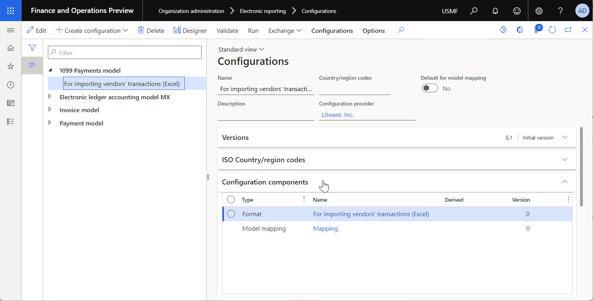
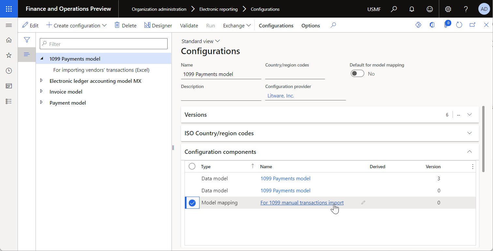
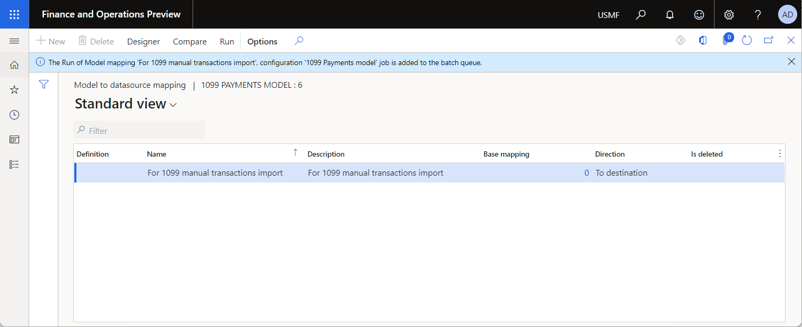
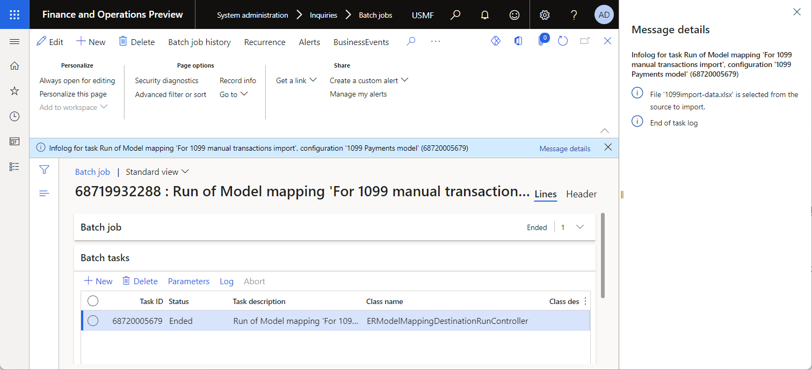
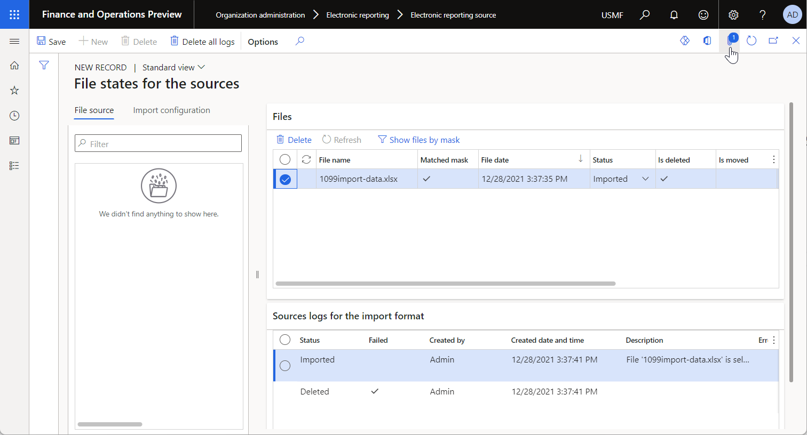
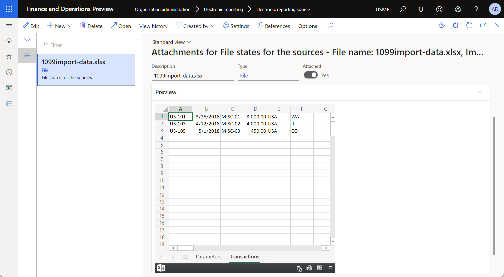

---
# required metadata

title: Import data from manually selected files in batch mode
description: This topic explains how to import data in batch mode from manually selected files.
author: NickSelin
ms.date: 12/28/2021
ms.topic: article
ms.prod: 
ms.technology: 

# optional metadata

ms.search.form: ERSolutionTable, ERImportFormatSourceTable, ERWorkspace
# ROBOTS: 
audience: Application User, Developer, IT Pro
# ms.devlang: 
ms.reviewer: kfend
# ms.tgt_pltfrm: 
ms.custom: 220314
ms.assetid: 
ms.search.region: Global
# ms.search.industry: 
ms.author: nselin
ms.search.validFrom: 2022-01-01
ms.dyn365.ops.version: Release 10.0.25

---
# Import data from manually selected files in batch mode

[!include[banner](../includes/banner.md)]

To import data in batch mode from a manually selected inbound file by using the [Electronic reporting (ER)](general-electronic-reporting.md) framework, you must configure an ER [format](er-overview-components.md#format-component) that supports the import and then run a [model mapping](er-overview-components.md#model-mapping-component) of the **To destination** type that uses that format as a data source. To import data, you must navigate to the file that you want to import and manually selected it. With the new ER capability to support importing data in batch mode, this process can be configured as unattended. You can use ER configurations to perform data import by scheduling a new batch job from the ER user interface (UI). This topic explains how to complete the import from the manually selected file in batch mode. The examples use vendor transactions as business data. The steps of these examples can be completed in the **USMF** company. No coding is required.

## Prerequisites

To complete the examples in this topic, you must have the following access:

- Access one of the following roles:

    - Electronic reporting developer
    - Electronic reporting functional consultant
    - System administrator

- ER format and model configurations for 1099 payments.

### Create required ER configurations

To create the required ER configurations and obtain other prerequisites, complete one of the following examples:

- Play the **ER Import data from a Microsoft Excel file** task guides, which are part of the **7.5.4.3 Acquire/Develop IT service/solution components (10677)** business process. These task guides walk you through the process of designing and using ER configurations to interactively import vendor transactions from Microsoft Excel files. For more information, see [Parse incoming documents in Excel format](parse-incoming-documents-excel.md).

- Complete the examples in the [Configure data import from SharePoint](er-configure-data-import-sharepoint.md) topic. These examples walk you through the process of designing and using ER configurations to interactively import vendor transactions from Microsoft Excel files that are stored in the SharePoint folder.

### Download required ER configurations

Alternatively, download and save locally the required ER configurations.

| Content description | File |
|---------------------|------|
| ER data model configuration **1099 Payments model** | [1099model.xml](https://download.microsoft.com/download/b/d/9/bd9e8373-d558-4ab8-aa9b-31981adc97ea/1099model.xml) |
| ER format configuration **For importing vendors' transactions (Excel)** | [1099format-import-from-excel.xml](https://download.microsoft.com/download/b/3/8/b38faf0a-fbaf-4e9e-84c2-dedae7464880/1099format-import-from-excel.xml) |

Use the [Load from XML file](er-defer-sequence-element.md#import-the-sample-er-configurations) ER option to import the downloaded ER configurations into your Finance instance in the following order:

1.  ER data model configuration
2.  ER format configuration

### Download required Excel files

Download and save locally the sample data set.

| Content description | File |
|---------------------|------|
| Inbound **1099import-data.xlsx** file in XLSX format containing sample data for import | [1099import-data.xlsx](https://download.microsoft.com/download/f/f/4/ff4dbce9-8364-4391-adee-877945ff01f7/1099import-data.xlsx) |

### Review prerequisites

1.  Go to **Organization administration\> Electronic reporting \> Configurations**.
2.  On the **Configurations** page, review the prepared ER solution for data import in batch mode.
3.  Review the **For importing vendors' transactions (Excel)** format configuration:

    - The format component of this configuration is designed to parse an inbound Excel file.
    - The model mapping component of this configuration is used to fill in the base data model by using data from the parsed Excel file.
    
    

4.  Review the **1099 Payments model** data model configuration:

    - The model component of this configuration represents the structure of the data model using to pass data between running ER components.
    - The model mapping component of this configuration is used to pull data from the executed format component and use this data to update application tables.
    
    

5.  Open the **1099import-data.xlsx** file in the Excel desktop application:

    

## Enable batch data import for ER from UI

1.  Go to **System administration \> Workspaces \> Feature management**.
2.  On the **Feature management** workspace, enable the **Run ER import of manually uploaded documents in batch** feature.

## Import data from manually selected Excel files

1.  On the **Configurations** page, select the **1099 Payments model** data model configuration.
2.  In the **Configuration components** FastTab, use the **For 1099 manual transactions import** link.
3.  On the **Model to datasource mapping** page, select **Run** for the preselected **For 1099 manual transactions import** model mapping.

4.  In the **Parameters** tab, complete the following steps:
    
    1.  Select **Browse**, find and select the **1099import-data.xlsx** file, and then select **OK**.
    2.  In the **Enter voucher id** field, enter **V-00001**.

5.  In the **Run in the background** tab, complete the following steps:

    1.  Set **Batch processing** to **Yes**.
    2.  Note that the **Task description** field is filled by the **Run of Model mapping 'For 1099 manual transactions import', configuration '1099 Payments model'** text to indicate that the execution of the selected model mapping will be scheduled as a new batch job.

    

6.  Select **OK**.

    

## Review results of data import on the Batch job page

1.  Go to **Common \> Inquiries \> Batch jobs \> My batch jobs**.
2.  On the **Batch job** page, filter batch jobs list to find and select the scheduled batch.
3.  Use the **Job ID** link to review job details.

    

4.  On the **Batch tasks** FastTab, select **Log** to review execution details.

    

## Change parameters of data import

When your batch is scheduled but has not been executed yet, you can change parameters of the scheduled data import. To achieve this, complete the following steps:

1.  Go to **Common \> Inquiries \> Batch jobs \> My batch jobs**.
2.  On the **Batch job** page, filter batch jobs list to find and select the scheduled batch.
3.  For the selected batch, select **Change status**.
4.  On the **Select new status** dialog, select **Withhold** and select **OK**.
5.  Use the **Job ID** link to access job details.
6.  On the **Batch tasks** FastTab, select **Parameters**.
7.  On the Electronic report parameters dialog, do the following:

    - Use **Browse** to select the alternative file for data import.
    - Use **Enter voucher id** to change the voucher number for importing vendor transactions.

    

    - Select **OK**.

8.  For the selected batch, select **Change status**.
9.  On the **Select new status** dialog, select **Waiting** and select **OK**.

## Review results of data import on the ER source page

1.  Go to **Organization administration \> Electronic reporting \> Electronic reporting source**.
2.  Select the automatically created during data import the **For importing vendors' transactions (Excel)** record.

    

3.  Select **File states for the sources**.
4.  Review the import details on the **Files** and **Source logs for the import format** Fast Tabs.
5.  Select the record in the **Files** FastTab. Note that the imported file is attached to this record.

    

6.  Select the **Attachments** icon to review the imported file.

    

    > [!TIP]
    > To keep such attachments, the ER framework uses a document type that is [set](electronic-reporting-er-configure-parameters.md#parameters-to-manage-documents) for the current company in the **Others** field of the ER parameters.

## Review results of data import on the Vendor settlement for 1099s page

1.  Go to **Accounts payable \> Periodic tasks \> Tax 1099 \> Vendor settlement for 1099s**.
2.  In the **From date** field, enter **12/31/2017**.
3.  Select **Manual 1099 transactions**.

## Additional resources

[Electronic Reporting overview](general-electronic-reporting.md)

[!INCLUDE[footer-include](../../../includes/footer-banner.md)]
