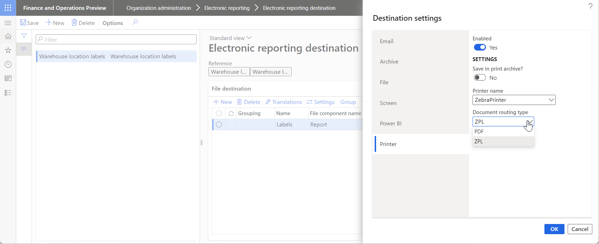

---
# required metadata

title: Printer ER destination type
description: This topic explains how you can configure a printer destination for each FOLDER or FILE component of an Electronic reporting (ER) format. 
author: NickSelin
ms.date: 02/24/2021
ms.topic: article
ms.prod: 
ms.technology: 

# optional metadata

ms.search.form: DocuType, ERSolutionTable, ERFormatDestinationTable
# ROBOTS: 
audience: Application User
# ms.devlang: 
ms.reviewer: kfend
# ms.tgt_pltfrm: 
ms.custom: 97423
ms.assetid: 
ms.search.region: Global
# ms.search.industry: 
ms.author: nselin
ms.search.validFrom: 2020-04-01
ms.dyn365.ops.version: AX 10.0.9

---

# Printer destination

[!include [banner](../includes/banner.md)]

You can send a generated document directly to a network printer for direct printing.

## Prerequisites

Before you begin, you must install and configure the Document Routing Agent, and then register the network printers. For more information, see [Install the Document Routing Agent to enable network printing](./install-document-routing-agent.md).

## Make the Printer destination available

To make the **Printer** destination available in the current instance of Microsoft Dynamics 365 Finance, go to the **Feature management** workspace, and turn on the following features, in this order:

1. Convert Electronic Reporting outbound documents from Microsoft Office formats to PDF
2. Document Routing Agent as Electronic Reporting destination for outbound documents

### Applicability

#### PDF printing

In versions of Finance before version 10.0.18, the **Printer** destination can be configured only for file components that are used to generate output in either printable PDF format (**PDF Merger** or **PDF file** format elements) or Microsoft Office Excel/Word format (**Excel file** format element). When output is generated in PDF format, it's sent to a printer. When output is generated in Microsoft Office format by using the **Excel file** format element, it's automatically converted to PDF format and then sent to a printer.

However, in version 10.0.18 and later, you can also configure the **Printer** destination for the **Common file** format element. Mostly, this format element is used to generate output in either TXT or XML formats. But you can configure an ER format containing the **Common file** format element as the root format element and the **Binary contents** format element that is only nested under the root format element. So, in this case the **Common file** format element will produce output in the format that is specified by the binding that you configure for the **Binary contents** format element. For example, you can configure this binding to [populate](tasks/er-document-management-files-5.md#modify-the-format-to-populate-attachments-into-generating-messages-in-binary-format) to this element the content of a [Document management](../../fin-ops/organization-administration/configure-document-management.md) attachment in PDF or Microsoft Office (Excel or Word) format. So, you can print out such output by using the configured **Printer** destination. 

> [!NOTE]
> Notice that when you select the **Common\File** format element to configure the **Printer** destination, the 
**Please, make sure that the output that is generated by selected format component can be converted to PDF. Otherwise, uncheck the 'Convert to PDF' option.** warning is thrown as it is not possible to guarantee at design time that the selected element will produce output in PDF or convertible to PDF format. So, you must control this to prevent runtime issues when non-PDF or non-PDF convertible output is provided at runtime for printing. The **Convert to PDF** option must be checked when you expect to receive output in Microsoft Office (Excel or Word) format.

> [!NOTE]
> In version 10.0.26 and later, to use the **Convert to PDF** option, you must select the **PDF** value for the **Document routing type** parameter of the configured **Printer** destination.

#### ZPL printing

In version 10.0.26 and later, you can also configure the **Printer** destination for the **Common\File** format element selecting the **ZPL** value for the **Document routing type** parameter. When you do this, the **Convert to PDF** option is ignored at runtime and TXT or XML output is directly sent out to a selected printer by using the ZPL contract of the [Document routing agent (DRA)](install-document-routing-agent.md). So, you can use this feature for an ER format that represents a Zebra printing language (ZPL II) label layout to print out various labels.

To learn more about this feature, review the [Design a new ER solution to print ZPL labels](er-design-zpl-labels.md) topic.

### Limitations

The **PDF** option of the **Document routing type** parameter that is configured for the **Printer** destination is implemented only for cloud deployments.

### Use the Printer destination

1. Set the **Enabled** option to **Yes** to send a generated document to a printer.
2. In the **Printer name** field, select the required network printer.
3. Set the **Save in print archive?** option to **Yes** to store the generated output in the print archive, so that it's available for further printing. To access archived output later, go to **Organization administration** \> **Inquiries and reports** \> **Report archive**.

> [!NOTE]
> The **Convert to PDF** option doesn't have to be turned on when you configure the **Printer** destination. The PDF conversion for printing purposes will occur even if the option is turned off.

To use a specific [page orientation](electronic-reporting-destinations.md#SelectPdfPageOrientation) when you print an outbound document in Excel format, you must turn on the **Convert to PDF** option. When you set the **Convert to PDF** option to **Yes**, the **Page orientation** field becomes available. In the **Page orientation** field, you can select a page orientation.

## Additional resources

- [Electronic reporting (ER) overview](general-electronic-reporting.md)
- [Electronic reporting (ER) destinations](electronic-reporting-destinations.md)

[!INCLUDE[footer-include](../../../includes/footer-banner.md)]
