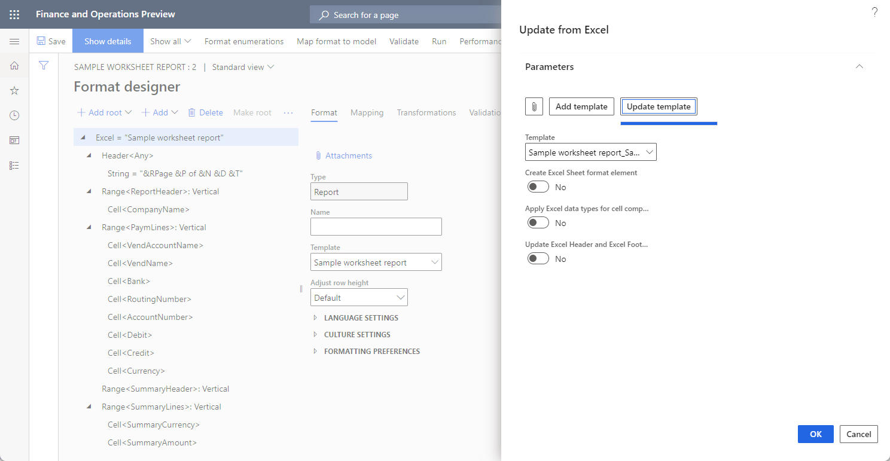
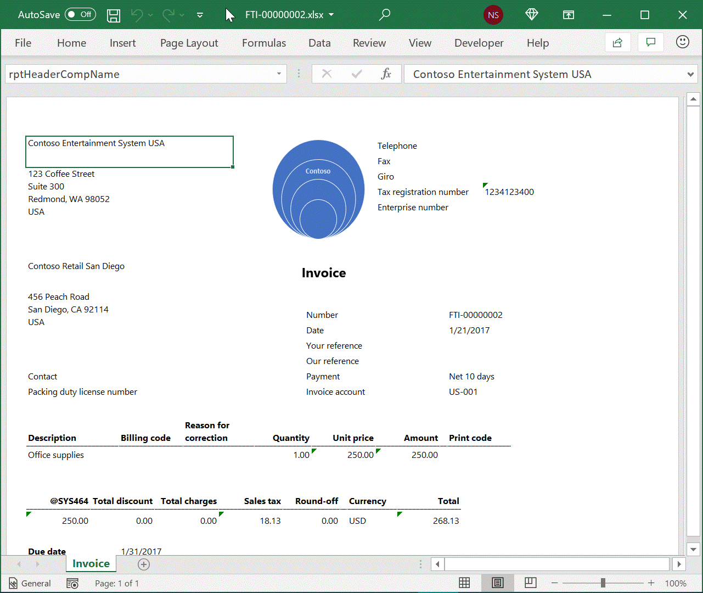
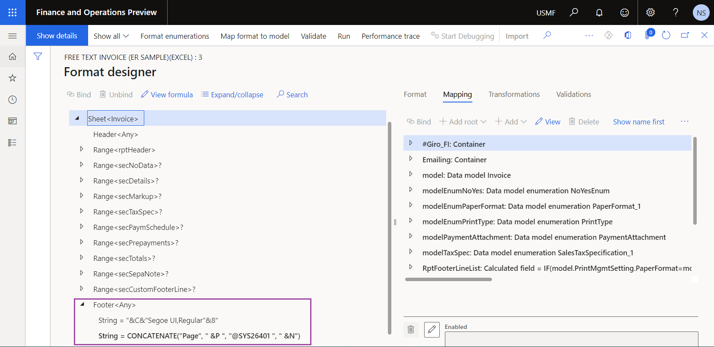
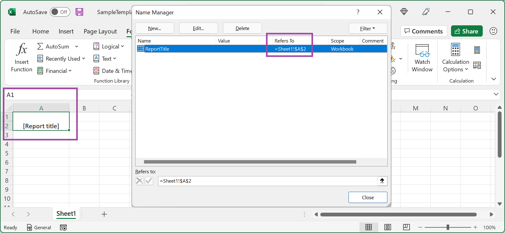
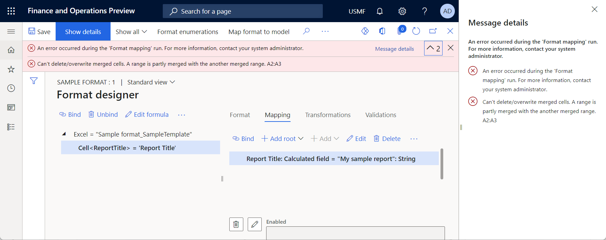
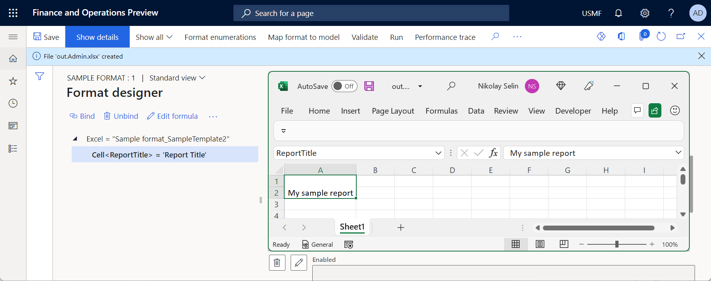

---
# required metadata

title: Design a configuration for generating documents in Excel format
description: This topic describes how to design an Electronic reporting (ER) format to fill in an Excel template, and then generate outbound Excel format documents.
author: NickSelin
ms.date: 05/09/2022
ms.topic: article
ms.prod: 
ms.technology: 

# optional metadata

ms.search.form: EROperationDesigner, ERParameters
# ROBOTS: 
audience: Application User, Developer, IT Pro
# ms.devlang: 
ms.reviewer: kfend
# ms.tgt_pltfrm: 
ms.custom: 220314
ms.assetid: 2685df16-5ec8-4fd7-9495-c0f653e82567
ms.search.region: Global
# ms.search.industry: 
ms.author: nselin
ms.search.validFrom: 2016-06-30
ms.dyn365.ops.version: Version 7.0.0

---

# Design a configuration for generating documents in Excel format

[!include[banner](../includes/banner.md)]

You can design an [Electronic reporting (ER)](general-electronic-reporting.md) format configuration that has an ER format component that you can configure to generate an outbound document in a Microsoft Excel workbook format. Specific ER format components must be used for this purpose.

To learn more about this feature, follow the steps in the topic, [Design a configuration for generating reports in OPENXML format](tasks/er-design-reports-openxml-2016-11.md).

## Add a new ER format

When you add a new ER format configuration to generate an outbound document in an Excel workbook format, you must either select the **Excel** value for the **Format type** attribute of the format or leave the **Format type** attribute blank.

- If you select **Excel**, you can configure the format to generate an outbound document only in Excel format.
- If you leave the attribute blank, you can configure the format to generate an outbound document in any format that is supported by the ER framework.

To configure the ER format component of the configuration, select **Designer** on the Action Pane, and open the ER format component for editing in the ER Operation designer.

## Excel file component

### Manual entry

You must add an **Excel\\File** component to the configured ER format to generate an outbound document in Excel format.

To specify the layout of the outbound document, attach an Excel workbook that has the .xlsx extension to the **Excel\\File** component as the template for outbound documents.

> [!NOTE]
> When you manually attach a template, you must use a [document type](../../../fin-ops-core/fin-ops/organization-administration/configure-document-management.md#configure-document-types) that has been configured for that purpose in the [ER parameters](electronic-reporting-er-configure-parameters.md#parameters-to-manage-documents).

To specify how the attached template will be filled in when you run the configured ER format, you must add nested **Sheet**, **Range**, and **Cell** components to the **Excel\\File** component. Each nested component must be associated with an Excel named item.

### Template import

You can select **Import from Excel** on the **Import** tab of the Action Pane to import a new template into a blank ER format. In this example, an **Excel\\File** component will be created automatically, and the imported template will be attached to it. All required ER components will also be created automatically, based on the list of Excel named items that are discovered.

> [!NOTE]
> If you want to create the optional **Sheet** element in the editable ER format, set the **Create Excel Sheet format element** option to **Yes**.

## Sheet component

The **Sheet** component indicates a worksheet of the attached Excel workbook that must be filled in. The name of the worksheet in an Excel template is defined in the **Sheet** property of this component.

> [!NOTE]
> This component is optional for Excel workbooks that contain a single worksheet.

On the **Mapping** tab of the ER Operation designer, you can configure the **Enabled** property for a **Sheet** component to specify whether the component must be put in a generated document:

- If an expression of the **Enabled** property is configured to return **True** at runtime, or if no expression is configured at all, the appropriate worksheet will be put in the generated document.
- If an expression of the **Enabled** property is configured to return **False** at runtime, the generated document won't contain a worksheet.

## Range component

### Nested components

#### Data typing

The **Range** component can have other nested ER components that are used to enter values in the appropriate ranges.

- If any component of the **Text** group is used to enter values, the value is entered in an Excel range as a text value.

    > [!NOTE]
    > Use this pattern to format entered values based on the locale that is defined in the application.

- If the **Cell** component of the **Excel** group is used to enter values, the value is entered in an Excel range as a value of the data type that is defined by the binding of that **Cell** component. For example, the data type might be **String**, **Real**, or **Integer**.

    > [!NOTE]
    > Use this pattern to enable the Excel application to format entered values based on the locale of the local computer that opens the outbound document.

#### Row handling

The **Range** component can be configured as vertically replicated, so that multiple rows are generated in an Excel worksheet. The rows can be generated by the parent **Range** component or by its nested **Range** components.

In version 10.0.26 and later, you can force a generated worksheet to keep the generated rows on the same page. In the ER format designer, set the **Keep rows together** option to **Yes** for the parent **Range** component in the editable ER format. ER will then try to keep all the content that is generated by that range on the same page. If the height of the content exceeds the remaining space on the current page, a page break will be added, and the content will start at the top of the next new page.

> [!NOTE]
> We recommend that you configure the **Keep rows together** option only for ranges that span the whole width of a generated document.
>
> The **Keep rows together** option is applicable only to **Excel \> File** components that are configured to use an Excel workbook template.
>
> The **Keep rows together** option can be used only when the **Enable usage of EPPlus library in Electronic reporting framework** feature is enabled.
>
> This feature can be used for **Range** components that reside under the **Page** component. However, there is no guarantee that [page footer totals](er-paginate-excel-reports.md#add-data-sources-to-calculate-page-footer-totals) will be correctly calculated by using [Data collection](er-data-collection-data-sources.md) data sources.

To learn how to use this option, follow the example steps in [Design an ER format to keep rows together on the same Excel page](er-keep-excel-rows-together.md).

### Replication

The **Replication direction** property specifies whether and how a range will be repeated in a generated document:

- **No replication** – The appropriate Excel range won't be repeated in the generated document.
- **Vertical** – The appropriate Excel range will be repeated vertically in the generated document. Each replicated range will be put below the original range in an Excel template. The number of repetitions is defined by the number of records in a data source of the **Record list** type that is bound to this ER component.
- **Horizontal** – The appropriate Excel range will be repeated horizontally in the generated document. Each replicated range will be put to the right of the original range in an Excel template. The number of repetitions is defined by the number of records in a data source of the **Record list** type that is bound to this ER component.

    To learn more about horizontal replication, follow the steps in [Use horizontally expandable ranges to dynamically add columns in Excel reports](tasks/er-horizontal-1.md).

### Enabling

On the **Mapping** tab of the ER Operation designer, you can configure the **Enabled** property for a **Range** component to specify whether the component must be put in a generated document:

- If an expression of the **Enabled** property is configured to return **True** at runtime, or if no expression is configured at all, the appropriate range will be filled in in the generated document.
- If an expression of the **Enabled** property is configured to return **False** at runtime, and if this range doesn't represent the entire rows or columns, the appropriate range won't be filled in in the generated document.
- If an expression of the **Enabled** property is configured to return **False** at runtime, and this range represents the entire rows or columns, the generated document will contain those rows and columns as hidden rows and columns.

### Resizing

You can configure your Excel template to use cells to present textual data. To ensure that the whole text in a cell is visible in a generated document, you can configure that cell to automatically wrap the text inside it. You can also configure the row that contains that cell to automatically adjust its height if the wrapped text isn't fully visible. For more information, see the "Wrap text in a cell" section in [Fix data that is cut off in cells](https://support.microsoft.com/office/fix-data-that-is-cut-off-in-cells-e996e213-6514-49d8-b82a-2721cef6144e).

> [!NOTE]
> Because of a known [Excel limitation](https://support.microsoft.com/topic/you-cannot-use-the-autofit-feature-for-rows-or-columns-that-contain-merged-cells-in-excel-34b54dd7-9bfc-6c8f-5ee3-2715d7db4353), even if you configure cells to wrap text, and you configure the rows that contain those cells to automatically adjust their height to fit the wrapped text, you might not be able to use the **AutoFit** and **Wrap text** Excel features for merged cells and the rows that contain them. 

As of Dynamics 365 Finance version 10.0.23, when you're working in a generated document, you can force ER to calculate the height of every row that was configured to automatically fit its height to the content of nested cells whenever that row contains at least one merged cell that was configured to wrap the text inside it. The calculated height is then used to resize the row to ensure that all cells in the row are visible in the generated document.

> [!NOTE]
> Be aware that this functionality might not work as expected when a custom font is used to format a merged cell. Because Excel doesn't embed custom fonts, it doesn't provide information about custom font size. Therefore, the size of the merged cell can be incorrectly estimated.

To start to use this functionality when you run any ER formats that were configured to use Excel templates to generate outbound documents, follow these steps.

1. Go to **Organization administration** \> **Workspaces** \> **Electronic reporting**.
2. On the **Localization configurations** page, in the **Related links** section, select **Electronic reporting parameters**.
3. On the **Electronic reporting parameters** page, on the **Runtime** tab, set the **Autofit row height** option to **Yes**.

When you want to change this rule for a single ER format, update the draft version of that format by following these steps.

1. Go to **Organization administration** \> **Workspaces** \> **Electronic reporting**.
2. On the **Localization configurations** page, in the **Configurations** section, select **Reporting configurations**.
3. On the **Configurations** page, in the configurations tree in the left pane, select an ER configuration that is designed to use an Excel template to generate outbound documents.
4. On the **Versions** FastTab, select the configuration version that has a status of **Draft**.
5. On the Action Pane, select **Designer**.
6. On the **Format designer** page, in the format tree in the left pane, select the Excel component that is linked to an Excel template.
7. On the **Format** tab, in the **Adjust row height** field, select a value to specify whether ER should be forced, at runtime, to change the height of rows in an outbound document that is generated by the edited ER format:

    - **Default** – Use the general setting that is configured in the **Autofit row height** field on the **Electronic reporting parameters** page.
    - **Yes** – Override the general setting, and change the row height at runtime.
    - **No** – Override the general setting, and don't change the row height at runtime.

## Cell component

The **Cell** component is used to fill in Excel named cells, shapes, and pictures. To indicate an Excel named object that must be filled in by a **Cell** ER component, you must specify the name of that object in the **Excel range** property of the **Cell** component.

On the **Mapping** tab of the ER Operation designer, you can configure the **Enabled** property for a **Cell** component to specify whether the object must be filled in in a generated document:

- If an expression of the **Enabled** property is configured to return **True** at runtime, or if no expression is configured at all, the appropriate object will be filled in in the generated document. The binding of this **Cell** component specifies a value that is put in the appropriate object.
- If an expression of the **Enabled** property is configured to return **False** at runtime, the appropriate object won't be filled in in the generated document.

When a **Cell** component is configured to enter a value in a cell, it can be bound with a data source that returns the value of a primitive data type (for example, **String**, **Real**, or **Integer**). In this case, the value is entered in the cell as a value of the same data type.

When a **Cell** component is configured to enter a value in an Excel shape, it can be bound with a data source that returns a value of a primitive data type (for example, **String**, **Real**, or **Integer**). In this case, the value is entered in the Excel shape as the text of that shape. For values of data types that aren't **String**, the conversion to text is done automatically.

> [!NOTE]
> You can configure a **Cell** component to fill in a shape only in cases where a shape text property is supported.

When a **Cell** component is configured to enter a value in an Excel picture, it can be bound with a data source that returns a value of the **Container** data type that represents an image in binary format. In this case, the value is entered in the Excel picture as an image.

> [!NOTE]
> Every Excel picture and shape is considered to be anchored by its upper-left corner to a specific Excel cell or range. If you want to replicate an Excel picture or shape, you must configure the cell or range that it's anchored to as a replicated cell or range.

To learn more about how to embed images and shapes, see [Embed images and shapes in documents that you generate by using ER](electronic-reporting-embed-images-shapes.md).

## Page break component

The **PageBreak** component forces Excel to start a new page. This component isn't required when you want to use Excel's default paging, but you should use it when you want Excel to follow your ER format to structure paging.

## Page component

### Overview

You can use the **Page** component when you want Excel to follow your ER format and structure pagination in a generated outbound document. When an ER format runs components that are under the **Page** component, the required page breaks are automatically added. During this process, the size of the generated content, the page setup of the Excel template, and the paper size that is selected in the Excel template are considered.

If you must split a generated document into different sections, each of which has a different pagination, you can configure several **Page** components in every [Sheet](er-fillable-excel.md#sheet-component) component.

### Structure

If the first component under the **Page** component is a [Range](er-fillable-excel.md#range-component) component where the **Replication direction** property is set to **No replication**, this range is considered the page header for pagination that is based on the settings of the current **Page** component. The Excel range that is associated with this format component is repeated at the top of every page that is generated by using the settings of the current **Page** component.

> [!NOTE]
> For correct pagination, if the [Rows to repeat at top](https://support.microsoft.com/office/repeat-specific-rows-or-columns-on-every-printed-page-0d6dac43-7ee7-4f34-8b08-ffcc8b022409) range is configured in your Excel template, the address of this Excel range must equal the address of the Excel range that is associated with the previously described **Range** component.

If the last component under the **Page** component is a **Range** component where the **Replication direction** property is set to **No replication**, this range is considered the page footer for pagination that is based on the settings of the current **Page** component. The Excel range that is associated with this format component is repeated at the bottom of every page that is generated by using the settings of the current **Page** component.

> [!NOTE]
> For correct pagination, the Excel ranges that are associated with the **Range** components should not be resized at runtime. We don't recommend that you format cells of this range by using the **Wrap text in a cell** and **Autofit row height** Excel [options](https://support.microsoft.com/office/wrap-text-in-a-cell-2a18cff5-ccc1-4bce-95e4-f0d4f3ff4e84).

You can add multiple other **Range** components between the optional **Range** components to specify how a generated document is filled in.

If the set of nested **Range** components under the **Page** component doesn't comply with the previously described structure, a validation [error](er-components-inspections.md#i17) occurs at design time in the ER format designer. The error message informs you that the issue can cause problems at runtime.

> [!NOTE]
> To generate correct output, don't specify a binding for any **Range** component under the **Page** component if the **Replication direction** property for that **Range** component is set to **No replication**, and the range is configured to generate page headers or page footers.

If you want pagination-related summing and counting to compute running totals and totals per page, we recommend that you configure the required [Data collection](er-data-collection-data-sources.md) data sources. To learn how to use the **Page** component to paginate a generated Excel document, complete the procedures in [Design an ER format to paginate a generated document in Excel format](er-paginate-excel-reports.md).

### Limitations

When you use the **Page** component for Excel pagination, you won't know the final number of pages in a generated document until the pagination is completed. Therefore, you can't calculate the total number of pages by using ER formulas and print the correct number of pages of a generated document on any page before the last page.

> [!TIP]
> To achieve this result in an Excel header or footer by using the special Excel [formatting](/office/vba/excel/concepts/workbooks-and-worksheets/formatting-and-vba-codes-for-headers-and-footers) for headers and footers.

Configured **Page** components aren't considered when you update an Excel template in the editable format in Dynamics 365 Finance version 10.0.22. This functionality is considered for further releases of Finance.

If you configure your Excel template to use [conditional formatting](/office/dev/add-ins/excel/excel-add-ins-conditional-formatting), it might not work as expected in some cases.

### Applicability

The **Page** component works for the [Excel file](er-fillable-excel.md#excel-file-component) format component only when that component is configured to use a template in Excel. If you [replace](tasks/er-design-configuration-word-2016-11.md) the Excel template with a Word template and then run the editable ER format, the **Page** component will be ignored.

The **Page** component works only when the **Enable usage of EPPlus library in Electronic reporting framework** feature is enabled. An exception is thrown at runtime if ER tries to process the **Page** component while this feature is disabled.

> [!NOTE]
> An exception is thrown at runtime if an ER format processes the **Page** component for an Excel template that contains at least one formula that refers to a cell that isn't valid. To help prevent runtime errors, fix the Excel template as described in [How to correct a #REF! error](https://support.microsoft.com/office/how-to-correct-a-ref-error-822c8e46-e610-4d02-bf29-ec4b8c5ff4be).

## Footer component

The **Footer** component is used to fill in footers at the bottom of a generated worksheet in an Excel workbook.

> [!NOTE]
> You can add this component for every **Sheet** component to specify different footers for different worksheets in a generated Excel workbook.

When you configure an individual **Footer** component, you can use the **Header/footer appearance** property to specify the pages that the component is used for. The following values are available:

- **Any** – Run the configured **Footer** component for any page of the parent Excel worksheet.
- **First** – Run the configured **Footer** component for only the first page of the parent Excel worksheet.
- **Even** – Run the configured **Footer** component for only the even pages of the parent Excel worksheet.
- **Odd** – Run the configured **Footer** component for only the odd pages of the parent Excel worksheet.

For a single **Sheet** component, you can add several **Footer** components, each of which has a different value for the **Header/footer appearance** property. In this way, you can generate different footers for different type of pages in an Excel worksheet.

> [!NOTE]
> Make sure that each **Footer** component that you add to a single **Sheet** component has a different value for the **Header/footer appearance** property. Otherwise, a [validation error](er-components-inspections.md#i16) occurs. The error message that you receive notifies you about the inconsistency.

Under the added **Footer** component, add the required nested components of the **Text\\String**, **Text\\DateTime**, or other type. Configure the bindings for those components to specify how your page footer is filled in.

You can also use special [formatting codes](/office/vba/excel/concepts/workbooks-and-worksheets/formatting-and-vba-codes-for-headers-and-footers) to correctly format the content of a generated footer. To learn how to use this approach, follow the steps in [Example 1](#example-1), later in this topic.

> [!NOTE]
> When you configure ER formats, be sure to consider the Excel [limit](https://support.microsoft.com/office/excel-specifications-and-limits-1672b34d-7043-467e-8e27-269d656771c3) and the maximum number of characters for a single header or footer.

## Header component

The **Header** component is used to fill in headers at the top of a generated worksheet in an Excel workbook. It's used like the **Footer** component.

## Edit an added ER format

### Update a template

You can select **Update from Excel** on the **Import** tab of the Action Pane to import an updated template into an editable ER format. During this process, a template of the selected **Excel\\File** component will be replaced by a new template. The content of the editable ER format will be synced with the content of the updated ER template.

- A new ER format component will automatically be created for every Excel name if the ER format component isn't found in the editable format.
- Every ER format component will be deleted from the editable ER format if the appropriate Excel name isn't found for it.

> [!NOTE]
> Set the **Create Excel Sheet format element** option to **Yes** if you want to create the optional **Sheet** element in the editable ER format.
>
> If the editable ER format originally contained **Sheet** elements, we recommend that you set the **Create Excel Sheet format element** option to **Yes** when you import an updated template. Otherwise, all nested elements of the original **Sheet** element will be created from scratch. Therefore, all bindings of the re-created format elements will be lost in the updated ER format.

In version 10.0.28 and later, you can use the **Update Excel Header and Excel Footer format elements** option.

- When you set this option to **No**, the Excel Header and Excel Footer format elements remain unchanged, even if the corresponding headers or footers have been updated in the worksheets of the imported template in the Excel workbook format.
- When you set this option to **Yes**, Excel Header and Excel Footer format elements will change when the corresponding headers or footers are updated in worksheets of the imported template in the Excel workbook format.

    - If the structure of a worksheet header or footer hasn't been changed, or if it has only been appended, the structure of the corresponding Excel Header or Excel Footer format element is updated. Bindings of format elements that are nested under this Excel Header or Excel Footer format element will be preserved.
    - If the structure of a worksheet header or footer has been changed, the corresponding Excel Header or Excel Footer format element is re-created. Bindings of format elements that are nested under this Excel Header or Excel Footer format element will be removed.

To learn more about this feature, follow the steps in [Modify Electronic reporting formats by reapplying Excel templates](modify-electronic-reporting-format-reapply-excel-template.md).

## Validate an ER format

When you validate an ER format that can be edited, a consistency check is done to make sure that the Excel name is present in the Excel template that is currently used. You will be notified about any inconsistencies. For some inconsistencies, the option to automatically fix issues will be offered.

## Control the calculation of Excel formulas

When an outbound document in a Microsoft Excel workbook format is generated, some cells of this document might contain Excel formulas. When the **Enable usage of EPPlus library in Electronic reporting framework** feature is enabled, you can control when the formulas are calculated by changing the value of the **Calculation Options** [parameter](https://support.microsoft.com/office/change-formula-recalculation-iteration-or-precision-in-excel-73fc7dac-91cf-4d36-86e8-67124f6bcce4#ID0EAACAAA=Windows) in the Excel template that is being used:

- Select **Automatic** to recalculate all dependent formulas every time a generated document is appended by new ranges, cells, etc.

    > [!NOTE]
    > This might cause a performance issue for Excel templates that contain multiple related formulas.

- Select **Manual** to avoid formula recalculation when a document is generated.

    > [!NOTE]
    > Formula recalculation is manually forced when a generated document is opened for preview using Excel.
    > Don't use this option if you configure an ER destination that assumes the usage of a generated document without its preview in Excel (PDF conversion, emailing, etc.) because the generated document might not contain values in cells that contain formulas.

## Example 1: Format footer content

1. Use the provided ER configurations to [generate](er-generate-printable-fti-forms.md) a printable free text invoice (FTI) document.
2. Review the footer of the generated document. Notice that it contains information about the current page number and the total number of pages in the document.

    

3. In the ER format designer, [open](er-generate-printable-fti-forms.md#features-that-are-implemented-in-the-sample-er-format) the sample ER format for review.

    The footer of the **Invoice** worksheet is generated based on the settings of two **String** components that reside under the **Footer** component:

    - The first **String** component fills in the following special formatting codes to force Excel to apply specific formatting:

        - **&C** – Align the footer text in the center.
        - **&"Segoe UI,Regular"&8** – Present the footer text in the "Segoe UI Regular" font at a size of 8 points.

    - The second **String** component fills in the text that contains the current page number and the total number of pages in the current document.

    

4. Customize the sample ER format to modify the current page footer:

    1. [Create](er-quick-start2-customize-report.md#DeriveProvidedFormat) a derived **Free text invoice (Excel) custom** ER format that is based on the sample ER format.
    2. Add the first new pair of **String** components for the **Footer** component of the **Invoice** worksheet:

        1. Add a **String** component that aligns the company name on the left and presents it in 8-point "Segoe UI Regular" font (**"&L&"Segoe UI,Regular"&8"**).
        2. Add a **String** component that fills in the company name (**model.InvoiceBase.CompanyInfo.Name**).

    3. Add the second new pair of **String** components for the **Footer** component of the **Invoice** worksheet:

        1. Add a **String** component that aligns the processing date on the right and presents it in 8-point "Segoe UI Regular" font (**"&R&"Segoe UI,Regular"&8"**).
        2. Add a **String** component that fills in the processing date in a custom format (**"&nbsp;"&DATEFORMAT(SESSIONTODAY(), "yyyy-MM-dd")**).

        

    4. [Complete](er-quick-start2-customize-report.md#CompleteDerivedFormat) the draft version of the derived **Free text invoice (Excel) custom** ER format.

5. [Configure](er-generate-printable-fti-forms.md#configure-print-management) Print management to use the derived **Free text invoice (Excel) custom** ER format instead of the sample ER format.
6. Generate a printable FTI document, and review the footer of the generated document.

    

## Example 2: Fixing the merged cells EPPlus issue

You can run an ER format to generate an outbound document in an Excel workbook format. When the **Enable usage of EPPlus library in Electronic reporting framework** feature is enabled in the **Feature management** workspace, the [EPPlus library](https://www.nuget.org/packages/epplus/4.5.2.1) is used to make Excel output. However, because of known [Excel behavior](https://answers.microsoft.com/en-us/msoffice/forum/all/deleting-a-range-of-cells-that-includes-merged/8601462c-4e2c-48e0-bd23-848eecb872a9) and a limitation of the EPPlus library, you might encounter the following exception: "Can't delete/overwrite merged cells. A range is partly merged with the another merged range." To learn what kind of Excel templates might cause this exception and how you can fix the issue, complete the following example.

1. In the Excel desktop application, create a new Excel workbook.
2. On worksheet **Sheet1**, add the **ReportTitle** name for cell **A2**.
3. Merge cells **A1** and **A2**.

    

3. On the **Configurations** page, [add a new ER format](er-fillable-excel.md#add-a-new-er-format) to generate an outbound document in an Excel workbook format.
4. On the **Format designer** page, [import](er-fillable-excel.md#template-import) the designed Excel workbook into the added ER format as a new template for outbound documents.
5. On the **Mapping** tab, configure the binding for the **ReportTitle** component of the [Cell](er-fillable-excel.md#cell-component) type.
6. Run the configured ER format. Notice that the following exception is thrown: "Can't delete/overwrite merged cells. A range is partly merged with the another merged range."

    

You can fix the issue in either of the following ways:

- **Easier but not recommended:** In the **Feature management** workspace, turn off the **Enable usage of EPPlus library in Electronic reporting framework** feature. Although this approach is easier, you might experience other issues if you use it, because some ER functionality is supported only when the **Enable usage of EPPlus library in Electronic reporting framework** feature is enabled.
- **Recommended:** Follow these steps:

    1. In the Excel desktop application, modify the Excel workbook in one of the following ways:

        - On worksheet **Sheet1**, unmerge cells **A1** and **A2**.
        - Change the reference for the **ReportTitle** name from **=Sheet1!$A$2** to **=Sheet1!$A$1**.

        

    2. On the **Format designer** page, [import](er-fillable-excel.md#template-import) the modified Excel workbook into the editable ER format to update the existing template.
    3. Run the modified ER format.

        

## Limitations

### Known EPPlus library limitations

#### External data sources

If one of your templates contains a PivotTable that is based on a PowerPivot model that refers to an [external data source](https://support.microsoft.com/office/create-a-pivottable-with-an-external-data-source-db50d01d-2e1c-43bd-bfb5-b76a818a927b), and the **Enable usage of EPPlus library in Electronic reporting framework** feature is enabled, you receive the following error message when you run an ER format that uses that template to generate an outbound document in Excel format: "The cachesource is not a worksheet." To fix this issue, you have the following options:

- **Recommended:** Redesign the Excel solution that you're using:

    1. Isolate the part that contains pivots in a separate Excel workbook (workbook A). 
    2. Use ER to generate a second Excel workbook (workbook B) from Finance that has the required details. 
    3. Refer to workbook B in workbook A as soon as workbook B is generated.

- Turn off the feature, **Enable usage of EPPlus library in Electronic reporting framework** to use an option other than EPPlus. 

## Additional resources

[Electronic Reporting overview](general-electronic-reporting.md)

[Design a configuration for generating reports in OPENXML format](tasks\er-design-reports-openxml-2016-11.md)

[Modify Electronic reporting formats by reapplying Excel templates](modify-electronic-reporting-format-reapply-excel-template.md)

[Use horizontally expandable ranges to dynamically add columns in Excel reports](tasks/er-horizontal-1.md)

[Embed images and shapes in documents that you generate by using ER](electronic-reporting-embed-images-shapes.md)

[Configure Electronic reporting (ER) to pull data into Power BI](general-electronic-reporting-report-configuration-get-data-powerbi.md)

[!INCLUDE[footer-include](../../../includes/footer-banner.md)]
