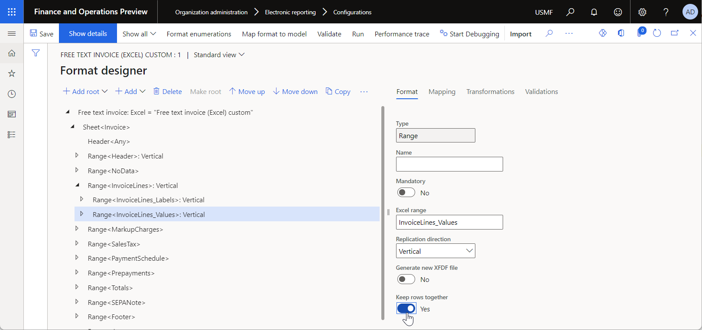
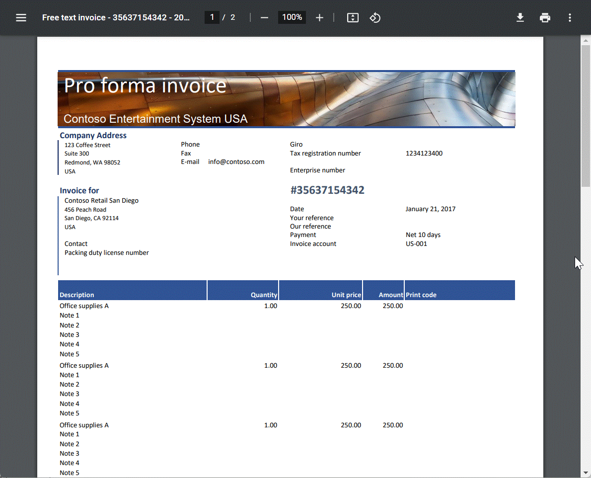

---
# required metadata

title: Design an ER format to keep rows together on the same Excel page
description: This topic explains how to design an Electronic reporting (ER) format that keeps rows together on the same Microsoft Excel page.
author: NickSelin
ms.date: 02/22/2022
ms.topic: article
ms.prod: 
ms.technology: 

# optional metadata

ms.search.form: EROperationDesigner
# ROBOTS: 
audience: Application User, Developer, IT Pro
# ms.devlang: 
ms.reviewer: kfend
# ms.tgt_pltfrm: 
ms.custom: 220314
ms.assetid: 
ms.search.region: Global
# ms.search.industry: 
ms.author: nselin
ms.search.validFrom: 2022-03-01
ms.dyn365.ops.version: Version 10.0.26

---

# Design an ER format to keep rows together on the same Excel page

[!include [banner](../includes/banner.md)]

This topic explains how a user in the System Administrator or Electronic Reporting Functional Consultant role can configure an [Electronic reporting (ER)](general-electronic-reporting.md) [format](er-overview-components.md#format-component) to generate outbound documents in Microsoft Excel and manage document pagination keeping created rows together on the same page.

In this example, you will modify the Microsoft-provided ER format that is used to print the free text invoice in Excel format. Your modifications will let you manage the pagination of a generated free text invoice report to keep rows of a single invoice line on the same page when it is possible.

The procedures in this topic can be completed in the **USMF** company. No coding is required.

In this example, you will create required ER [configurations](general-electronic-reporting.md#Configuration) for the sample company, **Litware, Inc.** Make sure that the configuration provider for the **Litware, Inc.** (http://www.litware.com) sample company is listed for the ER framework, and that it's marked as active. If this configuration provider isn't listed, or if it isn't marked as active, follow the steps in the [Create a configuration provider and mark it as active](tasks/er-configuration-provider-mark-it-active-2016-11.md) topic.

## Enter a new free text invoice

1.  Follow the steps in [Create a free text invoice](../../../finance/accounts-receivable/create-free-text-invoice-new.md#create-a-free-text-invoice-1) to add a new free text invoice.
    1.  Add a single line to the added invoice.
    2.  Add five notes for the added invoice line.
        
        

2.  Follow the steps in [Copy lines](../../../finance/accounts-receivable/create-free-text-invoice-new.md#copy-lines) to copy the added line and create 5 additional invoice lines.

    

## Configure the ER framework

Follow the steps in [Configure the ER framework](er-quick-start2-customize-report.md#ConfigureFramework) to set up the minimal set of ER parameters. You must complete this setup before you start to use the ER framework to design a custom version of a standard ER format.

## Import the standard ER format configuration

Follow the steps in [Import the standard ER format configuration](er-quick-start2-customize-report.md#ImportERSolution1) to add the standard ER configurations to your current instance of Dynamics 365 Finance. For example, import version **252.116** of the **Free text invoice (Excel)** format configuration. Base version **252** of the base **Invoice model** configuration is automatically imported from the repository along with the required **Invoice model mapping** configuration.

## Set up print management to use the standard ER format

Follow the steps in [Set up print management](er-embed-images-header-footer-excel-reports.md#ConfigurePrintManagement1) to configure print management of the **Accounts receivable** module for printing free text invoices by using the standard ER format.

## Configure a format destination for the standard ER format

Follow the steps in [Configure a format destination for on-screen preview]er-quick-start1-new-solution.md#ConfigureDestination) to configure the [Screen](er-destination-type-screen.md) ER destination of the standard ER format for converting a generated report to PDF and previewing it in a new tab of using web browser.

## Print a free text invoice by using the standard ER format

1.  Follow the steps in [Print a free text invoice](er-embed-images-header-footer-excel-reports.md#ProcessInvoice1) to use the standard ER format for generation of the free text invoice report in Excel format for the added invoice.

2.  Download the generated Excel workbook that is offered by using web browser and open it for review in the Excel desktop application.

    

    > [!TIP]
    > Notice that the 6th line of this invoice starts on the 1st page of the report and continues on the 2nd page of it. So, the last note is shown on the 2nd page and it is not obvious that it belongs to the 6th invoice line. The page break in the middle of the invoice line content complicates this document reading.

Complete the remaining steps of this example to learn how you can tune the standard ER format to improve the look and readability of your invoice report by keeping the entire content of a single invoice line on the same page.

## Create a custom format

Follow the steps in [Create a custom format](er-embed-images-header-footer-excel-reports.md#DeriveProvidedFormat) to derive the imported ER format and create your **Free text invoice (Excel) custom** ER configuration that is available for editing and modification.

## Edit the custom format

1.  Follow the steps in [Create a custom format](er-embed-images-header-footer-excel-reports.md#ConfigureDerivedFormat) to open the derived ER format for editing in the ER format designer.
2.  On the **Format designer** page, in the format components tree in the left pane, select the **Free text invoice \> Sheet \> InvoiceLines \> InvoiceLines_Values** component.
3.  On the **Format** tab, set the **Keep rows together** option to **Yes**.

    

4.  Select **Save** and close the current page.

## Mark the custom format as runnable

Follow the steps in [Mark the custom format as runnable](er-embed-images-header-footer-excel-reports.md#MarkFormatRunnable) to make the modified version of the custom ER format runnable.

## Set up print management to use the custom ER format

Follow the steps in [Set up print management](er-embed-images-header-footer-excel-reports.md#ConfigurePrintManagement2) to configure print management of the **Accounts receivable** module for printing free text invoices by using the custom ER format.

## Configure a format destination for the custom ER format

Follow the steps in [Configure a format destination for on-screen preview]er-quick-start1-new-solution.md#ConfigureDestination) to configure the **Screen** ER destination of the custom ER format for converting a generated report to PDF and previewing it in a new tab of using web browser.

## Print a free text invoice by using the custom ER format

1.  Follow the steps in [Print a free text invoice](er-embed-images-header-footer-excel-reports.md#ProcessInvoice2) to use the custom ER format for generation of the free text invoice report in Excel format for the added invoice.

2.  Download the generated Excel workbook that is offered by using web browser and open it for review in the Excel desktop application.

    

    > [!TIP]
    > Notice that the 6th line of this invoice starts on the 2nd page and all representing this invoice line Excel rows are shown together on this page.

## Additional resources

[Design a configuration for generating documents in Excel format](er-fillable-excel.md)

[!INCLUDE[footer-include](../../../includes/footer-banner.md)]
