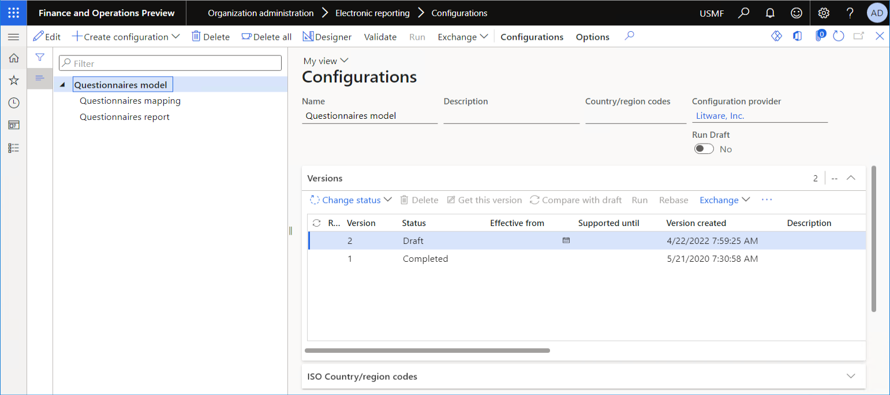
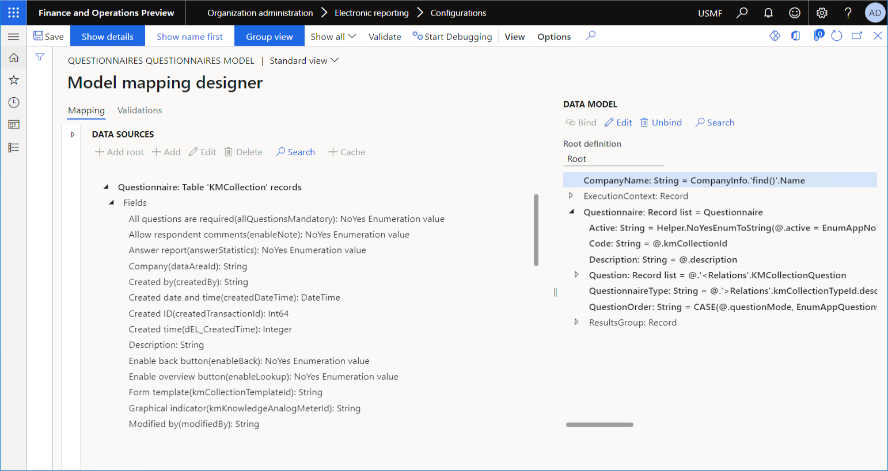
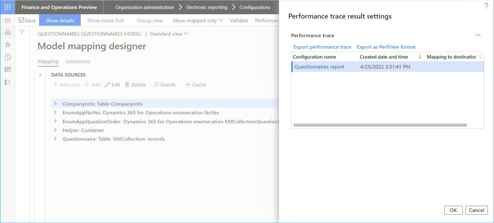
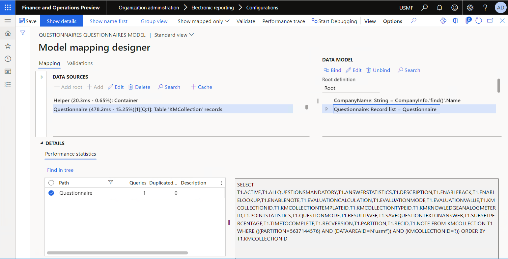
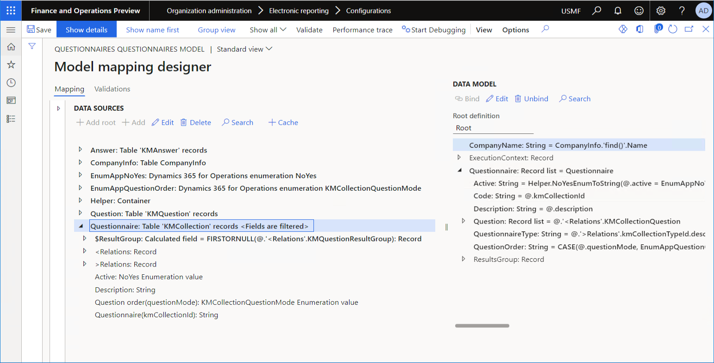

---
# required metadata

title: Improve performance of ER solutions by reducing the number of table fields that are fetched at runtime
description: This topic provides information about how to improve performance of ER solutions by reducing the number of table fields that are fetched at runtime.
author: NickSelin
ms.date: 04/25/2022
ms.topic: article
ms.prod: 
ms.technology: 

# optional metadata

ms.search.form: ERModelMappingDesigner, EROperationDesigner
# ROBOTS: 
audience: Application User, Developer, IT Pro
# ms.devlang: 
ms.reviewer: kfend
# ms.tgt_pltfrm: 
ms.custom: 
ms.assetid: 
ms.search.region: Global
# ms.search.industry: 
ms.author: nselin
ms.search.validFrom: 
ms.dyn365.ops.version: 10.0.28

---

# Improve performance of ER solutions by reducing the number of table fields that are fetched at runtime

[!include[banner](../includes/banner.md)]

You can design [Electronic reporting](general-electronic-reporting.md) (ER) [formats](er-overview-components.md#format-components-for-outgoing-electronic-documents) to generate outgoing documents in various formats. When a document is generated, an ER format calls data sources that were configured in a corresponding ER [model mapping](er-overview-components.md#model-mapping-component). To configure access to application tables, queries, or entities for records retrieval, you can use ER data sources of the *Table records* type. By default, a data source of the *Table records* type retrieves values of all fields of the requested records. You can configure this data source to fetch the only fields that are required for the running ER format. It will reduce memory consumption of an application server that performs data retrieval and further records caching.

To learn more about how to limit the list of fetched fields of data sources of the *Table records* type, complete the example in this topic.

## Example: Improve performance of ER solutions by reducing the number of table fields that are fetched at runtime

The following steps explain how a user in the System administrator or Electronic reporting developer role can configure an ER model mapping to fetch the only fields that are required for the running ER format for reducing consumption of application server memory.

These steps can be performed in the **USMF** company in Microsoft Dynamics 365 Finance. No coding is required. 

To complete this example, you must have access to the **USMF** company for one of the following roles:

-   Electronic reporting functional consultant
-   System administrator

In this example, you will use the provided ER [configurations](general-electronic-reporting.md#Configuration) for the **Litware, Inc.** sample company. Make sure that the configuration provider for the **Litware, Inc.** (`http://www.litware.com`) sample company is listed for the ER framework, and that it's marked as **Active**. If this configuration provider isn't listed, or if it isn't marked as **Active**, follow the steps in [Create a configuration provider and mark it as active](tasks/er-configuration-provider-mark-it-active-2016-11.md).

### Configure the ER framework

Follow the steps in [Configure the ER framework](er-quick-start2-customize-report.md#ConfigureFramework) to set up the minimal set of ER parameters. You must complete this setup before you start to use the ER framework to modify data sources of the provided ER solution.

### Import the sample ER configurations

If you haven't yet completed the example in the [Design a new ER solution to print a custom report](er-quick-start1-new-solution.md) topic, download and store locally as XML files the following configurations of the provided ER solution.

| Content description            | File name                              |
|--------------------------------|----------------------------------------|
| ER data model configuration    | [Questionnaires model.version.1.xml](https://download.microsoft.com/download/b/6/3/b633bd34-d200-4422-96d9-8f62eb5218f8/Questionnaires_model.version.1.xml) |
| ER model mapping configuration | [Questionnaires mapping.version.1.1.xml](https://download.microsoft.com/download/7/b/2/7b258e4e-4bd5-46a4-8114-27419ae4acd8/Questionnaires_mapping.version.1.1.xml) |
| ER format configuration        | [Questionnaires format.version.1.1.xml](https://download.microsoft.com/download/1/b/a/1ba39ec2-257a-44d8-972f-25bf7d18fb41/Questionnaires_format.version.1.1.xml) |

Then, upload the configurations of the provided ER solution to your Finance instance.

1.  Go to **Organization administration** \> **Workspaces** \> **Electronic reporting**.
2.  Select **Reporting configurations**.
3.  On the **Configurations** page, import the ER data model configuration:

    1.  Select **Exchange**, and then select **Load from XML file**.
    2.  Select **Browse**, find and select the **Questionnaires model.version.1.xml** file, and then select **OK**.

4. Import the ER model mapping configuration:

    1.  Select **Exchange**, and then select **Load from XML file**.
    2.  Select **Browse**, find and select the **Questionnaires mapping.1.1.xml** file, and then select **OK**.

5. Import the ER format configuration:

    1.  Select **Exchange**, and then select **Load from XML file**.
    2.  Select **Browse**, find and select the **Questionnaires format.1.1.xml** file, and then select **OK**.

6.  In the configuration tree, expand **Questionnaires model**.
7.  Review the list of imported ER configurations in the configuration tree.

    

### Review the provided ER model mapping

1.  On the **Configurations** page, select **Questionnaires mapping**.
2.  In the Action Pane, select **Designer**.
3.  On the **Model to datasource mapping** page, select **Designer**.
4.  On the **Model mapping designer** page, in the Action Pane, toggle on **Group view**.
5.  On the **DATA MODEL** pane, expand **Questionnaire**.

    > [!TIP]
    > Notice that the **Questionnaire** data source has been configured to access the `KMCollection` application table.

6.  On the **DATA SOURCES** pane, expand **Table records \> Questionnaire \> Fields**.

    

    > [!TIP]
    > Notice how many fields are exposed by the **Questionnaire** data source of the *Table records* type from the `KMCollection` application table.

7.  In the Action Pane, toggle off **Group view** and select **Show all \> Show mapped only**.

    

    > [!TIP]
    > Notice that a few fields of the `KMCollection` application table are really used to fill in the **Questionnaire** record list in the ER data model:
    >
    >   -   `Active`
    >   -   `Description`
    >   -   `questionMode`
    >   -   `kmCollectionId`

### Turn on the ER performance trace

[Turn on](trace-execution-er-troubleshoot-perf.md#turn-on-the-er-performance-trace) the ER user parameters to enable tracing of execution of ER components.

### Run the provided ER format by using the provided model mapping

[Run](er-quick-start1-new-solution.md#RunFormatFromER) the provided ER format for a single questionnaire from the **Configurations** page.

### Review the execution trace of the first run

1.  Go to **Organization administration** \> **Electronic reporting \> Configurations**.
2.  On the **Configurations** page, expand **Questionnaires model**.
3.  Select **Questionnaires mapping**.

    > [!TIP]
    > The details of the **Versions** FastTab indicate that you selected the draft version of the **Questionnaires mapping** configuration. So, you can modify the content of this model mapping.

4.  In the Action Pane, select **Designer**.
5.  On the **Model to datasource mapping** page, select **Designer**.
6.  On the **Model mapping designer** page, in the Action Pane, select **Performance trace**.
7.  On the **Performance trace result settings** dialog box, select the trace that has been generated during the last format's run.

    

8.  Select **OK**.
9.  On the **Details** FastTab, filter the **Questionnaire** path that points to the **Questionnaire** data source.
10. Review the details of the database query that has been generated when the **Questionnaire** data source has been called.

    > [!NOTE]
    > Notice that all fields of the `KMCollection` application table were fetched at runtime when the **Questionnaire** data source has been called.

    

### Modify the provided ER model mapping

1.  On the **Model mapping designer** page, on the **DATA SOURCES** pane, select the **Questionnaire** data source.
2.  On the **DATA SOURCES** pane, select **Edit**.
3.  On the **Data source properties** dialog box, select **Select field** to specify the list of fields of the referred `KMCollection` application table that will be fetched at runtime when the editable **Questionnaire** data source is called.

    

4.  On the **Select fields** page, select **Autofill**.

    > [!TIP]
    > When you select the **Autofill** option, the **Selected field** list is automatically filled in based on already configured artefacts of this model mapping. So, every field and relation of the referred table will be added to this list if this field or relation is mentioned in any binding, formula, or data source of this model mapping.

    

5.  Select **Save** and close the **Select fields** page.
6.  Select **OK** to store changes of this data source settings.
7.  In the Action Pane, select **Show all**

    > [!TIP]
    > Notice that the **\<Fields are filtered\>** sign indicates that the **Questionnaire** data source has been configured to fetch the limited number of fields from the referred application table.

    

8.  Select **Save** to store changes of the editable model mapping.

    > [!TIP]
    > Notice that ER analyzes the added relations at runtime and add to the database query all fields that are used in the added relations even when those fields were not explicitly added at design time to the list of fetched fields.

### Run the provided ER format by using the updated model mapping

[Run](er-quick-start1-new-solution.md#RunFormatFromER) the provided ER format for a single questionnaire from the **Configurations** page.

### Review the execution trace of the second run

1.  Go to **Organization administration** \> **Electronic reporting \> Configurations**.
2.  On the **Configurations** page, expand **Questionnaires model**.
3.  Select **Questionnaires mapping**.
4.  In the Action Pane, select **Designer**.
5.  On the **Model to datasource mapping** page, select **Designer**.
6.  On the **Model mapping designer** page, in the Action Pane, select **Performance trace**.
7.  On the **Performance trace result settings** dialog box, select the trace that has been generated during the last format's run.
8.  Select **OK**.
9.  On the **Details** FastTab, filter the **Questionnaire** path that points to the **Questionnaire** data source.
10. Review the details of the database query that has been generated when the **Questionnaire** data source has been called.

    > [!NOTE]
    > Notice that the only fields that are needed to fill in the data source were fetched at runtime from the `KMCollection` application table when the **Questionnaire** data source has been called.

    > [!TIP]
    > Certain fields like the partition id, data area id, record id, etc. are automatically added by the data management framework of the Finance application.

    

    > [!TIP]
    > Use this technique to reduce the number of fetched records when you must reduce memory consumption by the running ER model mapping and ER format.

## Limitations

Be aware that when you limited the number of fetched fields for a data source of the *Table records* type, you cannot use methods of an application table this data source refers to as the application metadata does not provide information about table fields that are needed to call those methods.

## Usage notes

The **Autofill** option automatically adds fields but it does not automatically delete earler added fields even when they are not used any more in bindings, formulas, and data sources of the editable model mapping.

When you select the **Autofill** option, ER analyzes bindings, formulas, and data sources that the editable model mapping had when you opened it for editing. So, if you changed bindings, formulas, and data sources of the editable model mapping and want to use the **Autofill** option, close the model mapping designer and re-open it again for editing your model mapping. 

## Additional resources

- [Trace the execution of ER formats to troubleshoot performance issues](trace-execution-er-troubleshoot-perf.md)
- [Troubleshooting performance issues in ER configurations](er-troubleshoot-perf-issues-in-configurations.md)

[!INCLUDE[footer-include](../../../includes/footer-banner.md)]
