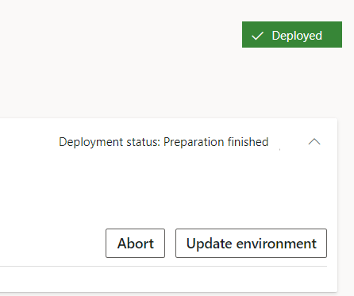

---
# required metadata

title: Upgrade the SQL Server instance that your environment is using
description: This topic explains how to upgrade the SQL Server instance that your environment is using.
author: faix
ms.date: 10/05/2021
ms.topic: article
ms.prod: 
ms.technology: 

# optional metadata

# ms.search.form: [Operations AOT form name to tie this topic to]
audience: IT Pro
# ms.devlang: 
ms.reviewer: sericks
# ms.tgt_pltfrm: 
# ms.custom: [used by loc for topics migrated from the wiki]
ms.search.region: Global
# ms.search.industry: [leave blank for most, retail, public sector]
ms.author: osfaixat
ms.search.validFrom: 2021-11-18
ms.dyn365.ops.version: Platform update 45 

---

# Upgrade the SQL Server instance that your environment is using

This topic covers how you can upgrade the SQL Server instance or cluster that your environment is using. You'll need to go through this process if you want to upgrade from one major version of SQL to another and don't want to do an in-place upgrade. 

## Prerequisites for upgrading the version of Microsoft SQL Server

### Upgrade from Microsoft SQL Server 2016 to Microsoft SQL Server 2019

Your environment must be on application version 10.0.21 or above. Additionally, the LocalAgent present in your environment also has to be on version 2.7.0 or higher.

## Preparation

1. Deploy your new SQL Server instance into a VM, or create a new SQL cluster.

1. Ensure you configure the new instance or cluster according to our documentation [Set up SQL Server](./setup-deploy-on-premises-pu41.md#setupsql)

1. If you are using self-signed certificates, ensure they have been imported into the nodes within the Service Fabric Cluster.

## Database operations

1. At this point, ensure that users aren't connected as your downtime will start.

1. Back up all of your databases from your current SQL Server instance or cluster.

1. Restore the database backups into the new SQL Server instance or cluster.

1. After restoring your databases, run the scripts in [Configure the databases](./setup-deploy-on-premises-pu41.md#configuredb).

## Upgrade other SQL Server components

All of your SQL Server components across an environment must be on the same version.

1. On your AOS nodes, upgrade the SSIS component.

1. On your BI nodes, upgrade the SSRS and database engine.

## Update the Local Agent

1. Clean up the Local Agent by running the following command from an orchestrator node:

    ```powershell
    LocalAgentCLI.exe Cleanup <path of localagent-config.json>
    ```

1. In [LCS](https://lcs.dynamics.com) update your connector configuration with the new FQDN of the SQL Server instance or cluster.

    

1. Download the new configuration file.

1. In the configuration file that was just download you have to update the SQL Server version. The version you specify must match the version of SQL Server present in the environment. For more information, see [Deployment configurations for the local agent](./onprem-localagent-options.md).

    ```json
    "deploymentOptions": {
        ...
        },
        "sqlServerVersion" : {
            "value": "2019"
        },
        ...
    }
    ```

1. Install the local agent with the new config file.

    ```powershell
    LocalAgentCLI.exe Install <path of the new localagent-config.json>
    ```

## Update your environment settings

1. In [LCS](https://lcs.dynamics.com), click the "Full Details" link for the environment you want to update the SQL Server.

1. Select **Maintain** and then select **Update Settings**.

1. When updating the settings, update the FQDN of the new SQL Server instance or cluster.

    

1. Select **Prepare**.

1. After downloading and preparation is complete, the **Update environment** button will display.

	

1. Select **Update environment** to start updating your environment.
     
1. The environment will now be redeployed and configured to interact with the new version of SQL Server.