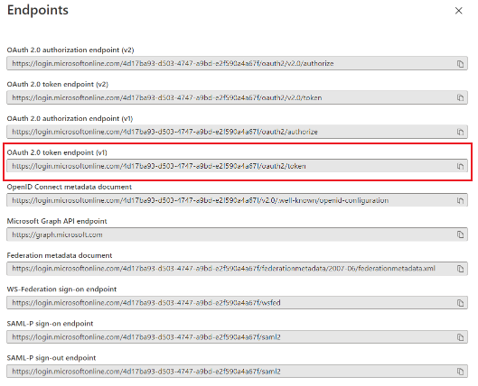
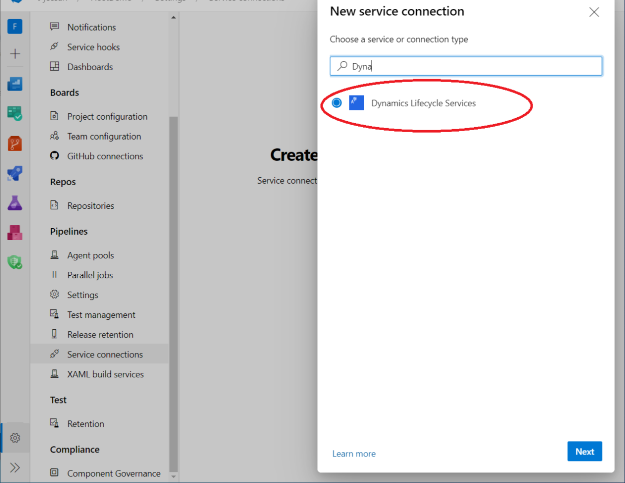
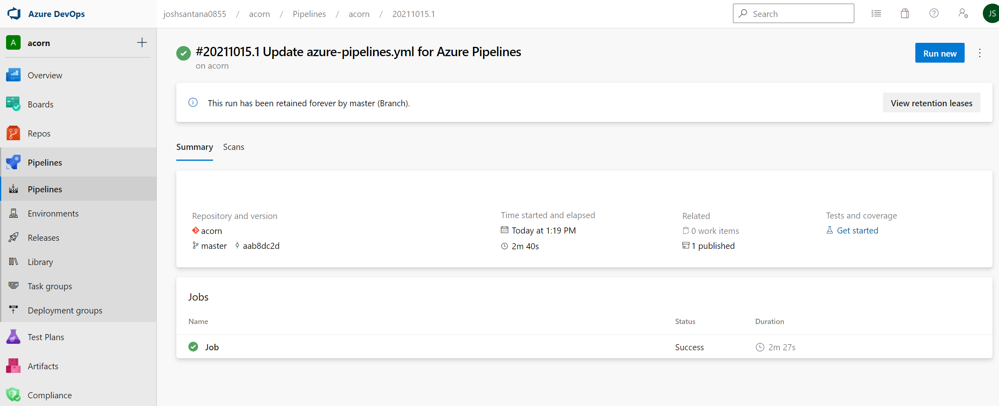

---
# required metadata

title: Dynamics 365 Translation Service DevOps extension tutorial
description: This tutorial explains how to integrate the Dynamics 365 Translation Service DevOps extension into your Azure DevOps workflow.
author: joshsantana
ms.date: 03/29/2022
ms.topic: article
audience: IT Pro
ms.reviewer: sericks
ms.search.region: Global
ms.author: joshsantana
ms.search.validFrom: 03-28-2022

---

# Dynamics 365 Translation Service DevOps extension tutorial
[!include[banner](../includes/banner.md)]
[!include[preview banner](../includes/preview-banner.md)]

The Dynamics 365 Translation Service (DTS) Azure DevOps extension provides several tasks for pipeline integration. Use this extension to conveniently translate your Dynamics 365 solutions from Azure DevOps.

## Learning Objectives

In this tutorial, you will:

- Learn about the functionality and features of the DTS Azure DevOps extension.
- Submit translation requests through an Azure DevOps pipeline.
- Revise and regenerate new translations.
- Submit alignment requests to create translation memory from previously translated files.

## Prerequisites

- General knowledge of Azure DevOps
- General understanding of Dynamics Lifecycle Services (LCS)


## Install and configure the DTS Azure DevOps extension

### Before you begin

For this exercise, you will need access to an Azure DevOps project, along with a repo on which you can run pipelines. You will also need access to LCS.

In this exercise you will:

- Install the DTS extension to your Azure DevOps organization.
- Register an application for use with the LCS API.
- Create an LCS service connection.

### Install the DTS Azure DevOps extension

1. Open a web browser and navigate to the [Visual Studio marketplace](https://marketplace.visualstudio.com/). 
2. Switch to the **Azure DevOps** tab and search for **Dynamics 365 Translation Service**.
3. Find the **Dynamics Translation Tasks** extension and open it. 
4. From the extension page, select **Get it free**.

   

The installation page will open. You can choose to either install the extension to a DevOps organization or download the .vsix package for server installation. 

Once the extension is installed, you can use it from any pipeline in the organization.

### Register an application

To consume the DTS API, the extension needs to acquire an access token from the Microsoft identity platform. A service connection to LCS provides the extension with the necessary configuration for obtaining API permissions. This service connection will make use of a registered application that you will configure with LCS permissions.

1. Sign into the Azure Portal by using a work or school account, or a personal Microsoft account.
1. In the search bar, begin typing "App registrations", then select it.
1. From the **App registrations** page, select **Newmregistration**. 
1. When the  **Register an application**  page appears, enter your application's registration information.
   1. **Name** – Enter a meaningful name.
   2. **Supported account types** – Select the types of accounts the app should support.
   3. **Redirect URI** – This field is optional and not necessary for our use case. 
1. Select the **API permissions** menu item and then select **Add a permission**.
   
   
   
1. Switch to the **APIs my organization uses** tab.
1. Search for LCS.
   1. Check the **user\_impersonation** permission to grant your application access to the LCS API.
   2. Select **Add permissions.** 
   
      
      
1. In the left navigation pane, under  **Manage** , select  **Authentication**.
1. On the  **Authentication**  page, under  **Advanced settings** , select  **Yes**  to enable the option to  **Allow public client flows**. 
   
   
   
1. Select save after enabling this setting. 
1. In the left navigation pane, select  **Overview**. The overview page for your app registration shows the client ID.
1. On the overview page, you can select  **Endpoints**  to find the authentication endpoint. Note the OAuth 2.0 token endpoint for use with the extension service connection. 

   

### Create an LCS connection

Now that you have an app registered with the LCS API connections, you can create an LCS service connection. This service connection allows the extension to obtain LCS permissions through the registered application.

> [!Note]
> LCS authentication requires Azure Active Directory (Azure AD) accounts where multi-factor authentication is turned off, and that aren't backed by federated sign-ons. We recommend using a separate account with limited permissions for the service connection.

1. In your Azure DevOps project, at the bottom of the left menu, select  **Project settings**.
1. In the  **Project Settings**  pane, under  **Pipelines** , find and select  **Service connections**. Then select  **Create service connection**.
  
   
   
1. In the  **New service connection**  dialog box, search for and select the **Dynamics Lifecycle Services** service connection type. Select  **Next**. 

   
   
1. Enter information for the service connection. Use the client ID and authentication endpoint from the registered app. The name that you select for this service will be used as input for the DTS DevOps extension tasks.

   

### Conclusion

In this exercise, you set up the DTS extension in your DevOps organization. You are now ready to create new pipelines for automated translation, regeneration, and alignment tasks.

## Create a translation pipeline

The DTS extension provides a task for automating DTS translation requests as a part of your development process. The translation task may be configured to collect resource files and upload them to DTS for localization. The localized files and translation memories can then be reviewed and adjusted as necessary.

### Before you begin

For this exercise you will need access to a DevOps organization with the DTS extension installed and an LCS service connection configured. For more information, see [Install and configure the DTS Azure DevOps extension](dts-ado-tutorial.md#install-and-configure-the-dts-azure-devops-extension).

In this exercise, you will:

- Define a pipeline in your DevOps project for translation requests.
- Run the translation pipeline.
- Get the translated files and review translation memory with the Multilingual Application Toolkit.
- Define a pipeline in your DevOps project for the regeneration task.
- Run the regeneration pipeline.

### Set up a sample repository for translation jobs

Open your Azure DevOps project and navigate to your repository. Create a new file named **res.label.txt** in the root of your repository with the following content:

```
Greeting=Hello

Farewell=Goodbye

InvalidFileHelpText=The specified file is invalid. Please try again.
```

Commit the new file to your repository.

### Define a translation pipeline

1. From the left-hand menu, select **Pipelines** and then select the **New pipeline** button.
2. Follow the wizard by selecting your repository, and create a **Starter pipeline**.
3. Expand the **Show assistant** menu item, and search for the **DTS Translation** task.
4. Configure the **DTS Translation** task.
   1. From the LCS service connection dropdown, select the service connection you created earlier.
   2. Enter any request name.
   3. Select **Finance and Operations** as the product.
   4. Select **English** as the source language.
   5. Select a target language, the language you will be translating into.
   6.  Select **User interface** as the translation type.
   7.  Enter the path to the resource file you created earlier: **$(Build.SourcesDirectory)/\*.label.txt**.
   8.  Enter **$(Build.ArtifactStagingDirectory)** as the output path.
5.  Select **Add** to add the task to your pipeline.
6.  Expand the **Show assistant** menu item and search for the **Publish Pipeline Artifacts** task.
    1. Set **File or directory path** to **$(Build.ArtifactStagingDirectory)**.
    2.  Enter any artifact name and keep the publish location to **Azure Pipelines**.
7.  Select **Add** to add the task to your pipeline.
8.  Save the pipeline.

### Run the translation pipeline

After saving the pipeline, an automatic run should be triggered. If the pipeline doesn't automatically run, you can manually run it from the **Pipelines** menu.


### Review pipeline output

After running the pipeline in the previous section, you will be redirected to the summary page. 

1. Select the job in the **Jobs** menu, which should have a state of queued or running. 
2. You should see the DTS translation task in the **Jobs output** pane. 
3. Select it to view the results.
4. The translation ID identifies the job and corresponds to the same ID found in the DTS dashboard within the LCS portal. You will need this ID later in the exercise for when you regenerate the translations.

   

5. The Publish Pipeline Artifact task will allow you to download the translation output from the Pipeline summary page. Select the back arrow to navigate back to the summary page. 
6. Select **1 published** under the **Related** menu.

   

7. Open the **For translation review** folder and download the .xlf file.

   


### Review and edit the translations

After downloading the translations, you may want to review and make any necessary changes. We recommend that you use the free [Multilingual Editor app](/windows/apps/design/globalizing/multilingual-app-toolkit-editor-downloads), or any XLIFF editor of your preference, to review and edit the translations. This tool will allow you to potentially prevent unwanted changes from being made in the XLIFF file. The following example shows the Multilingual Editor app being used.

1. Open the .xlf file in the Multilingual Editor app. If you encounter an error when opening the file, ignore the message and select the  **Strings**  tab in the lower-left corner of the window.
2. To verify the translations, you can apply a filter to show only strings that are in the **Needs Review** state. This feature will filter for translations that were either machine translated or recycled from a string with a different resource ID.
3. After you've reviewed and edited the translations and are confident that they are of expected quality, mark them as **Translated** , **Final** , or **Signed off** so that they can be used for future requests.
4. Make some arbitrary change to any of the strings and save the file. In the next step, we will use it to regenerate the resource files.

   


### Regenerate the translation

After you've finished reviewing and editing the translations in XLIFF, you will need to regenerate the translated native formats. The DTS extension provides a task for automating the regeneration process.

1. Upload the edited .xlf file to your repo.
2. Create a new starter pipeline for your repo from the **Pipelines** page, just as before.
3. In the editor, expand the **Show assistant** menu item and search for the **DTS Regeneration** task.
4. Configure the regeneration task.
   1. From the LCS service connection dropdown, select the service connection you created earlier.
   2. For **Regenerate File** , use the path to the recently edited .xlf file. If you placed it at the root of your repo it will be **$(Build.SourcesDirectory)/res.fr.label.txt.xlf**.
   3. Set **Translation ID** to the ID you noted from the translation pipeline output.
   4. Set the **Output Path** to **$(Build.ArtifactStagingDirectory)**.
5. Add the task to your pipeline.

   
   
6.  Expand the **Show assistant** menu item and search for the Publish Pipeline Artifacts task.
    1. Set **File or directory path** to **$(Build.ArtifactStagingDirectory)**.
    2. Enter any artifact name and keep the publish location to Azure Pipelines.
7.  Add the task to your pipeline.
8.  Save the pipeline.

### Run the regeneration pipeline

After saving the pipeline, an automatic run should be triggered. If the pipeline doesn't automatically run, you can manually run it from the **Pipelines** page.


### Review pipeline output

After running the pipeline in the previous section, you will be redirected to the summary page. 

1. Select the job in the **Jobs** menu, which should have a state of queued or running. 
2. After the execution is complete, select **1 published** under the **Related** menu to view and download the regenerated resource files and translation memory. 

Any edits made to the .xlf translation memory during review will be reflected in the new resource files.

### (Optional) Commit changes to Git

After translation, you may be interested in saving the localized files to your project's Git repository. Before running any Git commands, version control permissions must be granted to the pipeline agent.

### Grant permissions

1. Go to the project settings page at **Organization Settings > General > Projects**.
2. Select the project you want to edit.
3. Within **Project Settings** , select **Repositories**. Select the repository you are using for this exercise.
4. Select the **Security** tab to edit the security settings.
5. Search for the **Project Collection Build Service** user. Grant the permissions needed for the Git commands you want to run. You'll likely want to grant:
   - Contribute
   - Create branch
   - Read

   

### Add Git scripts to pipeline

Before running Git commands, you'll want to allow the script to access the system token. You can do so by adding a **checkout** step with **persistCredentials** set to **true**.

You can now add Git commands as part of a PowerShell or bash script task. Below is an example bash script that commits and pushes the translation task output. In this script, git config is first called twice to set the user email and name. Afterwards, a new branch is created using git checkout. The "git add" command then stages all changes in the $(Build.SourcesDirectory). Finally, the commit command is used to persist the changes and push uploads the new branch to the remote.

```
- checkout: self

persistCredentials: true

- task: Bash@3

  inputs:

    targetType: 'inline'

    script: |

      # Write your commands here

      git config --global user.email "user@microsoft.com"

      git config --global user.name "User Name"

      git checkout -b localized

      git add $(Build.SourcesDirectory)

      git commit -m "Commiting translations from pipeline"

git push --set-upstream origin localized

    workingDirectory: '$(Build.SourcesDirectory)'

```

## Create translation memory from previously translated files

The DTS alignment task can be used to create translation memory files. When you have previously translated files along with the corresponding source files, the alignment task can be used to generate an XLIFF file.

### Before you begin

For this exercise you will need access to a DevOps organization with the DTS extension installed and a configured LCS service connection. See the [Install and configure the DTS Azure DevOps extension](dts-ado-tutorial.md#install-and-configure-the-dts-azure-devops-extension) exercise for guidance on the prerequisites.

In this exercise you will:

- Define a pipeline for use with the alignment task.
- Run the pipeline and inspect the results.

### Set up a sample repository for alignment jobs

1. Open your Azure DevOps project and navigate to your repository. 
2. Create a new file named **res.label.txt** in the root of your repository with the following content:

   ```
   Greeting=Hello

   Farewell=Goodbye

   InvalidFileHelpText=The specified file is invalid. Please try again.
   ```
3. Next, create a new file named **res.label.fr.txt** with the following content:

   ```
   Greeting=Bonjour

   Farewell=Au revoir

   InvalidFileHelpText=Le fichier spécifié n'est pas valide. Veuillez réessayer.
   ```
4. Commit both files to your repository.

### Define an alignment pipeline

1. From the left-hand menu, select **Pipelines** and create a new starter pipeline.
2. Expand the **Show assistant** menu item and search for the **DTS Alignment** task **.**
3. Configure the **DTS Alignment** task.
   1. From the LCS service connection dropdown, select the service connection you created earlier.
   2. Select **Finance and Operations** as the product.
   3. Select **English** as the source language.
   4. Select **French** as the target language.
   5. Select **User Interface** as the translation type.
   6. For the **Source file**, enter the path to the resource file you created earlier: **$(Build.SourcesDirectory)/res.label.txt**.
   7.  For the **Target file**, enter **$(Build.SourcesDirectory)/res.label.fr.txt**.
   8.  Enter **$(Build.ArtifactStagingDirectory)** as the **Output path**.
   9.  Add the task to your pipeline.
   
       
       
4.  Expand the **Show assistant** menu item and search for the **Publish Pipeline Artifacts** task.
    1.  Set **File or directory path** to **$(Build.ArtifactStagingDirectory)**.
    2.  Enter any artifact name and keep the publish location to Azure Pipelines.
5.  Add the task to your pipeline.
6.  Save the pipeline.

### Run the alignment pipeline

After saving the pipeline, an automatic run should be triggered. If the pipeline doesn't automatically run, you can manually run it from the **Pipelines** menu.

### Review the pipeline output

After running the pipeline in the previous section, you will be redirected to the summary page. 

1. Select the job in the **Jobs** menu, which should have a state of queued or running. 
2. After the execution is complete, you can select the published artifact to view and download the XLIFF file.
3. You can make further changes to the file in the Multilingual Editor app, as described in the previous exercise, or you can use the XLIFF file as translation memory for future translation requests.

## Summary

In this tutorial, you learned about the functionality and features provided by the DTS Azure DevOps extension. You learned how to create a pipeline to automate translation requests. You also learned how to revise the translations and regenerate them based on your modifications. Finally, you learned how to create XLIFF translation memories with the align task.
