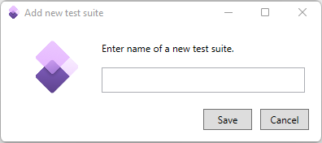
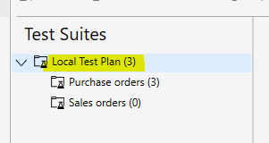
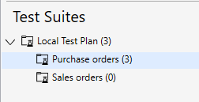

---
title: Trial mode without Azure DevOps
description: This topic describes how to use the Regression suite automation tool (RSAT) in trial mode without Azure DevOps.
author: FrankDahl
ms.date: 03/03/2021
ms.topic: article
ms.prod:
ms.technology:

# ms.search.form:
# ROBOTS:
audience: Developer
# ms.devlang:
ms.reviewer: tfehr
# ms.tgt_pltfrm:
ms.custom: 21631
ms.search.region: Global
# ms.search.industry:
ms.author: fdahl
ms.search.validFrom: 2021-03-03
ms.dyn365.ops.version: AX 7.0.0

---

# Trial mode without Azure DevOps

[!include [banner](../../includes/banner.md)]

The Regression Suite Automation Tool can be used in a trial mode. The benefit of this is that it does not require connections with Azure DevOps.

Companies that are new to RSAT will be able to explore the tool without having to commit to subscribing to Azure DevOps. This way, you can experience the value of test automation, decide whether RSAT is the right tool for you, and then add Azure DevOps with Test Plan subscriptions to users once and if this makes sense. The RSAT trial mode is not time limited, in fact you could decide to continue using the RSAT trial mode alone, without an Azure subscription, if this covers your needs well.

The RSAT trial mode is based upon the "Normal" RSAT as know from earlier versions. In fact, it is the same binary application just called differently to run in the new trial mode. Consider the trial mode as trim down of the functionality available in normal RSAT into a more simplified application, plus of course the fact that trial mode will not require an Azure DevOps to run.

The RSAT in trial model is limited in some ways. Review the paragraph "How does RSAT in trial mode differ from RSAT "Normal" mode?".

You select which of the two RSAT modes you want to be available by selecting this during the installation process. Both will be installed each with their own shortcut on the desktop. Both modes can be installed on the same machine and can be used interchangeably.

RSAT will continue to work exactly like it used to when run under the normal mode.

RSAT running in trial mode operates without any form of integration with RSAT in normal mode. The trial mode isolates all test suites and cases under a single dedicated test plan called "Local Test Plan", and there is no supported exchange of test suites or cases between the two modes. In other words, the two modes are not connected in any way. This will change with the RSAT 2.5 release where a new action is planned that will allow export and import of test suites with cases. With that new action test suites and cases can be transferred between the two RSAT modes, and even taken from one environment to another.

It is important to stress that trial mode is not time limited. In fact, if you find a long-term use of trial mode then keep it installed. There can even be companies that will be fully satisfied with what trial mode offers and stick with using this without ever integrating to Azure DevOps.

## Install RSAT in trial mode

The RSAT installer program now includes an extra page where you select which RSAT modes you want to have available to use. This will be prefilled with typical selection that install only RSAT in Normal mode, but here you can select also to install the trial mode and unselect Normal mode if this is not needed. The installation program will create shortcuts for the selections you make to the environment. Notice as earlier installation is done for the full environment, and shortcuts are created as shared for all users on this environment.

Icons appear on the desktop as shortcuts to call RSAT in the modes that we selected. Notice there is a new icon with a band that has the word "Trial" across to indicate this is the trial mode. Below is how this will appear if both modes were selected and installed. Simply click the RSAT shortcut that matches the mode you want to run from here.

## How does RSAT run in trial mode differ from RSAT "normal" mode?

Running RSAT in trial mode means a user experience that is trimmed down compared to RSAT run in "normal" mode. Actions and settings related to Azure DevOps are removed from the experience when running under trial mode.

Here is a summary of actions and settings which are **not available** under trial mode:

| Type     | Name                                                                                                                                          |
|----------|-----------------------------------------------------------------------------------------------------------------------------------------------|
| Action   | Load menu is not available as there is no connected Azure DevOps.                                                                             |
| Action   | New menu the item Create derived test case. Derived test cases are not supported under trial mode.                                            |
| Action   | Upload menu is not available as there is no connected Azure DevOps.                                                                           |
| Action   | Open menu is not available as there is no connected Azure DevOps.                                                                             |
| Action   | New Test Case menu the action Add existing Test Case. Adding test cases by referencing an existing case ID is not supported under trial mode. |
| Settings | The paragraph for Azure DevOps is not available under trial mode settings                                                                     |
| Settings | Enable upload to Azure DevOps – this optional setting is not available under trial mode.                                                      |
| Links    | Azure DevOps section with links, is not available under trial mode.                                                                           |

Another limitation is that trial mode does not support running against test environments run on OneBox developer Virtual Hard Disks (VHDs). This is not supported and will not be supported under trial mode. If this is required, then you will need to continue running RSAT under "Normal" mode. RSAT in trial mode can run again cloud hosted Dev Boxes just fine though. The far typical use of RSAT trial mode is considered using cloud hosted sandbox environments (Tier-2).

Some functions were provided by Azure DevOps that now needs to be available directly within RSAT trial mode.

When a new test case is created then the assigned ID is determined from the next available folder name under the trial directory.

There is only a single test plan available when running under trial mode. This is automatically named as "Local Test Plan". This is a limitation with trial mode and multiple test plans will only be supported when running RSAT in "Normal" mode with Azure DevOps.

Test suites are no longer created in DevOps under trial mode, so a new action is added in the toolbar called "New Test Suite", which opens a form to specify the name of the suite to create.

Notice there is only support for adding Test Suites directly with the Local Test Plan, and the action is only available when the test plan node has been selected in the tree like this.

There is also new "Delete Test Suite" action available for remove suites. This action will only allow deleting suites where there are no test cases within though. If you have test cases within the test suite, then you will need to delete these individually first before deleting the suite.

The actions for saving and loading settings available under Settings with the actions Save as and Open will save and load all available RSAT settings also Azure DevOps settings that are hidden under trial mode. This can be practical because you may reuse settings from Normal mode and share with another user then can open under trial mode for instance.

## Using RSAT in trial mode

You start the RSAT in trial mode by clicking the shortcut with the "Trial" band after you installed this mode. The application will seem very familiar to how you work with this only with a few less actions available.

The trial mode operates without a connection to Azure DevOps and tests are maintained exclusively by local files. Running RSAT in trial mode means you run an installation as a single user. There is no exchange of tests you make with other users. We recommend that you do not share working directories between users.

The RSAT 2.5 release plan includes adding a function that will allow exporting and importing suites. This is how exchange of test suites and cases becomes an option.

When you open RSAT in trial mode the first time then there are no test suites or cases shown only a single Test plan called "Local Test Plan". The test cases for trial mode are placed under the working directly you have specified in RSAT settings, within a subfolder named Trial. Test Cases each have their own folder under there with the ID of the case.

You can add one or more Test Suites under that Test Plan by using the "New Test Suite" action. It is highly advisable that you create suites and add test cases into these, and not add test cases directly to the test plan. Tests are always added to the current select node select on the left-hand control, like below where the suite "Purchase order" is selected.

How do you then add test cases, edit, and delete them? Well, this is done using the exact same actions that were added earlier with RSAT release 2.2 for RSAT in "Normal" mode. This is found explained with the existing documentation:

[Maintain test cases in Regression suite automation tool (RSAT) - Finance & Operations \| Dynamics 365 \| Microsoft Docs](https://docs.microsoft.com/en-us/dynamics365/fin-ops-core/dev-itpro/perf-test/rsat/rsat-maintain-test-cases)

There are very few things that are different about maintaining test cases under trial mode. There are mainly these two limitations: Derived test cases are not available, and test cases cannot be added as linked to an existing test case.

What is important to know is you cannot just add new files to the file system to add tests into RSAT trail mode. In fact, interacting with files directly is not advised. This is because RSAT maintains an internal database over all files used, and changes made outside of RSAT directly in the file system cannot be catalogued correctly. Therefore, use functions available in the RSAT user experience only to add new Test Cases and attachment. On a similar note, do interact with parameter files using the action available in RSAT to open this.

Running test under trial mode is done using the **Run** action on the RSAT toolbar. The results are presented only to the user running test by the results in the list with test cases, and this is not saved anywhere. These results are only available while RSAT is left open, and not visible anymore after restarting RSAT. Trial mode does not provide a way to share results with others like how Azure DevOps saves results from test runs. If this information is important, then consider using RSAT in the "Normal" mode.

Settings for RSAT in trial mode are shared with RSAT in "Normal" mode. There only real difference is the specific settings for connecting to Azure DevOps are hidden under trial mode. Saving and opening setting files will include all settings in RSAT, and it is not important which mode you run when saving or applying these.

The RSAT in trial mode adds two new actions that enable creating and deleting Test Suites directly within RSAT. These actions are only available for trial mode with this release. We have noted feedback that these are requested even for Normal mode use, and this will be considered that we add these for "Normal" mode too with upcoming releases.

The New feature to create test suites. Currently unique for trial mode but may become available in Normal mode later. You can add cases directly under test plan, but good practice is to organize your tests under suites. This will further help enable later that you can export tests and exchange these with Normal mode or other users or other organizations even.
