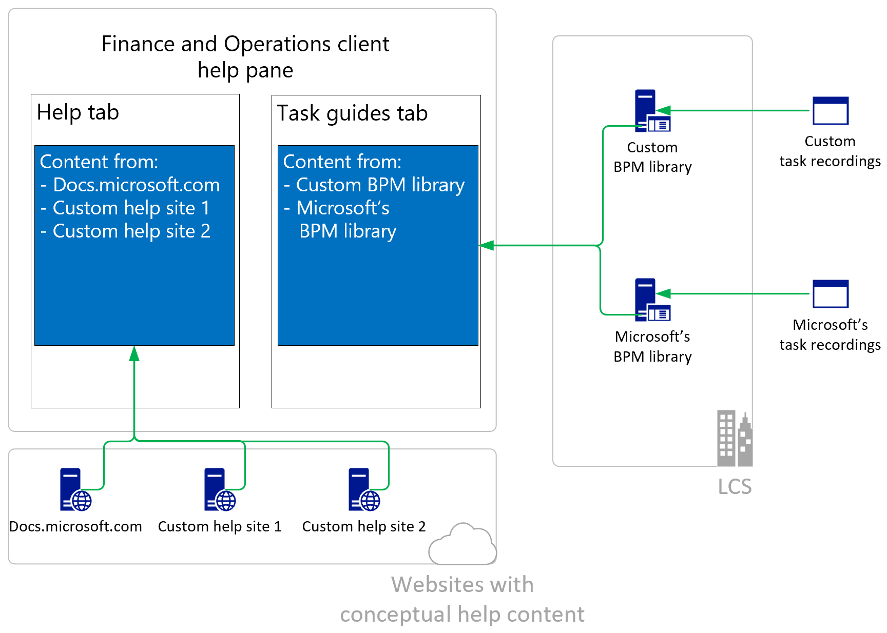

# Configure the Help experience for finance and operations apps

[!include [banner](../includes/banner.md)]

[!INCLUDE [PEAP](../../../includes/peap-1.md)]

In this article, you will find an overview of the components of the Help system for finance and operations apps, such as Microsoft Dynamics 365 Finance, Dynamics 365 Supply Chain Management, Dynamics 365 Commerce, and Dynamics 365 Human Resources. The article also explains how to connect these components and provides a summary of the process for creating custom Help.

## Help architecture

Finance and operations apps include conceptual overviews and other topics that are published to the [Microsoft Dynamics 365 documentation](/dynamics365/) site. This content can then be accessed from the in-product **Help** pane. The following illustration shows the parts of the Help system.

The in-product Help system pulls articles from learn.microsoft.com and other connected websites. It also pulls in task guides that are stored in Business process modeler (BPM) in Microsoft Dynamics Lifecycle Services (LCS).

## Adding task guides

> [!NOTE]
> The **Task guides** tab isn't currently available in Human Resources or Commerce. <!--We are currently working to enable this functionality in a future release.--> However, the task guides in the Getting Started experience in Human Resources remain available to cover basic functionality. For both Human Resources and Commerce, procedural Help is available on the [Microsoft Dynamics 365 documentation](/dynamics365/) site.

On the **System parameters** page, system admins can configure access to the relevant task guide libraries for an implementation.

> [!NOTE]
> - To configure Help, you must sign in by using an account in the same tenant as the tenant where the app is deployed.
> - An LCS library can't be connected from an instance of the app that is running on a local virtual hard drive (VHD).

To configure task guides for a solution, follow these steps on the **System parameters** page.

> [!IMPORTANT]
> The first time that you open the **Help** tab, you must connect to Lifecycle Services. Be sure to select the link in the middle of the form, wait for the connection, close the dialog box, and then select **OK** to get to the **System Parameters** page.
>
> 

1. Select the Lifecycle Services project to connect to.
2. Select the BPM libraries (within the selected project) to retrieve task recordings from.
3. Set the display order of the BPM libraries. The display order defines the order in which task recordings from the libraries will appear in the **Help** pane.

After you complete these steps, you can open the **Help** pane and select the **Task guides** tab. You'll now see the task guides that apply to the page that you're currently on in finance and operations apps. If no task guides are found, you can enter keywords to refine your search.

### Showing translated task guides

Translated task guides were first released in the May 2016 APQC Unified Library and in the Getting Started library. To view localized task guide Help, make sure that your Dynamics 365 solution is connected to the May 2016 library. Users can change the language that a task guide appears in by changing the language settings under **Options** &gt; **Preferences**.

> [!NOTE]
> Although many task guides have been translated, the client doesn't currently show the translated task guide names. Additionally, in the May 2016 library, translations are available only for the task guides that were released in February 2016. Microsoft will release an updated library that includes additional translations.
>
> - If a task guide has been translated, when you open that task guide all the text of the task guide will appear in your selected language.
> - If a task guide has not yet been translated, when you open it, only some of the text (the text of the controls) will appear in your selected language.

## Adding custom Help

You can use task guides to create custom Help, or you can connect a custom Help website to the **Help** pane.

### Create custom Help by using task guides

You can create custom Help for the supported apps by creating task recordings that reflect your implementation and then saving them to a Business process library in LCS. You can't create custom task guides for Human Resources.

If you're a partner, and you promote a library to a corporate library and include it in a solution, it will be available to your customers. You can also make a copy of the APQC Unified Library, and then open the task recordings in the copy, edit them, and save your changes. For more information, see [Task recorder resources](../../dev-itpro/user-interface/task-recorder.md).

### Connect a custom Help site

Finance and operations apps are rarely used in their out-of-box form. Instead, the solution is customized and extended to fit the organization's needs. You can also customize and extend the Help experience. For example, you can add custom Help to the in-product **Help** pane.

Microsoft has provided a toolkit to help you deploy and connect custom Help to the **Help** pane. For information about how you can set up a custom Help solution that is connected to the **Help** pane, see [Custom Help overview](../../dev-itpro/help/custom-help-overview.md).

If you want to collaborate with Microsoft on tools and processes for customizing Help, fill in the form at [https://aka.ms/customhelpfeedback](https://aka.ms/customhelpfeedback).

## See also

[Help system](help-overview.md)  
[Custom Help overview](../../dev-itpro/help/custom-help-overview.md)  
[Task recorder resources](../../dev-itpro/user-interface/task-recorder.md)  
[Create documentation or training with Task Recorder](../../dev-itpro/user-interface/task-recorder-training-docs.md)  
[Custom Help GitHub repository](https://github.com/microsoft/dynamics356f-o-custom-help)  

[!INCLUDE[footer-include](../../../includes/footer-banner.md)]
