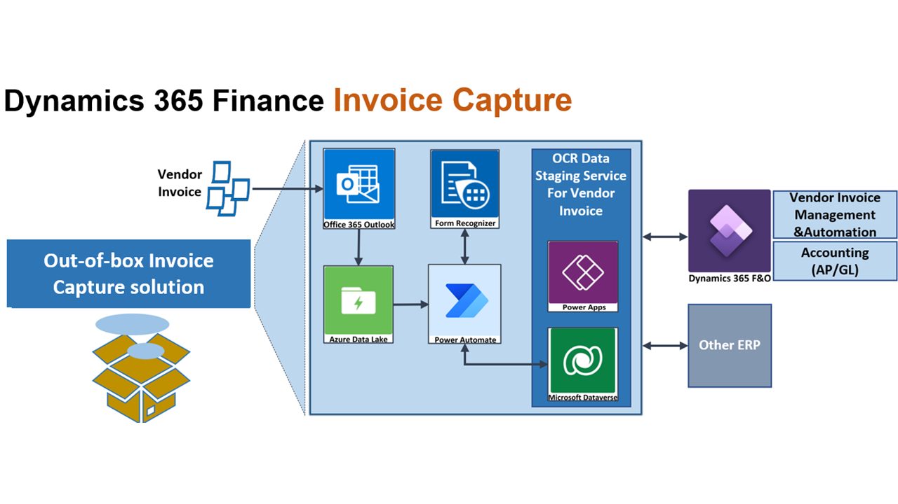

---
# required metadata

title: Invoice capture solution overview
description: This article provides information about the Invoice capture solution. 
author: sunfzam
ms.date: 09/25/2022
ms.topic: overview
ms.prod: 
ms.technology: 

# optional metadata

ms.search.form: VendorInvoiceWorkspace, VendInvoiceInfoListPage
# ROBOTS: 
audience: Application User
# ms.devlang: 
ms.reviewer: twheeloc
# ms.tgt_pltfrm: 
ms.custom: ["13971", "intro-internal"]
ms.assetid: 0ec4dbc0-2eeb-423b-8592-4b5d37e559d3
ms.search.region: Global
# ms.search.industry: 
ms.author: zezhangzhao
ms.search.validFrom: 2022-09-28
ms.dyn365.ops.version: 

---

# Invoice capture solution

[!include [banner](../includes/banner.md)]
[!include [preview banner](../includes/preview-banner.md)]

This article provides information about the Invoice capture service that automatically creates vendor invoices from invoice images.

## Invoice capture solution overview 
The Accounts payable (AP) department manages and processes invoices for goods and services received. The AP accountant verifies data on vendor invoices:
 - to avoid extra effort if adjustments or corrections are needed during period close 
 - pay vendor invoices in a timely manner to prevent financial loss due to error or fraud

Optical Character Recognition (OCR) has been widely used by various industries in past years. It's common to digitizing printed texts so that they can be electronically edited, searched, stored more compactly, and displayed on-line. The digital text can be used in machine processes such as cognitive computing, machine translation, text-to-speech, key data and text mining.

With evolvement of artificial intelligence (AI) technology, modern OCR solutions can read different invoice formats from various vendors with little human intervention. More companies are recognizing the fact that it can save effort and improve accuracy by processing invoices via automation than manual processing.

 
## System landscape 
The major components and steps contained in the Invoice capture solution are displayed in the diagram below:

## Required roles for Invoice capture service

The following roles are required to set up and use the Invoice capture solution:

  | Roles                 | Actions | Systems| Role name | 
  |----------------------|----------|--------|------------|
  |Administrator|<ul><li>Set up environment in power platform</li><li>Deploy solutions in power platform</li><li>Set up connection between Dynamics 365 and AI builder</li><li>Set up Azure data lake storage location</li></ul>|<ul><li>Dynamics 365</li><li>Power Platform</li><li>Azure Data Lake</li></ul>|<ul><li>Dynamics 365 administrator</li><li>Power Platform administrator</li><li>Storage Blob data owner</li></ul>|
  |AI maker |<ul><li>Maintain flow</li><li>Create custom AI model</li></ul>|<ul><li>Power Platform</li></ul>| <ul><li>Citizen makers</li></ul>|
  |AP clerk |<ul><li>Review and take actions in Vendor invoice staging area</li><ul>|<ul><li>Power Platform</li></ul>|<ul><li>New AP clerk role in Power Platform</li></ul>|
  |AP clerk |<ul><li>Daily operation as AP clerk</li><li>Navigate to Vendor invoice staging</li></ul>|<ul><li>Dynamics 365</li></ul>|<ul><li>Accounts payable clerk</li></ul>|
