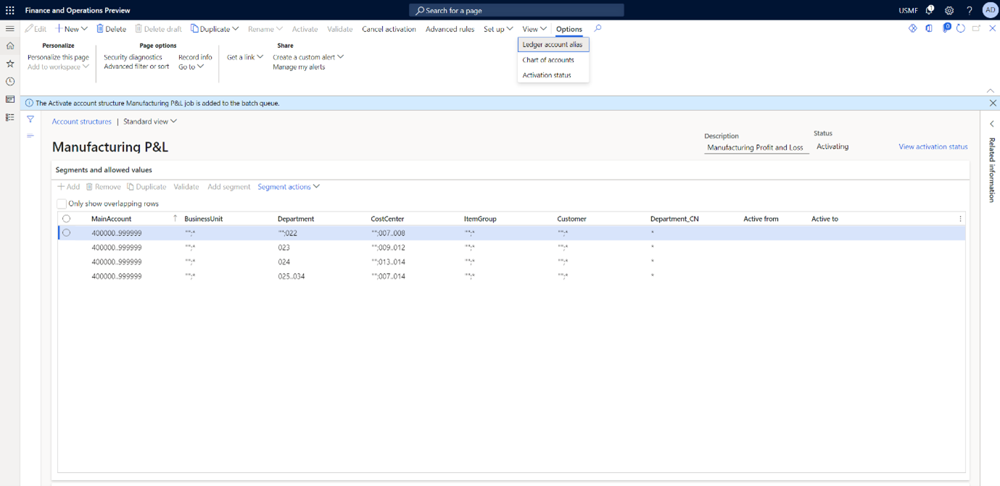
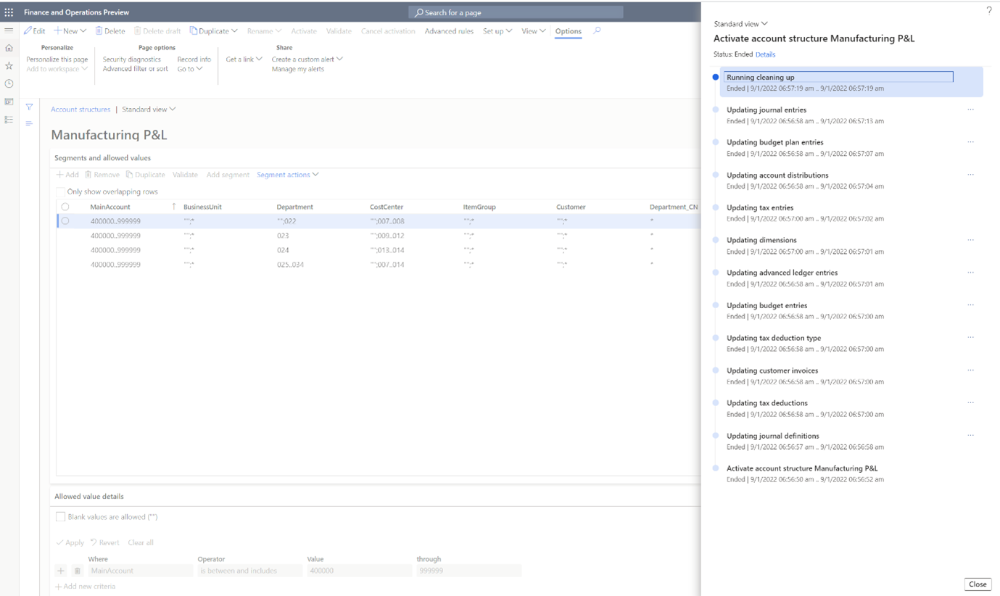

---
# required metadata

title: Account Structure activation performance enhancement 
description: This article explains the new performance enhancements for the account structure activation process.
author: RyanCCarlson2
ms.date: 10/31/2022
ms.topic: index-page
ms.prod: 
ms.technology: 

# optional metadata

ms.search.form: 
audience: Application User
# ms.devlang: 
ms.reviewer: kfend
# ms.tgt_pltfrm: 
# ms.custom: 
ms.search.region: Global 
# ms.search.industry: 
ms.author: RyanCCarlson2
ms.search.validFrom: 2022-10-08
ms.dyn365.ops.version: 10.0.31

---

# Account Structure activation performance enhancement

This enhancement will allow you to activate faster by running multiple transaction updates simultaneously. In addition, the structure itself will be marked as active once validated and allow transaction processing to continue while existing unposted transactions are updated to the new structure. Since updating transactions may take some time, you can track the status of your activation by clicking on ‘View activation status’. Alternately, you can also click on View and select ‘Activation status’ in the drop-down menu to view your activation status.  

After clicking on **View activation status** a dialog will appear showing the individual tasks running as part of the activation process. Each task will have a corresponding status for you to view as well as a completed date and time once it completes. 

 
## Account structure activation tips and FAQ

The account structure activation dialog that appears when you click activate for a draft account structure has a tab section with a title **Update unposted transactions**. This section has an option to select titled **Force update**.  This option can be used to update all unposted transactions to the current structure.  This option should only be selected when a prior error has happened or directed by Microsoft support to do so. 

Some factors that can impact the performance of the activation process are: 
 - High number of unposted journal records
 - High number of open source document records such as Free Text invoices, Vendor Invoices and related documents that use the source document framework and have open accounting distributions. 
 - The amount of data in TaxUncommitted.
 - The amount of open budget data. 
 - Importing journal data while the activation tasks are still running. 
