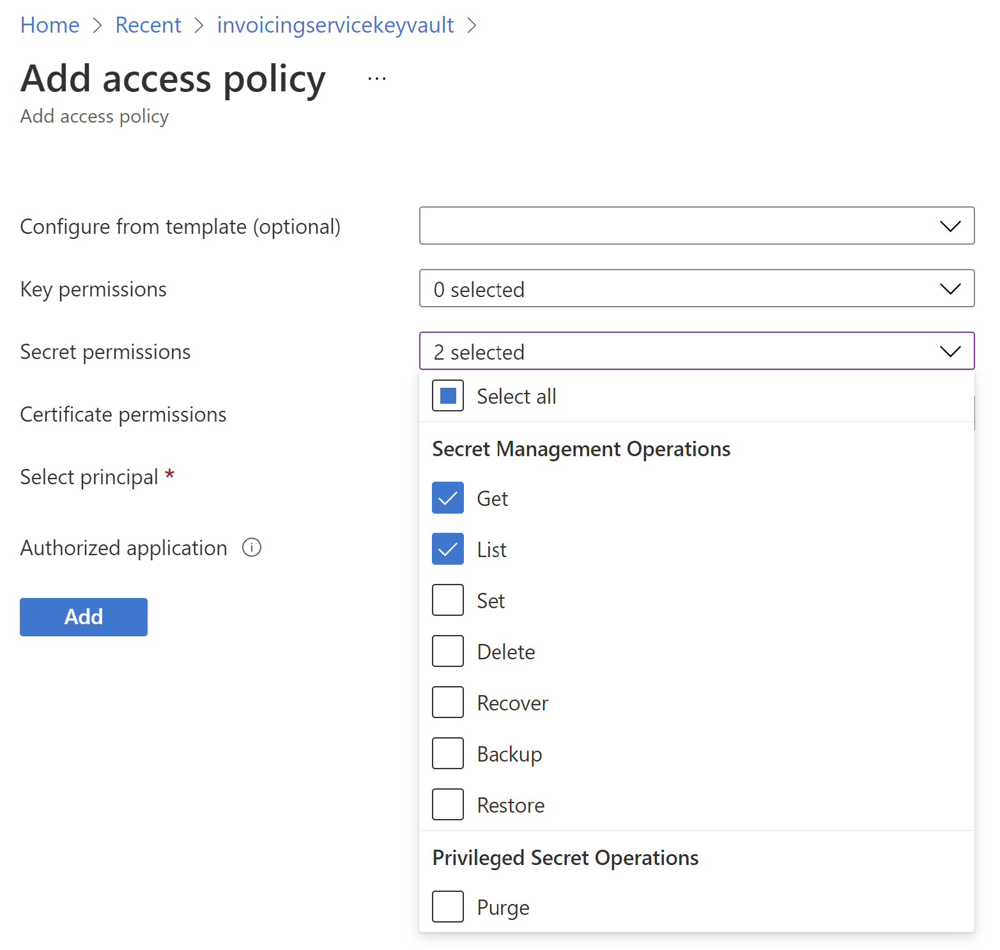

---
# required metadata

title: Create an Azure Key Vault in the Azure portal
description: This topic explains how to create an Azure Key Vault for Electronic invoicing.
author: dkalyuzh
ms.date: 12/15/2021
ms.topic: article
ms.prod: 
ms.technology: 

# optional metadata

ms.search.form: 
audience: 
# ms.devlang: 
ms.reviewer: kfend
# ms.tgt_pltfrm: 
ms.custom: 
ms.assetid: 
ms.search.region: 
# ms.search.industry: 
ms.author: kfend
ms.search.validFrom: 
ms.dyn365.ops.version: 

---

# Create an Azure Key Vault in the Azure portal

[!include [banner](../includes/banner.md)]

All the secrets and certificates that are used in the Electronic invoicing service must be stored in your Azure Key Vault. This storage helps ensure that you don't operate with the secrets directly, and that the secrets are stored securely. When you need to use digital signing, or secure a connection to external Web services, set the reference to the Key Vault secrets and certificates, rather than use secrets and certificates directly.

1. Create the Azure Key Vault in the tenant where the Regulatory configuration service (RCS) is installed. For information about how to create an Azure Key Vault, see [Create a key vault using the Azure portal](/azure/key-vault/general/quick-create-portal).
2. Set up the access policy to grant the Electronic invoicing service the correct level of secure access to the secret you created. Go to **Settings** > **Access policies**, and select **Add Access Policy**.
3. Set the **Secret permissions** for the **Get** and **List** operations.
  
   

4. Set the **Certificate permissions** for **Get** and **List** operations.
5. In the **Select principal** field, select **None selected**.
6. In the **Principal** dialog box, select the principal by adding **e-Invoicing Service**.
	
  > [!NOTE]
  > If you don't see e-Invoicing Service in the list of principals in your tenant, execute the following command in Azure portal: 
`New-AzureADServicePrincipal -AppId "ecd93392-c922-4f48-9ddf-10741e4a9b65"`

7. Select **Add**, and then select **Save**. 
8. On the **Overview** page, copy the DNS name value for the Key Vault. This value is used during setup of the service in RCS and will be referred as the **Key Vault URI**.
