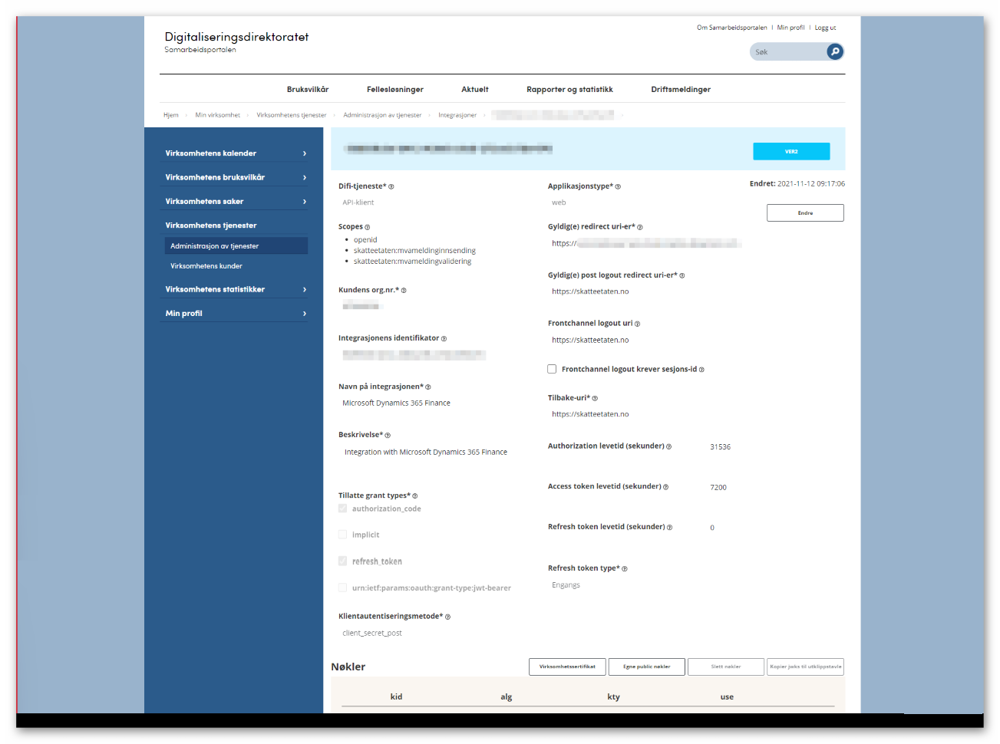

---
# required metadata

title: Register an integration point in ID-porten web portal
description: This topic explains how to register an integration point in ID-porten web portal in Norway. 
author: liza-golub
ms.author: elgolu
ms.date: 11/15/2022
ms.topic: article
ms.prod: 
ms.technology: 

# optional metadata

# ms.search.form: 
audience: Application User
# ms.devlang: 
ms.reviewer: kfend
# ms.tgt_pltfrm: 
# ms.custom: 
ms.search.region: Norway
# ms.search.industry: 
ms.search.validFrom: 2022-11-15

---

# Register an integration point in ID-porten web portal

[!include [banner](../includes/banner.md)]

Companies registered for VAT in the territory of Norway have their accounts in [ID-porten](https://samarbeid.digdir.no/id-porten/ta-i-bruk-id-porten/94) portal. You must create an [integration point](https://docs.digdir.no/oidc_index.html) in the company’s account in ID-porten to enable direct submission of VAT return to Altinn. For more information, see [ID-Porten & Authentication](https://skatteetaten.github.io/mva-meldingen/english/idportenauthentication/).

We recommend setting the following parameters for your integration point for direct submission of VAT return to Altinn from Finance:

| Parameter name (Norwegian) | Parameter name (English) | Parameter description | Parameter value |
|----------------------------|--------------------------|-----------------------|-----------------|
| Difi-tjeneste | Difi Service | Select service to be assigned correct scopes. | Select: "API-klient" |
|  Scopes	| Scopes |	APIs/resources that the integration can access. | <ul><li>openid</li><li>skatteetaten:mvameldinginnsending</li><li>skatteetaten:mvameldingvalidering</li></ul> |
| Kundens org.nr.	| Customer's organization number |Organization number of the service owner.	| You do not have to specify any value in this field. Necessary value will be populated automatically upon saving the setup of the integration point. |
| Integrasjonens identifikator	| The integration identifier	| Unique identifier of the service. (Automatically generated).|	You do not have to specify any value in this field. Necessary value will be populated automatically upon saving the setup of the integration point. |
| Navn på integrasjonen	| Name of the integration	| Name of the integration, appears in the login window. | Microsoft Dynamics 365 Finance |
| Beskrivelse	| Description	| Brief description of the service (e.g. Meeting portal for NN municipality).	| Integration with Microsoft Dynamics 365 Finance |
| Tillatte grant types | Grant types allowed	| A grant represents the user's consent to retrieve an access token. By selecting particular grants, user consents the corresponding methods of retrieving an access token.	| Select the following grant-types: <ul><li>authorization_code</li><li>refresh_token</li></ul> |
| Klientautentiseringsmetode	| Client authentication method	| Method of authentication of your client.	| Specify: “client_secret_post” |
| Applikasjonstype	| Application Type	| Application (or client) type is the type of runtime environment the client is running under. OAuth2 chapter 2.1 lists the options available. The choice of client type is a security assessment the customer will perform.	| Select: “web” |
| Gyldig(e) redirect uri-er	| Valid redirect uri's	| Applies only to personal login integrations. Uri's that the client is allowed to go to after logging in.	| In Finance, go to **Tax** > **Setup** > **Electronic messages** > **Web applications** page, copy the URL (https address) from the address line and paste it in this field. |
| Gyldig(e) post logout redirect uri-er |	Valid mail logout redirect uri's	| Applies only to personal login integrations. Uri's that the client is allowed to go to after logging out.	| Specify: “`https://skatteetaten.no`” |
| Frontchannel logout uri |	Frontchannel logout uri	| URI to which the provider sends request upon logoff triggered by another client in the same session. If you do not set the frontchannel logout uri, you risk that the user is still logged into your service when logging out from ID-porten.	| Specify: “`https://skatteetaten.no`” |
| Frontchannel logout krever sesjons-id	| Frontchannel logout requires session ID	| Applies only to personal login integrations. Flag that determines whether the issuer and session id parameters are passed with frontchannel_logout_uri.	| Leave this parameter unchecked. |
| Tilbake-uri	| Back-uri	| Applies only to personal login integrations. URI as a user is sent back to by canceling login.	| Specify: “`https://skatteetaten.no`” |
| Authorization levetid (sekunder)	| Authorization lifetime (seconds)	| Lifetime of registered authorization. In an OpenID Connect context, this will be access to the ‘userinfo’ endpoint. Value must be specified in seconds.	| Specify: “31536000” (1 year) |
| Access token levetid (sekunder) |	Access token lifetime (seconds)	| Issued access_token in seconds lifetime.	| Specify: “7200” (2 hours) |
| Refresh token levetid (sekunder)	| Refresh token lifetime (seconds)	| Issued refresh_token in seconds lifetime.	| Specify: “0” |
| Refresh token type	| Refresh token type	| One-time: You get a new refresh_token at each refresh of access_token. Reusable: refresh_tokenet doesn't change by refreshing access_token.	| Specify: “Engangs” |

    > [!IMPORTANT]
    > Store safely client ID and client secret of the integration point that you create for interoperation with ID-porten. You will need these credentials further on the [Set up client ID and client secret of your ID-porten integration point in Finance](emea-nor-vat-return-setup.md#client-credentials) step of your preparation for VAT return direct submission to Altinn in Finance.
