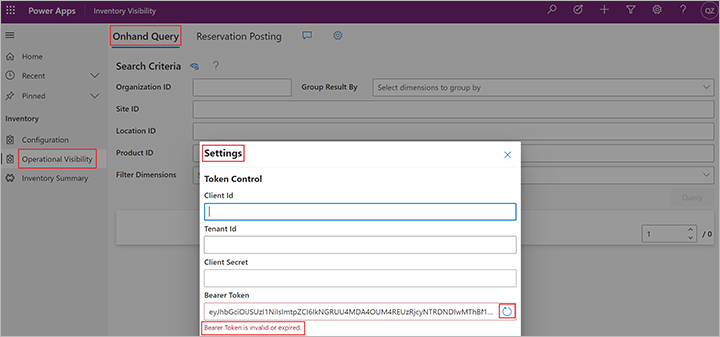

# Use the Inventory Visibility app

[!include [banner](../includes/banner.md)]

This topic describes how to use the Inventory Visibility app.

Inventory Visibility provides a model-driven app for visualization. The app contains three pages: **Configuration**, **Operational visibility**, and **Inventory summary**. It has the following features:

- It provides a user interface (UI) for on-hand configuration and soft reservation configuration.
- It supports real-time on-hand inventory queries on various dimension combinations.
- It provides a UI for posting reservation requests.
- It provides a customized view of the inventory on-hand for products together with all dimensions.

## Prerequisites

Before you begin, install and set up the Inventory Visibility Add-in as described in [Install and set up Inventory Visibility](inventory-visibility-setup.md).

## Open the Inventory Visibility app

To open the Inventory Visibility app, sign in to your Power Apps environment and open **Inventory Visibility**.

## Configuration

The **Configuration** page of the Inventory Visibility app helps you set up the on-hand configuration and soft reservation configuration. After the add-in is installed, the default configuration includes a default setup for Microsoft Dynamics 365 Supply Chain Management (the `fno` data source). You can review the default setting. Hereafter, based on your business requirements and the inventory posting requirements of your external system, you can modify the configuration to standardize the way that inventory changes can be posted, organized, and queried across the multiple systems.

For complete details on how to configure the solution, see [Configure Inventory Visibility](inventory-visibility-configuration.md).

## Operational visibility

The **Operational Visibility** page provides the results of a real-time on-hand inventory query, based on various dimension combinations. When the *OnHandReservation* feature is turned on, you can also post reservation requests from the  **Operational Visibility** page.

### On-hand query

The **Onhand Query** tab shows the results of a real-time on-hand inventory query.

When you select the **Onhand Query** tab, the system requests your credentials so that it can get the bearer token that is required to query the Inventory Visibility service. You can just paste the bearer token into the **BearerToken** field and close the dialog box. You can then post an on-hand query request.

If the bearer token isn't valid, or if it has expired, you must paste a new one into the **BearerToken** field. Enter the correct **Client ID**, **Tenant ID**, **Client Secret** values, and then select **Refresh**. The system will automatically get a new, valid bearer token.

To post an on-hand query, enter the query in the request body. Use the pattern that is described in [Query by using the post method](inventory-visibility-api.md#query-with-post-method).

### Reservation posting

Use the **Reservation Posting** tab to post a reservation request. Before you can post a reservation request, you must turn on the *OnHandReservation* feature. For more information about this feature, see [Inventory Visibility reservations](inventory-visibility-reservations.md).

To post a reservation request, you must enter a value in the request body. Use the pattern that is described in [Create one reservation event](inventory-visibility-api.md#create-one-reservation-event). Then select **Post**. To view the request response details, select **Show details**. You can also get the `reservationId` value from the response details.

## Inventory summary

**Inventory summary** is a customized view for the *Inventory OnHand Sum* entity. It provides an inventory summary for products together with all dimensions. Inventory summary data is synced periodically from Inventory Visibility every 15 minutes. To see data on the **Inventory summary** tab, you must turn on the *OnHandMostSpecificBackgroundService* feature on the **Feature Management** tab and select **Update configuration**.

> [!NOTE]
> The *OnHandMostSpecificBackgroundService* feature only tracks product on-hand changes that occurred after you turned on the feature. Data for products that haven't changed since you turned on the feature won't be synced from the inventory service cache to the Dataverse environment. If your **Inventory summary** page doesn't show all of the on-hand information you are expecting, go to **Inventory Management > Periodic tasks > Inventory Visibility integration**, disable the batch job and reenable it. This will do the initial push, and all data will sync to the *Inventory OnHand Sum* entity in next 15 minutes. If you want to use this feature, we recommend that you turn it on before you create any on-hand changes and enable the **Inventory Visibility integration** batch job.

By using the **Advanced filter** that Dataverse provides, you can create a personal view that shows the rows that are important to you. The advanced filter options let you create a wide range of views, from simple to complex. They also let you add grouped and nested conditions to the filters. To learn more about how to use the **Advanced filter**, see [Edit or create personal views using advanced grid filters](/powerapps/user/grid-filters-advanced).

The top of the customized view provides three fields: **Default dimension**, **Custom dimension**, and **Measure**. You can use these fields to control which columns are visible.

You can select the column header to filter or sort the current result.

The bottom of the customized view shows information such as "50 records (29 selected)" or "50 records." This information refers to the currently loaded records from the **Advanced filter** result. The text "29 selected" refers to the number of records that have been selected by using the column header filter for the loaded records.

At the bottom of the view is a **Load more** button that you can use to load more records from Dataverse. The default number of records that is loaded is 50. When you select **Load more**, the next 1,000 available records are loaded into the view. The number on the **Load more** button indicates the currently loaded records and the total number of records for the **Advanced Filter** result.

