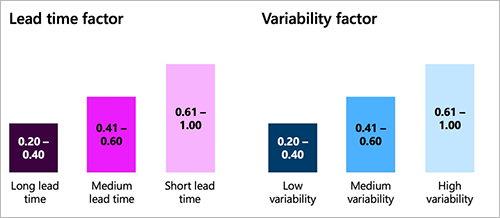
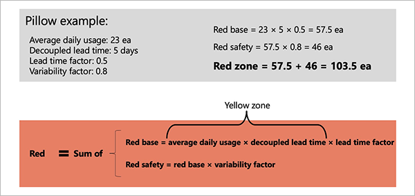
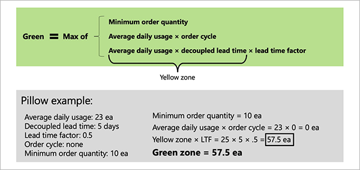
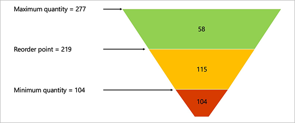

# Buffer profile and levels

[!include [banner](../includes/banner.md)]

Once you have identified your decoupling points (key items that you will strategically keep in stock) you must decide how much stock (buffer) you will keep at each of them. This is the second step of Demand Driven Materials Resource Planning (DDMRP).

## Buffer levels and zones

In DDMRP, each stock buffer is defined using three values: minimum quantity, maximum quantity, and reorder point. These values establish three difference zones, are identified using the following color codes:

- **Red zone** – This is the area below the minium quantity. The minimum point is also called "top of red" and your planning strategy should be designed to ensure that stock levels are always above this point.
- **Yellow zone** – This is the area between the minimum quantity and the reorder point. The reorder point is also called "top of yellow". When this point is reached, the system should reorder.
- **Green zone** – This is the area between the reorder point and the maximum quantity. The maximum point is also called "top of green". This point is the maximum level to which the stock will be replenished.

The following illustration shows the three colored zones and how they relate to the minimum quantity, maximum quantity, and reorder point.

## Calculating the buffer zones

This section explains how the height of each buffer zone is calculated.

The yellow zone is usually calculated first. This zone represents the quantity you consume from the moment you order until the order arrives. In other words, it's the expected consumption during the replenishment lead time and is calculated using the following equation:

- **Yellow zone** = \[Average daily usage\] × \[decoupled lead time\]

The *decoupled lead time* represents the time it takes to produce or receive an item assuming the decoupling points are always stock, and is normally much shorter than the *cumulative lead time* traditionally used in master planning. Correct buffer settings are key to ensuring that decoupling points actually are always in stock without being overstocked.

The red zone is calculated using the following equations:

- **Red base** = \[Average daily usage\] × \[Decoupled lead time\] × \[Lead time factor\]
- **Red safety** = \[Red base\] × \[Variability factor\]
- **Red zone** = \[Red base\] + \[Red safety\]

The green zone is calculated as the maximum result of the following three equations:

- \[Minimum order quantity\]
- \[Average daily usage\] × \[Order cycle\]
- \[Average daily usage\] × \[Decoupled lead time\] × \[Lead time factor\]

## Calculating average daily usage

The system calculates the amount you consume per day using one of three approaches:

- **Average daily usage (past)** – Based on actual past consumption
- **Average daily usage (forward)** – Based on the forecasted future consumption.
- **Average daily usage (blended)** - Based on a weighted mix of past and forecasted consumption

<!-- KFM: We should provide examples/logic for picking each of the above. -->

### Average daily usage (past)

Past average daily usage (ADU) is calculated as an average by adding up the quantities used each day for a specified number of past days and then dividing by that number of days. The following illustration shows how this works when looking three days into the past.

 chart")

<!-- KFM: The average values in the figure are shifted back one day, so this image should be updated. -->

In previous illustration, if today is the morning of June 11th, the average daily usage for the previous 3 days (June 8th, 9th, and 10th) is 21.

- **ADU (past)** = (29 + 11 + 23) ÷ 3 = 21

### Average daily usage (forward)

For a new product, you may not have any past usage data, so you might instead use the projected average daily usage going forward, for example based on forecasted demand. The following illustration shows how this works when looking three days into the future (which includes today).

 chart")

In previous illustration, if today is the morning of June 11th, the average daily usage for the next 3 days (June 11th, 12th, and 13th) is 21.66.

- **ADU (forward)** = (18+18+29) ÷ 3 = 21.66

### Average daily usage (blended)

The blended average daily usage combines the average past usage and average forward usage, as shown in the following illustration.

 chart")

In previous illustration, if today is the morning of June 11th, the blended average daily usage for the previous and next 3 days (June 8th to 13th) is 21.33.

- **ADU blended** = (\[ADU past\] + \[ADU forward\]) ÷ 2 = (21+ 21.66) ÷ 2 = 21.33

<!-- KFM: We should probably show the weighting factors here. -->

## Buffer calculation factors

For each item, you can define two factors to adjust how big the red and green zones should be to compensate for the expected lead time and demand variability.

The first factor is the *lead time factor*. The value is a decimal that ranges from 0 to 1. The longer the lead time is, the lower the value should be. The Demand Driven Institute recommends the following ranges:

- Long lead time: 0.20 - 0.40
- Medium lead time: 0.41 - 0.60
- Short lead time: 0.61 - 1.00

The second factor is the *variability factor*. The value is also a decimal that ranges from 0 to 1. The higher the demand variability is, the lower the value should be. The Demand Driven Institute recommends the following ranges:

- Low variability: 0.20 - 0.40
- Medium variability: 0.41 - 0.60
- High variability: 0.61 - 1.00

## Buffer calculation examples

This example continues with the pillow production example provided in [Inventory positioning](ddmrp-inventory-positioning.md), where we selected decoupling points that reduced the lead time from 21 days to 5 days, as shown in the following illustration.

For the pillow example, assume that the average daily usage has been calculated to 23 pieces and, as shown in the previous illustration, the decoupled lead time is 5 days. Using these values, you can calculate the yellow zone using the following equation:

- **Yellow zone** = \[Average daily usage\] × \[Decoupled lead time\] = 115

The red zone calculation is similar to the yellow zone, but is padded for variability and lead time. For the pillow example, assume that you have observed a medium lead time (factor = 0.50) and high demand variability (factor = 0.8). Using these values, combined with the components from the yellow equation, you can calculate the red zone using the following equations:

- **Red base** = \[Average daily usage\] × \[Decoupled lead time\] × \[Lead time factor\] = 57.5
- **Red safety** = \[Red base\] × \[Variability factor\] = 46
- **Red zone** = \[Red base\] + \[Red safety\] = 103.5

The system will round the red zone off to 104 pieces (ea) because pieces are counted in whole numbers.

The green zone calculation also includes the yellow zone equation, but allows for minimum order size, order cycle, and lead time factor. Looking at the pillow example, assume there is no order cycle (which means you don't have any time constraints around how frequently you order), and the minimum order quantity is 10 pieces. The green zone is then calculated as the maximum result of the following three equations:

- \[Minimum order quantity\] = 10
- \[Average daily usage\] × \[Order cycle\] = 0
- \[Average daily usage\] × \[Decoupled lead time\] × \[Lead time factor\] = 57.5

Once again, the system will round the green zone off to 58 pieces (ea) because pieces are counted in whole numbers.

The following illustration summarizes these zone calculation results using the funnel graphic often used in DDMRP.

## Implement buffers in Supply Chain Management

This section describes how to implement your buffer zone strategy in Supply Chain Management.

### Set up buffer values for a decoupling point

Use the following procedure to set up buffer values for a decoupling point:

1. Go to **Product information management \> Products \> Released products**
1. Select a released item that you want to set up
1. Click the **Plan** tab
1. Click **Item coverage** under **Coverage** button group
1. Select a record for decoupling point
1. Click the **General** tab
1. Set **Buffer values over time** = *Checked*
1. The confirmation page opens.
1. Click **Yes**, as a result the system will disable **Minimum**, **Reorder point** and **Maximum** fields and will begin calculating these values automatically. The result of this calculations you can see on the **Buffer values** tab

> [!NOTE]
> If you set **Buffer values over time** = *Unchecked*, you can set values for the **Minimum**, **Reorder point** and **Maximum** fields manually.

Work with the **Buffer values**

1. Preconditions are a decoupling point is set up, the **Buffer values over time** = *Checked* for this decoupling point.

1. Go to **Product information management \> Products \> Released products**

1. Select a released item that you want to set up

1. Click the **Plan** tab

1. Click **Item coverage** under **Coverage** button group

1. Select a record for decoupling point

1. Click the **Buffer values** tab

1. Click **Add time period**s under the **Periodic setup button** group on the **Buffer values** tab of the ribbon

1. The grid on the **Buffer values** tab of the **Item coverage** page is populated with **From date** and **To date** values

1. Click **Calculate decoupled lead time** under the **Calculate** button group on the the **Buffer values** tab of the ribbon

1. The **Calculate decoupled lead time** page shows

1. Set **BOM** = the BOM you want to run calculation and **Date** and **Quantity** for this calculation

1. Click **OK** to run the calculation process

1. The system calculates the **Decoupled lead time** for the selected date

1. Select dates you want to calculate average daily usage

1. Click **Calculate** **average daily usage** under the **Calculate** button group on the the **Buffer values** tab of the ribbon

1. The system calculates the value of **Average daily usage** for the selected dates in case you have any usage data. If not, set the value of **Average daily usage** manually in the grid

1. Select dates you want to calculate min, max and reorder point quantities

1. Click **Calculate min, max and reorder point quantities** under the **Calculate** button group on the the **Buffer values** tab of the ribbon

1. The system calculates and populates the **Calculated min**, **Calculated reorder point** and **Calculated max** fields in the grid on the **Item coverage** page.

1. Click **Accept all calculations** under the **Take action** button group on the the **Buffer values** tab of the ribbon. You also can use **Accept calculations from selected rows** depends on what calculation you want to accept or **Decline all calculations** or **Decline calculations from selected rows** in case you want to decline calculations

1. The **Min**, **Reorder** **point** and **Max** fields will be populated based on the calculated valued for accepted records

Calculating the Buffer values in batch mode

1. Go to **Master planning \> Master planning \> DDMRP \> Calculate buffer values**

1. The **Calculate buffer values** form opens

1. Set **Calculate average daily usage** = *Yes*

1. Set **Calculate decoupled lead time** = *Yes*

1. Set **Calculate buffer values** = *Yes*

1. Set **Accept calculation for min, max and reorder point** = *Yes*

1. Set filter to run this calculation for the selected items

1. Set **Batch processing** = *Yes* on the**Run in the background** FastTab

1. Se Recurrence if you want

1. Click OK to put new task in a batch queue for execution.

As a result, the system will calculate the buffer values on a date when the batch task is executed.

Calculating the **Decoupling lead time**

1. Go to **Master planning \> Master planning \> DDMRP \> Decoupled lead time**

1. Click **OK**

1. The **Decoupled lead time** form opens

1. Select the line you want to check the Decoupled lead time calculation

1. Click the selected record to open a page with detailed information

1. Expand the **General** tab

1. Verify calculated values in **Decoupled lead time** and **Lead time** fields

