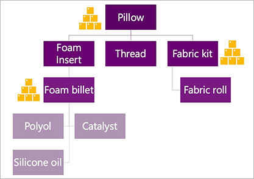
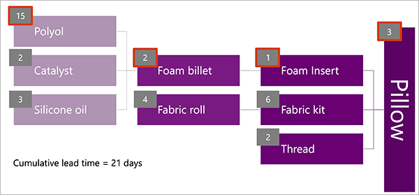

---
title: Inventory positioning
description: Strategic inventory positioning involves identifying points in your supply chain where you can build up inventory on hand, which helps compress lead times and absorb shocks to your supply chain.
author: t-benebo
ms.date: 06/30/2022
ms.topic: article
ms.search.form:
audience: Application User
ms.reviewer: kamaybac
ms.search.region: Global
ms.author: benebotg
ms.search.validFrom: 2022-06-30
ms.dyn365.ops.version: 10.0.28
---

# Inventory positioning

[!include [banner](../includes/banner.md)]

Strategic inventory positioning involves identifying decoupling points in your supply chain where you can build up inventory on hand. This is mainly done to provide lead time compression and shock absorption in your supply chain. It lets you mitigate the bullwhip effect by not passing demand variability all the way down the supply chain.

## Inventory positioning for manufacturing

This section provides an example that illustrates how to make inventory positioning decisions when manufacturing a typical pillow product. The pillow has a multi-level bill of material (BOM), as shown in the following illustration.

 for a pillow product")

### Choose your decoupling points

When choosing where to put your decoupling points, consider all of the following aspects of each item in the BOM:

- External variability
- Inventory leverage and flexibility
- Critical operation protection
- Customer tolerance time
- Sales order visibility horizon
- Market potential lead time

In the pillow example, you might place your first decoupling point might at the *foam billets* for the following reasons:

- It is difficult to source the materials used to make the billet and availability is volatile. This meets the criterion on *external variability*.
- The foam billets can be cut into many different shapes and sizes to create foam inserts for a variety of products that you manufacture, in addition to the pillow. This meets the criterion on *inventory leverage and flexibility*.

Continuing with this example, the next decoupling point could be at the *fabric kit*, which is pre-cut pillow fabric. You might choose this one because you only have one fabric cutting machine, so  the *critical operation protection* criterion applies.

Finally, you might set the finished good pillow item as your final decoupling point. This could be because you have a very low *customer tolerance time* on sales, and because your *sales order visibility horizon* is fairly short so  you want to ensure you have the inventory on hand to meet incoming orders. You can also set a higher price by keeping the lead time this short, which is what the *market potential lead time* criterion refers to.

Based on this analysis, the following illustration shows the pillow BOM would like with the decoupling points highlighted by yellow inventory icons.

### Calculate your decoupled lead time

This section shows how to calculate your new lead times after you have introduced decoupling points. 

Continuing with the pillow example used in the previous section, the followign illustration shows lead times in grey boxes at the top left of each BOM item. Boxes with a red outline indicate items that drive the cumulative lead time, which is 21 days when starting from scratch.

However, if you apply the decoupling points found previously, then the decoupled items will always be in stock and therefore have a lead time of zero. The new lead time for the pillow is just five days&mdash;two days to purchase the thread and three days to produce the pillow. This is called a decoupled lead time.

## Strategic inventory positioning in a retail model

Retailers only stock finished products, so BOMs aren't an issue. However, retainers can still use DDMRP by setting strategic inventory positioning and buffer levels based on storage locations within the distribution network.

The following illustration shows an example of a company that has a distribution center in Seattle and stores in Boston, Atlanta, and Portland.

You could decide that the transfer time to move a blanket product between the distribution center and the stores violates your *customer tolerance time* because your customers expect the blanket to be in stock when they visit. In this case, you would set up a decoupling point for the blanket item at each of the three stores and each one would get a different buffer level based on that particular store's lead times, demand patterns, and so on.

## Implement inventory positioning in Supply Chain Management

It's a very careful, unexamined decision on how should you place decoupling points and where.

And there's many factors such as Customer tolerance time, External variability and Inventory leverage and flexibility that would influence on and how should you take them into account.

### Customer tolerance time

If you know that for your end item, the highest in this bill of material, the customers willing to wait, let's say 8 days. Please see the Pillow item structure picture from Decoupling lead time parameters.

Then you probably want to took the items as in the picture. Because the whole cumulative time will be longer than 8 days and it is about 25 days.

If you place decoupling points at Foam billet and Fabric kit you will be able to reduce cumulative time up to 5 days and you will be able to meet the expectations of the client.

### External variability

If there's a lot of variability your stock, have some stock to be on the safe side seems to be a good idea because some of your items may have long lead time.

### Same with inventory, leverage and flexibility

Maybe a purchased item you probably want to stock because it's used in many bills of materials across many your items. So that gives you a lot of flexibility.

In case of having some bottlenecks in production, or if you have specific resources that breakdown a lot, or they are very expensive if they go down, you probably want to protect those operations and then make sure that the product you use before that operation you always have it stocked and handy.

Step 1. Set up an Item coverage group

1. Go to **Master planning &gt; Setup &gt; Coverage &gt; Coverage groups**

1. Click **New**

1. Set **Coverage code** = *Decoupling point*

1. Expand the **Other** FastTab

1. Set necessary values to **Lead time factor**, **Variability factor**, **Average daily usage past period (days)**, **Min, max, and re-order point period**.

Once you choose value *Decoupling po*int for the**Coverage code** field, all new fields DDMRP parameters are going to be enabled and then these will be used in DDMRP process.

Step 2. Set up Item coverage for item

1. Go to **Product information management &gt; Products &gt; Released products**

1. Select a released item that you want to set up

1. Click the **Plan** tab

1. Click **Item coverage** under **Coverage** button group

1. Click **New** and create a new item coverage record

1. Click the **General** tab

1. Set **Use specific settings** = *Checked*

1. Set **Coverage group** to previously created coverage group for your decoupling point

To define a decoupling point for specific item you have to put this definition on the item coverage level. You need to specify the following fields:

**Coverage code** = Decoupling point. The value of the field determines the principle of replenishment. All records with Decoupling points value are considered by the system as part of the data for DDMRP planning.

**Lead time factor** – The values range from 0 to 1 and the guidance is that the longer the lead time is, the lower the value should be.

**Variability factor** – The values once again range from 0 to 1 and the guidance for this is that products with a higher demand variability should have a higher value for this factor

**Average daily usage past period (days)** – the value means how much do you consume when you order from the moment you order until the order arrives.

**Min, max and reorder-point period** – ???

Besides, you have to specify all the dimensions. If you miss site or warehouse that are mandatory for this item, you will not be able to define the decoupling point for this item.

Among other things you can create many different Item coverage codes if you want many different defaults. There is the easiest way to specify a decoupling point.

> [!NOTE]
> All other items that are not decoupling points should continue to be planned as they are with the classic MRP.
