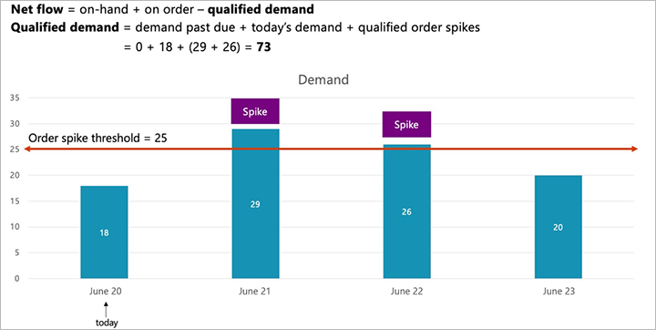

# Demand driven planning

[!include [banner](../../includes/banner.md)]
[!INCLUDE [preview-banner](../../includes/preview-banner.md)]

The article describes how to generate planned orders for items that are set up as decoupling points.

## Net flow and qualified demand

During master planning, the system applies the concept of *net flow* to establish the effective on-hand quantity based both on the actual on-hand inventory plus inventory that is on order (existing supply orders that aren't yet received) minus what we term to be *qualified demand* (qualified upcoming sales), as shown in the following illustration. The system evaluates the net flow, not the actual on-hand, when deciding which buffer zone an item belongs in and what the order quantity should be.

When a planned order is triggered during a planning run, the quantity ordered will be the maximum level minus the net flow. The system also leverages [priority-based planning](priority-based-planning.md) functionality to assign an order priority instead of using requirement dates. DDMRP uses the order quantity as a percentage of maximum inventory as the basis for assigning the priority of a planed order. In the previous illustration, the ordered quantity is 53% of the maximum quantity, so the order priority for replenishment will be 53 (where 0 is the highest priority and 100 is the lowest).

*Qualified demand* is the demand past due plus today's demand, plus qualified order spikes in the future. The following illustration shows an example of demand levels for today (June 12) and the next three days. DDMRP lets you set an order spike threshold to identify demand that exceeds normal expectations. If the threshold is set at 25 pieces, then two of the future dates shown in the illustration would qualify as order spikes. You must assign an order spike threshold individually for each product using its **Item coverage** page, as described in [Set up buffers for a decoupling point item](ddmrp-buffer-profile-and-levels.md#set-up-buffers).

Assuming there's no demand past due, you can now add today's demand (18) to the quantities of the two order spikes (29 and 26), to get a qualified demand of 73. Notice that even though there's demand for June 23, this isn't included in the net flow calculation because DDMRP is different from traditional planning coverage groups in the way it triggers planned orders.

## Generating planned orders with DDMRP

During a planning run, the system will create a new planned order when the net flow for an item falls below the reorder point level. When you use DDMRP, you'll usually do a planning is run every day, so you're essentially checking your inventory levels once a day to determine which items need to be replenished.

The following screenshot shows an example of a situation where you have an order for 18 pieces on June 20, 29 on June 21, 26 on June 22, and 20 on June 23. The spike threshold is set at 25 pieces, so two fo these orders are flagged as spikes. Finally, there are 220 pieces of this item on hand. 

If you were to run master planning now, it will generate a planned order if the net flow is found to drop below the reorder point, which in this example is 219 pieces.

This example results in a planned purchase order for a quantity of 130, which is the maximum level minus the net flow. The planned order is assigned a priority of 53.07 based on its percentage of the maximum quantity. These values were found on June 20, so the system creates a planned order dated for June 20 plus the decoupled lead time for the item (which in this case is five business days). Five business days is one week from today, so the planned order is dated for June 27.

> [!NOTE]
> Planning Optimization only calculates decoupled items using DDMRP. All other items are calculated using standard MRP.
