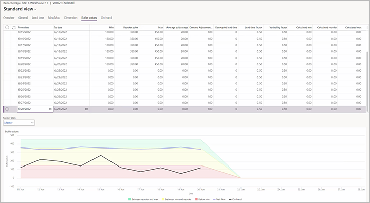

---
title: Visual and collaborative execution
description: This article describes how to monitor your DDMRP decoupling points, buffer zones, planned orders, and history.
author: t-benebo
ms.date: 06/30/2022
ms.topic: article
ms.search.form:
audience: Application User
ms.reviewer: kamaybac
ms.search.region: Global
ms.author: benebotg
ms.search.validFrom: 2022-06-30
ms.dyn365.ops.version: 10.0.28
---

# Visual and collaborative execution

[!include [banner](../../includes/banner.md)]
[!INCLUDE [preview-banner](../../includes/preview-banner.md)]

This article describes how to monitor your DDMRP decoupling points, buffer zones, planned orders, and history.

## Visually tack buffers and quantities for a selected item

In Supply Chain Management, you can visually track how buffers, on-hand quantities, and net-flow levels change over time for any selected released product. Follow these steps to open and review the graphs:

1. Go to **Product information management \> Products \> Released products**
1. Select a released item that is set up as a decoupling point (see also [Inventory positioning](ddmrp-inventory-positioning.md)).
1. On the Action Pane, open the **Plan** tab and select **Item coverage**.
1. The **Item coverage** page opens. Select an item coverage record that creates a decoupling point (this record will show the name of a **Coverage group** that is set up to create decoupling points).
1. Open the **On-hand** tab. This tab shows a graph of how on-hand quantities changed over time, with the value of the on-hand recorded for a specific period every time planning optimization is run. The page also provides a table that indicates which of the following categories each recorded on-hand level falls into:

    - Critically low (less than half of the minimum for that period of time)
    - Low (between half of the minimum and the minimum)
    - Average on-hand (if it between the minimum and the minimum plus the green zone)
    - Higher than average

    

    Note that the colors used on the **On-hand** tab represent different ranges than in the buffer.

1. To see how your buffer values changed over time and how they compare to on-hand and net-flow levels, open the **Buffer values** tab.

    

## Track the status and planned orders for all decoupling points

The **Demand driven MRP** workspace provides several tools with KPIs and overviews of the status of your decoupling point items and related planned orders. To open it, go to **Master planning \> Workspaces \> Demand driven MRP**.

## Get overviews of decoupling points and planned orders

In addition to the **Demand driven MRP** workspace, Supply Chain Management provides several pages where you can view information about your DDMRP setup, decoupling points, and planned orders. Some of these pages also provide convenient buttons in the Action Pane that enable you to manage buffers, run master planning, and/or navigate to other related views.

- To view decoupling point status by net flow, go to **Master planning \> Master planning \> DDMRP \> Decoupling points status by net flow**.
- To view decoupling point status by on-hand, go to **Master planning \> Master planning \> DDMRP \> Decoupling points status by on-hand**.
- To view planned orders for decoupling points, go to **Master planning \> Master planning \> DDMRP \> Planned orders for decoupling points**.
- To view decoupled lead times, go to **Master planning \> Master planning \> DDMRP \> Decoupled lead time**.

## Clean up decoupling point buffer values

With time, your system will build up a large amount of historical data related to ongoing buffer calculations. This will cause your data volume to increase and can eventually affect the performance of your system. Therefore, we recommend that you clean up the old decoupling point buffer values from time to time.

> [!WARNING]
> Running this job will remove historical buffer value settings and historical on-hand/net flow information and is not reversible.

Use the following procedure to clean up your decoupling point buffer values 

1. Go to **Master planning \> Master planning \> DDMRP \> Clean up decoupling point buffer values**
1. The **Clean up decoupling point buffer values** dialog opens. Make the following settings:
    - **Delete records older than (days)** – Specify the age of the youngest record to keep. All decoupling point buffer value records older than this will be deleted.
    - **Master plan** – Select a master plan that includes items to be affected by this cleanup. The cleanup will apply to all of the items in the plan filter limited by the **Filter** settings you make in this dialog.
1. To limit the set of records on which this batch job should run, expand the **Records to include** FastTab and select **Filter** to open the **Inquiry** dialog, which works the same as it does for other types of [background jobs](../../../fin-ops-core/dev-itpro/sysadmin/batch-processing-overview.md) in Supply Chain Management
1. On the **Run in the background** FastTab, specify how, when, and how often the cleanup should be made. The fields work just as they do for other types of [background jobs](../../../fin-ops-core/dev-itpro/sysadmin/batch-processing-overview.md) in Supply Chain Management.
1. Select **OK** to add the new job to a batch queue for execution.
