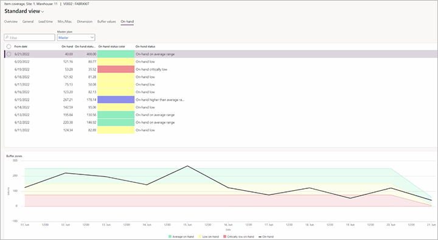

---
title: Visual and collaborative execution
description: This article describes how to monitor your DDMRP decoupling points, buffer zones, planned orders, and history.
author: t-benebo
ms.date: 06/30/2022
ms.topic: article
ms.search.form:
audience: Application User
ms.reviewer: kamaybac
ms.search.region: Global
ms.author: benebotg
ms.search.validFrom: 2022-06-30
ms.dyn365.ops.version: 10.0.28
---

# Visual and collaborative execution

[!include [banner](../../includes/banner.md)]
[!INCLUDE [preview-banner](../../includes/preview-banner.md)]

This article describes how to monitor your DDMRP decoupling points, buffer zones, planned orders, and history.

## Visually tack buffers and quantities for a selected item

In Supply Chain Management, you can visually track how buffers, on-hand quantities, and net-flow levels change over time for any selected released product. Follow these steps to open and review the graphs:

1. Go to **Product information management \> Products \> Released products**
1. Select a released item that is set up as a decoupling point (see also [Inventory positioning](ddmrp-inventory-positioning.md)).
1. On the Action Pane, open the **Plan** tab and select **Item coverage**.
1. The **Item coverage** page opens. Select an item coverage record that creates a decoupling point (this record will show the name of a **Coverage group** that is set up to create decoupling points).
1. Open the **On-hand** tab. This tab shows a graph of how on-hand quantities changed over time, with the value of the on-hand recorded for a specific period every time planning optimization is run. The page also provides a table that indicates which of the following categories each recorded on-hand level falls into:

    - Critically low (less than half of the minimum for that period of time)
    - Low (between half of the minimum and the minimum)
    - Average on-hand (if it between the minimum and the minimum plus the green zone)
    - Higher than average

    

    Note that the colors used on the **On-hand** tab represent different ranges than in the buffer.

1. To see how your buffer values changed over time and how they compare to on-hand and net-flow levels, open the **Buffer values** tab.

    

## Track the status and planned orders for all decoupling points

The **Demand driven MRP** workspace provides several tools with KPIs and overviews of the status of your decoupling point items and related planned orders. To open it, go to **Master planning \> Workspaces \> Demand driven MRP**.

<!-- KFM: The following pages still require documentation; note also that the final page title contains a misspelling:  

- Decoupling points status by net flow
- Decoupling points status by on-hand
- Planned orders for decoupling points
- Cleanup decoupling point buffer values

-->