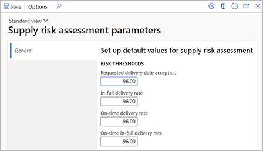

# Supply Risk Assessment configuration

[!include [banner](../includes/banner.md)]
[!INCLUDE [preview-banner](../includes/preview-banner.md)]

## Turn on the supply risk assessment feature

Before you can use this feature, it must be turned on in your system. Admins can use the [feature management](../../fin-ops-core/fin-ops/get-started/feature-management/feature-management-overview.md) settings to check the status of the feature and turn it on. In the **Feature management** workspace, the feature is listed in the following way:

- **Module:** *Procurement and sourcing*
- **Feature name:** *Supply risk assessment*

## Enable the capability

You must first enable the supply risk assessment capability in [feature management](../../fin-ops-core/fin-ops/get-started/feature-management/feature-management-overview.md). The feature is named “Assess supply risks to prevent supply chain disruptions".
Once enabled you can configure individual risk thresholds, access the workspace and  embedded Power BI reports.
thresholds

## Configure thresholds

Navigate to the page called “Supply risk assessment parameters” to change minimum rates used to calculate risks. The system uses 4 metrics to assess risks.

- Requested delivery date acceptance rate
- In-Full delivery rate (IT)
- On-Time delivery  rate (OT)
- On-Time In-Full delivery rate (OTIF)

Each metric is calculated as a rate against within a current scope of analysis. Set the rate which you regard a risk for your business. By default the threshold is set to a rate of 96%.

## Initialize or refresh data on the supply risk assessment workspace

You might need to use the **Refresh data** link to immediately see the updated data in the workspace. If this link is not accessible for you, go to the **Data set cache configuration** from the search bar and you will see the cache consumer `VendSupplyRiskCacheDataSet`, which you can edit and enable for manual refresh. <!-- KFM: I moved this here from the overview. I think a more detailed procedure may be needed here. -->