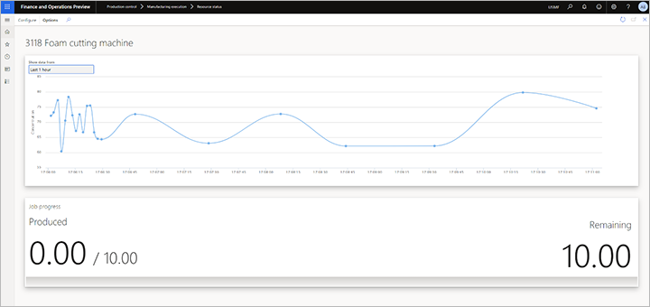
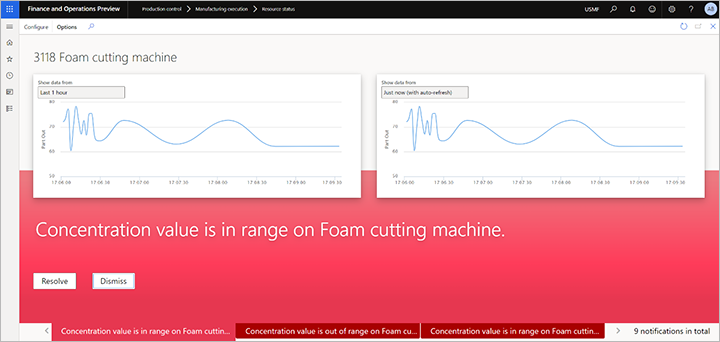

---
title: The equipment downtime scenario
description: The product quality scenario uses a sensor to measure the quality of a product batch and generates an alert if a measurement falls outside a defined threshold.
author: johanhoffmann
ms.date: 09/02/2022
ms.topic: article
ms.search.form: IoTIntCoreScenarioManagement
audience: Application User
ms.reviewer: kamaybac
ms.search.region: Global
ms.author: johanho
ms.search.validFrom: 2022-09-02
ms.dyn365.ops.version: 10.0.30
---

# The product quality scenario

[!include [banner](../includes/banner.md)]
[!INCLUDE [preview-banner](../includes/preview-banner.md)]

In the *product quality* scenario, a sensor is set up to measure the quality of a product batch on the shop floor. If a measurement falls outside a defined threshold for the product, then a notification is shown on the supervisor's dashboard. For example, suppose a sensor is measuring the moisture of a food product coming out of the production line. If the measurement is outside the allowed minimum or maximum value for moisture for the product, a notification is generated.

## Scenario dependencies

The *product quality* scenario has the following dependencies:

- For an alert to be triggered, a production order must be running on a mapped machine, and that machine must be producing a product that has a mapped batch attribute.
- A signal that represents the batch attribute must be sent to the IoT hub, and a unique property name must be included.

## Prepare demo data for the product quality scenario

If you would like to use a demo system to test the *product quality* scenario, then use a system that has the [demo data](../../fin-ops-core/fin-ops/get-started/demo-data.md) installed, select the *USMF* legal entity (company) and prepare the additional demo data as described in this section. If you are using your own sensors and data, then you can skip this section.

In this section, you will set up the demo data so you can use the released product *P0111 - Composite Case* with the *product quality* scenario. In this scenario, the system tracks whether a batch attribute value, measured by a sensor, is outside the defined threshold for a batch attribute associated with the product.

### Set up sensor simulator

If you'd like to try this scenario without using a physical sensor, then you can set up a simulator to generate the required signals as described in [Set up a simulated sensor for testing](sdi-set-up-simulated-sensor.md).

### Associate a batch attribute and resource to product P0111

Follow these steps to associate a batch attribute to product *P0111* and verify that *Resource 3118 – Foam cutting machine* is used for it:

1. Go to **Product information management \> Products \> Released products**.
1. Find and select the product with **Item number** *P0111*.
1. In the action pane, select the **Manage inventory** tab and, in the **Batch attributes** field group, select **Product specific**.
1. In the **Product specific** page, select **New** to create a new product specific batch attribute and set the following values in the header section:
    - **Attribute code** – Set the scope of attributes that you will monitor (*Table*, *Group*, or *All*). For this scenario, you will always monitor a single attribute, so set this to *Table*.
    - **Attribute relation** – Select the attribute whose value you will monitor using the product quality scenario. Select *Concentration*, which is an attribute included in the standard demo data.

1. On the **Values** FastTab, the **Minimum** and **Maximum** fields establish the range of acceptable values that this attribute must report to pass the quality check. If the sensor reports a value outside of this range, then the system will identify it as a quality violation. The other fields in this FastTab aren't relevant for the *product quality* scenario. The defaults you see now come from the demo data, so just leave them as they are and close the **Product specific** page.
1. You return to the **Released product details** page for item *P0111*. On the Action Pane, select the **Engineer** tab and in the **View** field group, select **Route**.
1. On the **Route** page, open the **Overview** tab at the bottom of the page and select the line with **Oper. No**. *30*.
1. At the bottom of the page, open the **Resource requirements** tab and make sure that the resource *3118 – Foam cutting machine* is associated with the operation.

### Create and release a production order for product **P0111**

Follow these steps to create and release a production order for product *P0111*:

1. Go to **Production control \> Production orders \> All production orders**.
1. The **All production orders** page opens. On the Action Pane, select **New batch order**.
1. The **Create batch** dialog opens. Set the following values:
    - **Item number:** *P0111*
    - **Quantity:** *10*

1. Select **Create** in the dialog to create the order and return to the **All production orders** page.
1. Use the **Filter** field to find production orders for **Item number** *P0111*. Then identify and select the production order that you just created.
1. On the Action Pane, select the **Production order** tab and, in the **Process** group, select **Estimate**.
1. The **Estimate** dialog opens. Select **OK** to run the estimate.
1. On the Action Pane, select the **Production order** tab and, in the **Process** group, select **Release**.
1. The **Release** dialog opens.
1. Write down the number for the batch order you just created.
1. Select **OK** to release the order.

### Configure the production floor execution interface

If you haven't already done so, configure the production floor execution interface to show jobs assigned to the *3118 – Foam cutting machine* resource. See the following sections for instructions:

- [Configure the production floor execution interface](sdi-scenario-equipment-downtime.md#config-pfe)
- [Enable search option on the production floor execution interface](sdi-scenario-equipment-downtime.md#enable-pfe-search)

### Start the first job in the batch order

Follow these steps to start the first job in the batch order:

1. Go to **Production control \> Manufacturing execution \> Production floor execution**.
1. In the **Badge ID** field, type *123* and select **Sign in**.
1. If prompted for an absence reason, select one of the cards for absence and select **OK**.
1. In the **Search** field, enter the batch order number that you wrote down previously and then press return.
1. Select the order and then select **Start job**.
1. The **Start job** dialog opens. Select **Start**.

## Set up the product quality scenario

Follow these steps to set up the *product quality* scenario in Supply Chain Management:

1. Go to **Production control \> Setup \> Sensor Data Intelligence \> Scenarios** to open the **Scenarios** page.
1. In the **Product quality** scenario box, select **Configure** to launch the setup wizard for this scenario.
1. The wizard starts with the **Sensors** page. Select **New** to add a new sensor to the grid and set the following values for it:
    - **Sensor ID** - Enter the ID of the sensor you are using. (If you are using the Raspberry PI Azure IoT Online Simulator and have set it up as described in [Set up a simulated sensor for testing](sdi-set-up-simulated-sensor.md), then enter *Quality*.)
    - **Sensor description** - Enter a description of the sensor.

1. Repeat the previous step for each sensor you want to add for now. You can come back and add more sensors at any time.
1. Select **Next**.
1. The **Business record mapping** page opens. In the **Sensors** section, select the record for the sensor you defined in the previous step.
1. In the **Business record mapping** section**,** select **New** to add a new row to the grid.
1. The new row should automatically show a **Business record type** of *Resources(WrkCtrTable)*. For this row, set **Business record** to the resource you are monitoring with the selected sensor. (If you are using the demo data created earlier in this article, set it to *3118, Foam cutting machine*.)
1. Right after you select a business record type for the previous row, a second row is automatically added to the grid, this time with a **Business record type** of *Batch attributes(PdsBatchAttrib)*. For this row, set **Business record** to batch attribute you are monitoring with the selected sensor. (If you are using the demo data created earlier in this article, set it to *Concentration, Concentration Percentage*.)
1. Select **Next**.
1. The **Activate sensors** page opens. In the grid, select the sensor you just added and then select **Activate**. Each activated sensor in the grid shows a check in its **Active** column.
1. Select **Finish**.

## Work with the product quality scenario

### View product quality data on the Resource status page

On the **Resource status** page, supervisors can monitor a timeline of the product quality signal received from the sensors mapped to each machine resource. Follow these steps to configure the timeline:

1. Go to **Production control \> Manufacturing execution \> Resource status**.
1. The **Configure** dialog opens. Set the following values:
    - **Resource** – Select the resources you want to monitor. (If you're working with the demo data, select *3118*.)
    - **Time series 1** - Select the record (metric key) with the following name format: *ProductQuality:&lt;JobId&gt;:&lt;AttributeName&gt;*
    - **Display name** – Enter *Batch attribute values*.

The following screenshots provide some examples of how product quality data looks on the **Resource status** page.

### View product quality data on the Notifications page

On the **Notifications** page, supervisors can see the notification generated when the sensor measures a batch attribute value that falls outside the defined threshold for the batch attribute. Each notification provides an overview of which production job is impacted by the outage and provides the option to reassign the affected job to another resource.

To open the **Notification** page, go to **Production control \> Inquiries and reports \> Sensor Data Intelligence \> Notifications**.

The following screenshot shows an example of a product quality notification.

